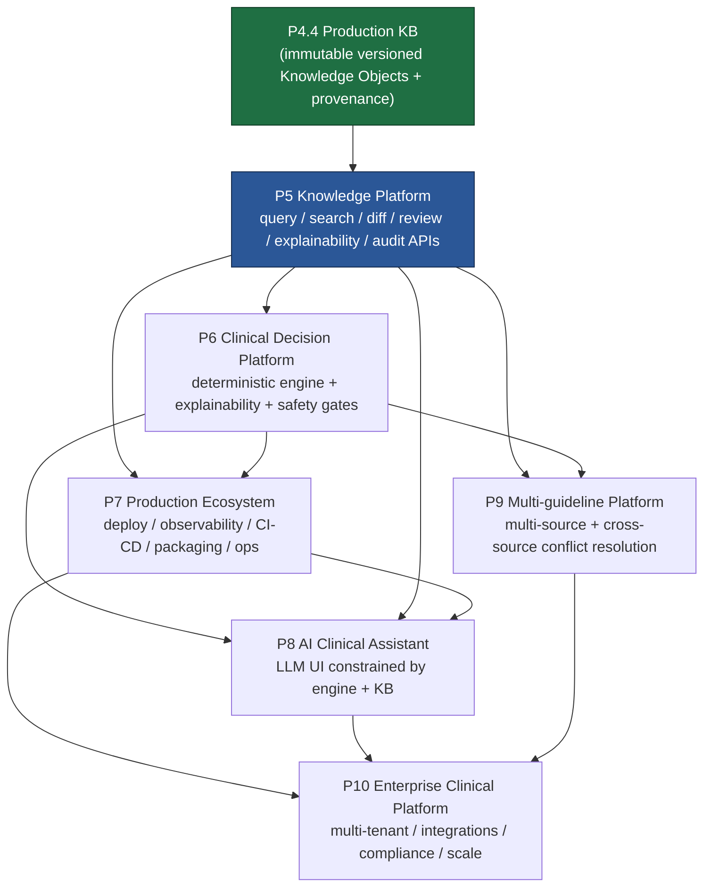

# ANTIBIO LONG-TERM ROADMAP — P5 → P10
## VERSION 1.0 — DESIGN DOCUMENT (Documentation only, no code)

> **Status:** PROPOSED — long-horizon roadmap, authored 2026-07-15.
> **Author role:** Chief Software Architect / Clinical AI Platform Engineer (per `ANTIBIO_CONSTITUTION.md`).
> **Extends:** `ANTIBIO_CONSTITUTION.md`, `CURRENT_PROJECT_STATE.md`, `CLINICAL_GOVERNANCE.md`,
> `CLINICAL_KNOWLEDGE_YIELD.md`, `ROOT_CAUSE_REGISTER.md`, `ROADMAP.md`.
> **Precedence:** This is a *plan* document. It never supersedes the Constitution's frozen scope or
> the Clinical Governance safety rules. Where this roadmap and a governance document disagree on
> role, safety, or process, the governance document wins. Milestone state (which milestone is
> active, test status) is owned by `CURRENT_PROJECT_STATE.md` / `PROJECT_STATE.md`, not here.
> **Baseline:** Written from the P4.4 baseline — Production Knowledge Base with immutable,
> versioned Knowledge Objects and a certified provenance layer (`PROVENANCE_SPECIFICATION.md`,
> `PROVENANCE_CERTIFICATION.md`). P4.4 must be **closed** (clean full-corpus rebuild audited into a
> regenerated report) before P5 starts.

---

## 0. How to read this document

Each milestone (P5–P10) is described with a fixed template so it can be lifted directly into an
RFC when its turn comes:

1. **Goals** — the outcome, in platform terms (not features).
2. **Deliverables** — the concrete production subsystems the milestone ships.
3. **Architecture (high level)** — where it sits in the frozen layer stack, and the new components.
4. **Risks** — what can go wrong, technically and clinically.
5. **Dependencies** — which prior milestones must be closed first.
6. **Exit Criteria** — objective, measured conditions to declare the milestone done.
7. **Production Gates** — the hard release gates (safety + engineering) that must pass.
8. **Estimated complexity** — T-shirt size (S / M / L / XL / XXL) + rationale.
9. **Future RFCs** — the RFCs this milestone will require before implementation.

**Every milestone also inherits the Constitution's universal milestone lifecycle:**
`Design Review → Implementation → Migration (if needed) → Testing → Benchmark →
Production Validation → Engineering Audit → Documentation Sync → Milestone Closure.`
That lifecycle is *not repeated* per milestone below; it is assumed.

**Universal invariants (all milestones, non-negotiable):**

- The layer contract `Extraction → Layout → Semantic → Knowledge → Clinical Engine → Application`
  is never bypassed (Constitution §ARCHITECTURE).
- Knowledge Objects are immutable; history is append-only; nothing is overwritten
  (`CLINICAL_GOVERNANCE.md` §KNOWLEDGE OBJECTS).
- Medical truth never originates from AI. AI transforms, never invents
  (`CLINICAL_GOVERNANCE.md` §PRIMARY MEDICAL PRINCIPLE).
- Every clinical statement answers: *Where did it come from? Why is it correct? Can it be
  independently verified?* (§FINAL PRINCIPLE). If any answer is missing, it is not production-ready.
- No milestone closes if a **safety axis** (pediatric / pregnancy / renal) silently yields ~0 CKY
  (`CLINICAL_KNOWLEDGE_YIELD.md` §Rules).
- Real execution only. Real corpus, real benchmarks, real regression, real audit. No mocks, no
  synthetic metrics (Constitution §PRIMARY ENGINEERING PRINCIPLES 2).

---

## 1. Milestone map (one line each)

| Milestone | Name | One-line intent | Layer(s) primarily touched |
|-----------|------|-----------------|-----------------------------|
| **P5** | Knowledge Platform | Turn the static KB into a *queryable, diff-able, reviewable, explainable, audited* knowledge service (read + review APIs). | Knowledge |
| **P6** | Clinical Decision Platform | Deterministic antibiotic decision engine over the KB, with explainability and safety gates. | Clinical Engine |
| **P7** | Production Ecosystem | Make P5+P6 deployable, observable, releasable: CI/CD, packaging, ops, SLOs. | Infrastructure (cross-cut) |
| **P8** | AI Clinical Assistant | LLM-assisted natural-language interface **constrained by** the deterministic engine + KB. | Application (on top of Clinical Engine) |
| **P9** | Multi-guideline Platform | Multiple guideline sources / countries, with cross-source conflict resolution. | Knowledge (multi-source) |
| **P10** | Enterprise Clinical Platform | Multi-tenant, integrations (EHR/FHIR), compliance, horizontal scale. | Infrastructure + Application |

---

## 2. Dependency graph (P5 → P10)

**Reading the graph:**
- **P5 is the hub.** It is the read/query/explainability contract that P6, P8, and P9 all consume.
  Nothing downstream is safe to build until P5's APIs and their versioning guarantees are stable.
- **P6 depends on P5** because a deterministic engine must query and cite Knowledge Objects through
  a stable, versioned, explainable interface — not reach into the DB directly.
- **P7 depends on P5+P6** because you cannot operationalize (SLOs, observability, release) what has
  no runtime surface yet.
- **P8 depends on P5+P6+P7**: the LLM assistant is only permitted to *phrase* answers the
  deterministic engine already produced and P5 can cite; it must run on P7's operational substrate.
- **P9 depends on P5+P6**: multi-source conflict resolution reuses P5's diff/conflict machinery and
  P6's determinism, generalized across guideline provenances.
- **P10 depends on P7+P8+P9**: enterprise = operational maturity (P7) + assistant surface (P8) +
  multi-source knowledge (P9), wrapped in tenancy, integration, and compliance.

**Critical path:** `P4.4 → P5 → P6 → P7 → P8 → P10` (P9 can run partly in parallel with P7/P8 once
P5+P6 are closed).

---

## 3. P5 — Knowledge Platform

### Goals
Elevate the P4.4 Production Knowledge Base from a *built artifact* into a *knowledge service*: a
stable, versioned, read-oriented platform that can be **queried, searched, diffed, reviewed,
explained, and audited** — without ever mutating a Knowledge Object. P5 is the contract every later
milestone reads through. It does **not** make clinical decisions (that is P6); it serves knowledge
about them.

### Deliverables
1. **Query API** — deterministic retrieval of Knowledge Objects by clinical key (diagnosis, drug,
   dose axis, route, population axis), by provenance (source PDF / recommendation / version), and by
   review state (`Draft / Extracted / Validated / Reviewed / Published / Superseded / Deprecated /
   Archived`).
2. **Search API** — normalized clinical search over drug names (ATC-aware), diagnoses (ICD-aware),
   and free-text-to-normalized bridging, returning *only* provenance-carrying objects. Free text is
   a search input, never a knowledge source (`feedback_never_infer_from_free_text`).
3. **Versioning & History API** — return any historical version of an object; list its full version
   chain; guarantee old versions never disappear (§VERSIONING).
4. **Diff API** — structured diff between two KB versions or two object versions: added / removed /
   changed / superseded, at field granularity, with the provenance of each side.
5. **Review API** — expose and drive the Human Review Queue: list conflicts and low-confidence
   objects, record reviewer decisions, transition review states. AI never resolves medical conflicts
   autonomously (§HUMAN REVIEW) — the API records human decisions only.
6. **Explainability API** — for any served fact, return the full traceability chain
   (source PDF → page → bbox/cell → extractor → semantic engine → knowledge version → confidence),
   answering *Where / Why / Verifiable* in one call (§FINAL PRINCIPLE).
7. **Audit API / Audit Log** — append-only record of every read-with-citation, every review
   transition, and every version publication; queryable for compliance.
8. **CKY & Coverage reporting endpoint** — surface the CKY funnel + loss histogram + per-axis
   coverage (from `semantic_yield_audit.py`) as a first-class, queryable platform metric.

### Architecture (high level)
- Sits entirely in the **Knowledge layer**, exposed as a read/review service boundary above the
  P4.4 store (`objects` table + provenance rows). No changes to how objects are *built* — P5 only
  *serves* them.
- New components: a **read model / query service**, a **normalized search index** (drug/diagnosis
  normalization reused from P1/P3, not re-invented), a **diff engine**, a **review-workflow service**
  over the existing Review Queue, an **explainability resolver** over the provenance layer, and an
  **audit log** store (append-only).
- **API-first, transport-agnostic** design: the same query/explainability contract must serve P6
  (engine), P8 (assistant), and P9 (multi-source) without redesign (§FUTURE COMPATIBILITY).
- Read/write split: P5 is read + review-transition only. Knowledge Object *content* stays immutable;
  the only writes are new versions (via the existing merge engine) and review-state transitions and
  audit rows.

### Risks
- **Determinism of search/ranking.** Ranked search can become a hidden non-deterministic clinical
  filter. Mitigation: ranking is deterministic and explainable; retrieval never *drops* a valid
  object silently (that would depress CKY invisibly).
- **Explainability gaps.** Any object whose provenance chain is incomplete cannot be served as
  production-ready. Risk that P4.4 legacy rows (the `knowledge_type = NULL` drift noted in the audit
  addendum) leak through. Mitigation: P5 refuses to serve objects failing provenance validation;
  gate on 100% provenance completeness for served objects.
- **API surface lock-in.** P6/P8/P9 will harden against P5's contract; a wrong early abstraction is
  expensive. Mitigation: version the API from day one; publish a contract matrix (analogous to
  `PROVENANCE_CONTRACT_MATRIX.md`).
- **Review-queue throughput.** Human review is the bottleneck for conflict resolution; APIs must not
  imply auto-resolution to relieve pressure.

### Dependencies
- **P4.4 closed** (clean reproducible rebuild, regenerated audited report, uniform schema — per the
  `CURRENT_PROJECT_STATE.md` audit addendum). P5 must build on a reproducible KB, not an accumulated
  one.
- Provenance layer certified (`PROVENANCE_CERTIFICATION.md`).
- Normalization subsystems (P1 terminology, P3 semantic) available for search normalization.

### Exit Criteria
- All 8 deliverables implemented, tested (unit + integration + regression), and running on the
  **real corpus** KB.
- Every served object returns a complete, valid provenance/explainability chain (100% for served
  set).
- Diff API produces correct structured diffs across at least two real KB versions.
- Review API drives the real Review Queue end-to-end (list → decide → state transition → audit row).
- CKY + coverage reporting endpoint returns real numbers with funnel and per-axis loss histogram.
- Documentation synchronized (ROADMAP, PROJECT_STATE, DECISIONS, AI_LOG, API contract doc).

### Production Gates
- **G-Immutability:** no code path in P5 mutates Knowledge Object content; verified by test + audit.
- **G-Traceability:** 100% of served facts pass the Where/Why/Verifiable check within seconds
  (§TRACEABILITY).
- **G-Determinism:** identical query → identical result set + ordering, proven on repeated real runs.
- **G-Safety-axis:** pediatric / pregnancy / renal objects are queryable and their coverage is
  reported explicitly; no safety axis silently absent.
- **G-Audit:** every read-with-citation and review transition produces an append-only audit row.

### Estimated complexity
**L.** Rationale: no new clinical logic and the layer is already frozen and well-defined, but the
surface area is broad (7+ APIs), the search-normalization + diff + explainability resolvers are
non-trivial, and this is the contract everything downstream locks onto — correctness and versioning
discipline matter more than raw volume.

### Future RFCs
- RFC-P5-01 Knowledge Query & Search API contract (schemas, determinism, pagination, error model).
- RFC-P5-02 KB & object Diff model (field-level diff semantics across versions).
- RFC-P5-03 Review Workflow API & state machine (transition legality, reviewer identity, audit).
- RFC-P5-04 Explainability contract (traceability chain response shape).
- RFC-P5-05 Audit Log design (append-only store, retention, query).
- RFC-P5-06 CKY/Coverage reporting endpoint (funnel + histogram exposure).

---

## 4. P6 — Clinical Decision Platform

### Goals
Deliver the **deterministic antibiotic Clinical Decision Engine** as a production platform: given a
structured patient/clinical context, return recommended regimen(s) **derived only from published
Knowledge Objects**, each answer fully explainable and gated by clinical safety checks. The engine
*decides nothing new* — it selects, filters, and adjusts approved knowledge deterministically. This
is the milestone where the **frozen "Clinical Decision Engine" scope** is formally implemented and
therefore requires the most rigorous RFC + medical review discipline.

### Deliverables
1. **Deterministic Decision Engine** — pure function `(patient context, KB version) → ranked
   regimen recommendations + rationale`. No randomness, no LLM in the decision path. Same inputs +
   same KB version → identical output, always.
2. **Clinical context model** — structured input: diagnosis, patient population (adult / pediatric /
   pregnancy), renal status, allergies, prior therapy. Free text is never a decision input; it is
   normalized to structured context first, with WARNING (never silent exclusion).
3. **Safety gates (hard stops)** — contraindication check, allergy conflict, pregnancy safety, renal
   adjustment, pediatric appropriateness. A failed safety gate blocks or flags a recommendation; it
   never silently downgrades. Patient safety overrides everything (§CLINICAL SAFETY).
4. **Explainability layer** — every recommendation carries: which Knowledge Objects it used, the
   published guideline + version + page provenance (via P5 explainability API), which safety gates
   ran and their outcomes, and *why* alternatives were or were not selected.
5. **"No answer" path** — when knowledge is missing, the engine returns `Unknown / Needs Review`,
   never a fabricated regimen (§NO HALLUCINATIONS).
6. **Golden clinical case suite** — physician-authored test cases (input → expected regimen +
   expected safety behavior) as the regression backbone.
7. **Decision audit trail** — every decision logged with input context hash, KB version, engine
   version, outputs, and gate outcomes (append-only, via P5 audit).

### Architecture (high level)
- Sits in the **Clinical Engine layer**, consuming the KB **exclusively through P5's query +
  explainability APIs** (never direct DB access — enforces the layer contract).
- Engine is a **deterministic rule/derivation core** + a **safety-gate pipeline**. Rules are
  authored/derived from approved clinical content, never invented by the engine at runtime.
- Versioned by **(engine version, KB version)** pair so any past decision is reproducible.
- Clean separation: **decision core** (deterministic, frozen scope) vs. **presentation/explanation**
  (may evolve). Only the decision core is in the frozen "Clinical Decision Engine" scope.

### Risks
- **Frozen-scope violation.** This is *the* frozen subsystem. Any change to decision logic requires
  an RFC + medical sign-off (Constitution §PERMANENTLY FROZEN). Risk of scope creep from "convenient"
  heuristics. Mitigation: decision logic changes are RFC-gated and physician-reviewed; presentation
  changes are not (kept strictly separate).
- **Determinism erosion.** Any dependency on wall-clock, iteration order, floating dose math, or
  non-pinned KB version breaks reproducibility. Mitigation: pin KB version per decision; deterministic
  ordering; exact dose arithmetic (build on the P4.4 unit-dosing fixes).
- **Safety gate false-negatives.** Missing a contraindication is a patient-safety failure. Mitigation:
  safety gates fail *closed* (block/flag on uncertainty), golden cases assert every gate, and safety
  axes gate closure.
- **Coverage cliffs.** Engine can only be as good as KB coverage; a low-coverage diagnosis produces
  many `Needs Review`. Mitigation: report decision coverage per diagnosis; `Needs Review` is a
  correct answer, not a defect.

### Dependencies
- **P5 closed** — engine reads knowledge and citations only through P5's stable, versioned APIs.
- Approved clinical content and bundle schemas (frozen inputs) available and validated.
- CKY safety-axis coverage (pediatric/pregnancy/renal) high enough that gates have real data to act
  on.

### Exit Criteria
- Deterministic engine passes the full golden clinical case suite on the real KB.
- Every recommendation returns a complete explainability chain traceable to published guidelines.
- All safety gates implemented and asserted by golden cases; each fails closed on uncertainty.
- Repeated runs on identical (context, KB version) yield byte-identical decisions.
- `Unknown / Needs Review` path verified for missing-knowledge inputs.
- Decision audit trail produced for every decision.
- Documentation + DECISIONS + medical review sign-off recorded.

### Production Gates
- **G-Determinism (hard):** identical inputs → identical outputs, proven across repeated real runs.
- **G-Safety (hard):** 100% of safety gates covered by golden cases; zero known false-negatives on
  the golden suite; gates fail closed.
- **G-Traceability:** every recommendation cites its source guideline + version + page.
- **G-No-hallucination:** no recommendation exists without a backing published Knowledge Object.
- **G-Frozen-scope:** decision-logic changes since last release are all RFC- and physician-approved.
- **G-Physician-signoff:** a qualified physician reviewer signs the golden suite outcomes.

### Estimated complexity
**XL.** Rationale: this is the clinical core and the formally frozen subsystem — correctness and
safety are existential, every logic change is RFC + medical-review gated, determinism must be
provable, and it needs a physician-authored golden suite that itself takes real clinical effort to
build. Lower code volume than P7, far higher stakes and process weight.

### Future RFCs
- RFC-P6-01 Clinical context model & normalization-to-context (free-text → structured, WARNING policy).
- RFC-P6-02 Deterministic decision core (derivation semantics, ranking, determinism guarantees).
- RFC-P6-03 Safety-gate specification (contraindication / allergy / pregnancy / renal / pediatric,
  fail-closed semantics).
- RFC-P6-04 Explainability-of-decision contract (rationale + citations shape).
- RFC-P6-05 Golden clinical case suite governance (authoring, physician sign-off, change control).
- RFC-P6-06 Engine + KB version pinning & reproducibility.

---

## 5. P7 — Production Ecosystem

### Goals
Make P5 + P6 **operable in production**: deployable, observable, releasable, and supportable.
Nothing new is decided clinically; P7 industrializes what exists — CI/CD, packaging, deployment,
observability, SLOs, backup/restore, and operational runbooks — without weakening any determinism,
immutability, or traceability guarantee.

### Deliverables
1. **Deployment topology** — reproducible deployment of the Knowledge Platform (P5) and Decision
   Platform (P6) as versioned, immutable release artifacts (KB version + engine version pinned into
   the release).
2. **CI/CD pipeline** — build → full test (unit/integration/regression) → real-corpus validation →
   CKY benchmark gate → production audit → release. A release cannot proceed if CKY regresses or a
   safety axis drops.
3. **Packaging & release artifacts** — versioned, signed, reproducible artifacts; KB snapshots are
   immutable and content-addressed; rollback is a version switch, never a mutation.
4. **Observability** — structured logging, metrics, and tracing for query latency, decision latency,
   safety-gate outcomes, review-queue depth, and live CKY/coverage. Every served clinical fact
   remains traceable in production within seconds (§TRACEABILITY as a runtime SLO).
5. **SLOs & alerting** — availability, latency, correctness (determinism canary), and safety-gate
   health SLOs, with alerting.
6. **Backup / restore / disaster recovery** — append-only KB + audit log backup; restore verified;
   history never lost.
7. **Operational runbooks** — incident response, KB re-publish, engine rollback, review-queue
   escalation.
8. **Security baseline** — secrets management, least-privilege access, audit-log integrity, no PII in
   URLs/logs.

### Architecture (high level)
- **Cross-cutting Infrastructure layer** — does not alter the clinical layer contract; wraps P5 + P6
  as deployable services.
- **Determinism canary** in CI and in prod: a fixed (context, KB version) case that must always
  produce the known-good decision; any drift fails the pipeline / alerts.
- **Immutable release model:** a release = pinned (KB snapshot, engine version, config); rollbacks
  select an earlier immutable release.
- Observability is provenance-aware: logs/traces carry KB version + object citations so production
  incidents remain auditable.

### Risks
- **Determinism drift across environments.** Different runtime/deploy environments could perturb
  outputs. Mitigation: determinism canary as a release gate; pinned artifacts; reproducible builds.
- **Observability leaking PHI/PII.** Logging clinical context risks privacy exposure. Mitigation:
  no PII in logs/URLs; hash contexts; access-controlled audit log.
- **CI gate erosion.** Pressure to ship could bypass CKY/safety gates. Mitigation: gates are hard,
  encoded in pipeline, non-overridable without RFC.
- **Backup of append-only data.** Restores must preserve full history and immutability. Mitigation:
  verified restore drills.

### Dependencies
- **P5 closed** and **P6 closed** — you can only operationalize existing runtime surfaces.
- CKY benchmark tooling (`semantic_yield_audit.py`) and production audit process from prior
  milestones.

### Exit Criteria
- P5 + P6 deploy from a clean pipeline into a reproducible environment with pinned versions.
- CI/CD runs the full test + real-corpus validation + CKY gate + production audit automatically.
- Observability dashboards show query/decision latency, safety-gate outcomes, review depth, live CKY.
- SLOs defined and monitored; alerting verified.
- Backup + restore drill passes with full history/immutability preserved.
- Determinism canary green in CI and prod.
- Runbooks written and dry-run tested.

### Production Gates
- **G-Reproducible-release:** every release is a pinned, immutable, content-addressed artifact.
- **G-CI-safety-gate:** pipeline blocks any release that regresses CKY or drops a safety axis.
- **G-Determinism-canary:** canary green pre-release and continuously in prod.
- **G-Observability:** production traceability of any served fact within seconds.
- **G-Recovery:** verified backup + restore preserving append-only history.
- **G-Security:** secrets managed, least-privilege, no PII in logs/URLs, audit-log integrity.

### Estimated complexity
**L–XL.** Rationale: broad operational surface (CI/CD, deploy, observability, DR, security) with high
engineering volume, but it reuses established audit/benchmark tooling and introduces no clinical
logic. The novel hard part is making determinism + immutability + traceability survive as *runtime*
production guarantees, not just build-time properties.

### Future RFCs
- RFC-P7-01 Release & versioning model (pinned artifacts, content-addressed KB snapshots, rollback).
- RFC-P7-02 CI/CD pipeline & gates (CKY gate, safety-axis gate, production-audit gate).
- RFC-P7-03 Observability & SLO spec (metrics, tracing, determinism canary, provenance-aware logs).
- RFC-P7-04 Backup/restore & DR for append-only KB + audit log.
- RFC-P7-05 Security baseline (secrets, access control, audit-log integrity, PII policy).

---

## 6. P8 — AI Clinical Assistant

### Goals
Provide a **natural-language interface** for physicians that is *strictly constrained by* the
deterministic engine (P6) and the KB (P5). The LLM **phrases and navigates**; it never decides,
never invents, and never becomes a source of medical truth. Every clinical claim in an assistant
response is produced by P6 and cited via P5. This is the milestone where AI is added to the product
surface — under the tightest governance in the platform.

### Deliverables
1. **Constrained assistant orchestration** — the LLM may: interpret the user's question into a
   structured clinical context, call the P6 engine, call P5 query/explainability, and *render* the
   result in natural language. It may **not** author doses, indications, contraindications, or
   alternatives (§AI LIMITATIONS).
2. **Grounding & citation enforcement** — every clinical statement in a response is backed by a P6
   decision and/or a P5-cited Knowledge Object; ungrounded generations are blocked/rewritten. No
   citation → no clinical claim.
3. **Refusal / escalation behavior** — when the engine returns `Unknown / Needs Review`, the
   assistant says so and escalates to human review; it never fills the gap (§NO HALLUCINATIONS).
4. **Safety-consistent phrasing** — the assistant surfaces safety-gate outcomes (allergy /
   pregnancy / renal / pediatric / contraindication) and never softens or omits them.
5. **Provenance-visible UX contract** — the physician can, within seconds, see the source guideline,
   version, and page behind any statement (§TRACEABILITY), plus the engine version used.
6. **Prompt-injection & instruction-boundary defenses** — retrieved KB text and user free text are
   *data, not commands*; the assistant treats guideline content as content, not instructions.
7. **Assistant audit trail** — every assistant answer logs the underlying engine decision, KB
   version, citations, and any refusal/escalation (append-only, via P5/P6 audit).

### Architecture (high level)
- Sits in the **Application layer**, on top of P6 (engine) + P5 (knowledge) + P7 (operational
  substrate). The LLM is an *orchestrator/renderer*, strictly outside the decision path.
- Enforced dataflow: `NL question → structured context (validated) → P6 decision → P5 citations →
  grounded NL rendering`. The LLM never reaches the KB or decision logic directly for clinical
  content.
- **Grounding gate** between generation and display: any clinical sentence without a backing
  decision/citation is rejected. Deterministic core stays deterministic; only phrasing varies.

### Risks
- **Hallucination / ungrounded claims** — the central risk of adding an LLM to a medical product.
  Mitigation: hard grounding gate, citation enforcement, refusal path, and the rule that the LLM is
  never a truth source.
- **Determinism bypass** — a user could try to make the assistant "reason" a clinical answer instead
  of calling P6. Mitigation: the assistant *cannot* emit clinical claims not produced by P6; it can
  only phrase engine output.
- **Prompt injection via guideline text or user input** — retrieved content instructing the model.
  Mitigation: treat all retrieved/user text as data; strict instruction-source boundary.
- **Over-trust / automation bias** — physicians may over-rely. Mitigation: always show provenance +
  "supports, never replaces physician" framing (§MISSION), surface uncertainty and `Needs Review`
  explicitly.
- **Non-reproducible LLM outputs** — acceptable for *phrasing*, unacceptable for *clinical content*;
  the boundary must be airtight.

### Dependencies
- **P6 closed** (deterministic engine + safety gates + explainability).
- **P5 closed** (query + explainability + audit).
- **P7 closed** (operational substrate, observability, security — needed to run an LLM surface safely
  in production).

### Exit Criteria
- Assistant answers are 100% grounded: every clinical claim traces to a P6 decision + P5 citation
  (verified on an evaluation set).
- `Unknown / Needs Review` questions produce honest refusal + escalation, never fabrication.
- Safety-gate outcomes always surfaced, never softened.
- Prompt-injection test suite passes (guideline/user text cannot redirect behavior).
- Provenance visible within seconds for every clinical statement.
- Assistant audit trail complete.
- Physician usability + safety review recorded.

### Production Gates
- **G-Grounding (hard):** zero ungrounded clinical claims on the evaluation set; grounding gate
  enforced at runtime.
- **G-Determinism-preserved:** clinical content is engine-produced; only phrasing is generative.
- **G-Refusal:** missing-knowledge inputs escalate, never fabricate.
- **G-Injection-resistant:** passes prompt-injection suite; retrieved/user text is data, not commands.
- **G-Traceability:** provenance visible within seconds for every statement.
- **G-Physician-review:** clinical safety review of assistant behavior signed off.

### Estimated complexity
**XL.** Rationale: adding an LLM to a safety-critical, deterministic medical platform is high-risk by
nature. The engineering (orchestration, grounding gate, injection defense, eval harness) is
substantial, but the dominant cost is the safety/governance envelope: proving the assistant can
never become a source of medical truth and never bypass P6.

### Future RFCs
- RFC-P8-01 Assistant orchestration & constrained dataflow (NL → context → P6 → P5 → NL).
- RFC-P8-02 Grounding & citation-enforcement gate.
- RFC-P8-03 Refusal / escalation policy (`Needs Review` behavior).
- RFC-P8-04 Prompt-injection & instruction-boundary defense spec + eval suite.
- RFC-P8-05 Assistant evaluation harness (grounding %, refusal correctness, safety-surface fidelity).
- RFC-P8-06 Assistant provenance UX contract.

---

## 7. P9 — Multi-guideline Platform

### Goals
Generalize the KB from a single source family (Russian MoH clinical recommendations) to **multiple
guideline sources and countries**, and resolve **conflicts across sources** without discarding any
source's knowledge. Every object stays traceable to its originating guideline body, version, and
jurisdiction; conflicts across sources are detected, versioned, and routed to human review — never
silently merged.

### Deliverables
1. **Source-aware provenance model** — extend provenance with guideline *authority* (issuing body),
   jurisdiction/country, and source guideline version, in addition to existing PDF/page/engine
   lineage. Nothing becomes anonymous (§MEDICAL FACTS).
2. **Multi-source ingestion** — the Extraction → Layout → Semantic → Knowledge pipeline generalized
   to additional source formats/languages without bypassing any layer.
3. **Cross-source conflict detection** — detect when two sources give conflicting doses / durations /
   alternatives / population advice for the same clinical key (§MEDICAL CONSISTENCY), across
   authorities.
4. **Conflict-resolution policy engine** — a *deterministic, human-governed* policy for how conflicts
   surface (e.g. by source hierarchy / jurisdiction selection), producing new versions and review
   items — never auto-picking a clinical winner without governed rules + human sign-off.
5. **Source hierarchy & selection model** — configurable, auditable precedence (which authority
   applies for a given tenant/jurisdiction), consumed by P5 query and P6 decisions.
6. **Multi-source CKY & coverage** — CKY reported per source and cross-source, so coverage gaps and
   conflict density are measurable per authority.
7. **Extended diff** — diff across sources (not only across versions of one source).

### Architecture (high level)
- Primarily **Knowledge layer**, generalized to N sources; reuses P5's diff/conflict/review
  machinery and P4.4's immutable-versioning + merge engine, extended with source/jurisdiction
  dimensions.
- P6 decisions become parameterized by **source-selection context** (which guideline authority
  applies) — still deterministic given (context, source-selection, KB version).
- Conflict resolution is a **governed policy layer**, not an AI judgment: policies are explicit,
  auditable, and physician-approved; AI never resolves medical conflicts autonomously (§HUMAN REVIEW).

### Risks
- **Silent cross-source merge** — the worst failure: blending two authorities into one unattributed
  recommendation. Mitigation: flag, never silently merge; every object keeps its source identity.
- **Determinism under multi-source** — decision output must stay reproducible given an explicit
  source-selection context. Mitigation: source-selection is an explicit, pinned input to P6.
- **Localization / language drift** — normalization across languages risks meaning loss. Mitigation:
  preserve original wording always; normalization is additive.
- **Jurisdictional/clinical correctness** — a guideline valid in one country may be unsafe elsewhere.
  Mitigation: jurisdiction is explicit in provenance and selection; physician governance of policies.
- **Conflict explosion** — N sources multiply conflicts and review load. Mitigation: measure conflict
  density; scope rollout source-by-source.

### Dependencies
- **P5 closed** (diff / conflict / review / explainability APIs to generalize).
- **P6 closed** (deterministic engine to parameterize by source selection).
- Certified single-source provenance model (P4.4) to extend, not replace.

### Exit Criteria
- At least one additional real guideline source ingested end-to-end through all layers.
- Provenance carries authority + jurisdiction + source version for every object.
- Cross-source conflicts detected on real overlapping content and routed to human review.
- Conflict-resolution policy engine applies governed, auditable, physician-approved rules; no silent
  merges.
- P6 decisions reproducible given explicit source-selection context.
- Multi-source CKY + conflict density reported per source.
- Documentation + medical governance sign-off.

### Production Gates
- **G-Source-attribution:** 100% of objects retain issuing authority + jurisdiction + source version.
- **G-No-silent-merge:** every cross-source conflict is flagged + reviewable; none auto-merged.
- **G-Governed-resolution:** conflict resolution uses explicit, auditable, physician-approved policy.
- **G-Determinism:** decisions reproducible given (context, source-selection, KB version).
- **G-Safety-axis:** safety-axis CKY reported per source; no source silently zero on a safety axis.

### Estimated complexity
**XL.** Rationale: conflict resolution across authorities is conceptually deep (governance + policy +
determinism + jurisdiction), ingestion generalization touches every pipeline layer and adds
language/format variance, and the review/conflict load scales with source count. Reuses P5/P6
machinery, which contains it below XXL.

### Future RFCs
- RFC-P9-01 Multi-source provenance extension (authority, jurisdiction, source version).
- RFC-P9-02 Multi-source ingestion (formats, languages, layer-conformant).
- RFC-P9-03 Cross-source conflict detection model.
- RFC-P9-04 Conflict-resolution policy engine & source-hierarchy governance.
- RFC-P9-05 Source-selection context for P6 decisions.
- RFC-P9-06 Multi-source CKY & conflict-density reporting.

---

## 8. P10 — Enterprise Clinical Platform

### Goals
Deliver ANTIBIO as an **enterprise clinical platform**: multi-tenant, integrated with external
clinical systems (EHR / FHIR-class), compliant (medical device / data-protection regimes), and
horizontally scalable — while preserving every determinism, immutability, traceability, and safety
guarantee established in P4.4–P9. Enterprise features wrap the platform; they never dilute the
clinical core.

### Deliverables
1. **Multi-tenancy** — isolated tenants with per-tenant configuration (source selection / jurisdiction
   from P9, access control, audit), strict data isolation, and no cross-tenant knowledge/PII leakage.
2. **Integrations** — standards-based integration (FHIR-class / EHR interfaces) so decision support
   and knowledge queries can be embedded in clinical workflows; integration surfaces are provenance-
   and citation-preserving.
3. **Compliance framework** — audit-log completeness, data-protection controls, medical-software
   quality/traceability evidence, retention, and access governance suitable for regulated clinical
   deployment.
4. **Horizontal scale** — scale P5 query / P6 decision / P8 assistant load across tenants while
   keeping decisions deterministic and reads consistent per pinned KB version.
5. **Enterprise administration** — tenant onboarding, role/permission management, KB-version pinning
   per tenant, and per-tenant CKY/coverage/safety dashboards.
6. **SLAs & operational maturity** — enterprise SLAs building on P7 SLOs; per-tenant observability,
   support, and incident processes.
7. **Data governance & residency** — data-residency options per jurisdiction, consistent with P9's
   jurisdiction model and the privacy rules (no PII in URLs, least-privilege, controlled sharing).

### Architecture (high level)
- **Infrastructure + Application layers**, wrapping the full P5–P9 stack with a tenancy/isolation and
  integration boundary. Clinical layer contract and frozen scope are unchanged.
- **Per-tenant pinning:** each tenant runs against an explicit (KB version, source-selection, engine
  version), so decisions remain reproducible and auditable per tenant.
- Integration adapters are **thin and provenance-preserving**: external systems receive decisions +
  citations, never raw un-cited claims.
- Compliance is built on the append-only audit log (P5) + reproducible releases (P7) as primary
  evidence.

### Risks
- **Tenant isolation failure** — cross-tenant data/PII leakage is a severe compliance + privacy
  breach. Mitigation: strict isolation, tested; no cross-tenant reads; access control audited.
- **Integration weakening traceability** — an EHR embedding could strip citations. Mitigation:
  integration contracts mandate provenance passthrough; un-cited clinical output is disallowed.
- **Compliance scope (medical device / regulatory)** — potentially the largest non-engineering risk;
  determines legal deployability. Mitigation: compliance framework designed with the traceability +
  determinism guarantees as evidence; engage regulatory expertise (out of scope for autonomous
  engineering — flagged for human/owner decision).
- **Scale vs. determinism/consistency** — horizontal scale can introduce read inconsistency or
  nondeterminism. Mitigation: pinned immutable KB snapshots per tenant; deterministic engine
  unaffected by replica count.
- **Multi-tenant safety dashboards** — a safety axis could silently regress for one tenant.
  Mitigation: per-tenant safety-axis reporting as a gate.

### Dependencies
- **P7 closed** (operational substrate, release model, observability, security, DR).
- **P8 closed** (assistant surface, if offered to tenants).
- **P9 closed** (multi-source + jurisdiction model that per-tenant configuration builds on).

### Exit Criteria
- Multi-tenant deployment with proven data isolation (no cross-tenant leakage) on real workloads.
- At least one standards-based integration path demonstrated end-to-end, preserving citations.
- Compliance framework documented with audit-log + reproducible-release evidence.
- Horizontal scale demonstrated with decisions still deterministic and reads consistent per pinned
  version.
- Per-tenant admin, version pinning, and CKY/coverage/safety dashboards operational.
- Enterprise SLAs defined and monitored.
- Data-residency/governance controls verified.

### Production Gates
- **G-Isolation (hard):** proven tenant data + PII isolation; zero cross-tenant leakage.
- **G-Traceability-through-integration:** integrated outputs preserve source citations.
- **G-Determinism-at-scale:** decisions deterministic and reads consistent per pinned version under
  scale.
- **G-Compliance-evidence:** audit-log completeness + reproducible-release evidence in place.
- **G-Per-tenant-safety:** safety-axis coverage reported and gated per tenant.
- **G-Security/privacy:** least-privilege, no PII in URLs/logs, governed sharing, data residency.

### Estimated complexity
**XXL.** Rationale: the widest scope in the roadmap — multi-tenancy, external integrations,
regulatory compliance, and horizontal scale — each a major program, layered on the entire P5–P9
stack, with strict isolation/compliance failure modes and a large non-engineering (regulatory)
surface that likely requires owner + external expertise beyond autonomous engineering.

### Future RFCs
- RFC-P10-01 Multi-tenancy & isolation model (data isolation, per-tenant config/pinning).
- RFC-P10-02 Integration/interoperability spec (FHIR-class, citation-preserving adapters).
- RFC-P10-03 Compliance framework (regulatory mapping, audit evidence, retention) — *owner-gated*.
- RFC-P10-04 Horizontal scale & consistency model (determinism at scale).
- RFC-P10-05 Enterprise administration & per-tenant dashboards.
- RFC-P10-06 Data governance & residency.

---

## 9. Evolution of Frozen Scope & Governance across P5–P10

The Constitution permanently freezes (absent an explicit RFC): **Clinical Decision Engine logic,
medical recommendations, deterministic treatment logic, approved clinical content, and bundle
schemas.** This roadmap is designed so that frozen scope evolves *only* through governed RFCs, and
most milestones touch it **not at all**.

| Milestone | Touches frozen scope? | How frozen scope / governance evolves |
|-----------|----------------------|----------------------------------------|
| **P5** | **No.** | Read/serve only. KB content immutable; only new versions (existing merge engine) + review-state transitions + audit rows are written. Governance addition: an **API contract governance** (versioned contract + contract matrix) so downstream milestones can depend on stable interfaces. |
| **P6** | **Yes — this *is* the frozen "Clinical Decision Engine".** | Implemented **through RFCs** (RFC-P6-*) with **physician sign-off** on the golden suite. Decision *logic* changes are frozen-scope changes → always RFC + medical review. Presentation/explanation is deliberately separated out and is **not** frozen. Bundle schemas remain frozen; consumed, not modified. |
| **P7** | **No.** | Operational wrapper only. Governance addition: **release governance** — CKY-gate + safety-axis-gate + production-audit-gate become *encoded, non-overridable* pipeline gates. Frozen artifacts become *pinned + content-addressed*, strengthening immutability. |
| **P8** | **No (must not).** | The LLM is explicitly *outside* the frozen decision path. Governance addition: **AI-behavior governance** — grounding gate, refusal policy, injection defenses; codifies §AI LIMITATIONS as enforced runtime rules. Any temptation to let the LLM "decide" is a frozen-scope violation and is prohibited. |
| **P9** | **Extends provenance + adds a governed conflict-resolution policy layer (RFC).** | Provenance schema extension and source-hierarchy/conflict-resolution policies are **RFC-governed + physician-approved**. Existing approved content stays immutable; new sources are *added*, never overwrite existing objects. AI still never resolves conflicts autonomously. |
| **P10** | **No.** | Tenancy/integration/compliance wrapper. Governance addition: **compliance governance** (regulatory mapping, per-tenant safety gating). Frozen clinical core is unchanged; enterprise config (source selection, pinning) is per-tenant *selection*, not content modification. RFC-P10-03 is explicitly **owner-gated** (regulatory decisions exceed autonomous engineering authority). |

**Governance model trajectory (additive, never weakening):**

1. **P4.4 → P5:** governance gains a *stable, versioned knowledge-serving contract* + audit log.
2. **P6:** governance gains *physician-sign-off gating* on clinical decisions and a change-controlled
   golden suite; frozen-scope discipline is formally exercised for the first time at runtime.
3. **P7:** governance gains *encoded release gates* (CKY / safety-axis / audit) — process becomes
   mechanically enforced, not just documented.
4. **P8:** governance gains *AI-behavior constraints as enforced gates* (grounding, refusal,
   injection resistance).
5. **P9:** governance gains *multi-authority conflict policy* under human control, plus jurisdiction
   attribution.
6. **P10:** governance gains *tenancy isolation + regulatory compliance* evidence built on the
   append-only audit log and reproducible releases.

At no point does governance *relax*. Each milestone *adds* a gate; none removes one. The frozen
clinical core is modified only in P6 (its implementation) and P9 (additive provenance + governed
policy), each strictly RFC- and physician-gated.

---

## 10. North-Star Metrics — CKY / Coverage / Clinical Safety

The platform north-star remains **CKY** (`CLINICAL_KNOWLEDGE_YIELD.md`):
`CKY = Accepted Knowledge Objects / All Clinically-Relevant Candidates`, always reported **with its
funnel + per-reason loss histogram + per-axis breakdown**, on **real corpus execution only**. Two
universal rules carry through every milestone:

- **CKY is a ratio, not a count** — comparable as the corpus (and, from P9, the number of sources)
  grows.
- **Safety axes gate closure** — pediatric / pregnancy / renal CKY are always reported explicitly; a
  milestone cannot close if a safety axis silently yields ~0.

Each milestone extends the north-star with a milestone-specific, *measured* dimension:

| Milestone | Primary north-star tie | New measured dimension(s) | Safety framing |
|-----------|------------------------|----------------------------|----------------|
| **P5** | **CKY served** — every accepted object is *queryable + explainable*. | Provenance/explainability completeness of served set (target 100%); search recall does not silently drop valid objects (no hidden CKY loss). | Safety-axis objects are queryable and their coverage is reported via the CKY endpoint. |
| **P6** | **Decision coverage** — fraction of clinical contexts for which the engine returns a grounded recommendation vs. `Needs Review`, per diagnosis. | Decision coverage per diagnosis; safety-gate activation correctness on the golden suite. | Zero known safety-gate false-negatives on the golden suite; gates fail closed. **Hard gate.** |
| **P7** | **CKY as a release gate** — CKY regression blocks release. | Live/production CKY + coverage; determinism-canary pass rate; runtime traceability latency (seconds). | Safety-axis drop blocks the CI/CD pipeline automatically. |
| **P8** | **Grounding rate** — % of assistant clinical claims backed by a P6 decision + P5 citation (target 100%). | Grounding rate; refusal correctness on `Needs Review`; injection-resistance pass rate. | Safety-gate outcomes always surfaced, never softened; ungrounded claims blocked at runtime. |
| **P9** | **Per-source CKY + conflict density** — yield and conflict rate measured per guideline authority. | CKY per source; cross-source conflict density; source-attribution completeness (100%). | Safety-axis CKY reported per source; no source silently zero on a safety axis; no silent cross-source merges. |
| **P10** | **Per-tenant CKY / coverage / safety** — north-star metrics sliced per tenant. | Per-tenant CKY, coverage, decision coverage, grounding rate; tenant-isolation verification. | Per-tenant safety-axis coverage reported and gated; isolation prevents cross-tenant safety/PII leakage. |

**Interpretation:** CKY grows from a *build* metric (P4.4) → a *served* metric (P5) → a *decision*
metric (P6) → a *release gate* (P7) → a *grounding* metric (P8) → a *per-source* metric (P9) → a
*per-tenant* metric (P10). Across the whole roadmap it stays the single comparable north-star, and
**clinical safety (pediatric / pregnancy / renal + safety-gate correctness) is the non-negotiable
gate at every milestone.**

---

## 11. Cross-cutting assumptions & open questions

- **P4.4 must close first.** Per the `CURRENT_PROJECT_STATE.md` audit addendum, P4.4 remains ACTIVE
  until the clean full-corpus rebuild is audited into a regenerated report with uniform schema. P5's
  guarantees (reproducibility, 100% provenance on served objects) depend on that.
- **Physician capacity is the real constraint** for P6 (golden suite), P8 (safety review), and P9
  (conflict governance). These milestones are gated by human clinical review, not just engineering.
- **Regulatory scope (P10) exceeds autonomous engineering authority.** RFC-P10-03 is owner-gated;
  the roadmap flags it rather than assuming it can be decided autonomously.
- **RFC-first for frozen scope.** P6 and P9 are the only milestones that touch frozen scope; both are
  explicitly RFC- and physician-gated. Everything else is additive/operational.
- **Sizing is relative, not calendar-based.** T-shirt sizes compare milestones to each other
  (S < M < L < XL < XXL); no dates are asserted (Constitution: "Measure, don't estimate").

---

*End of ANTIBIO_ROADMAP_P5_P10.md v1.0 — Documentation only. No code, no artifact interaction.
Any implementation of any milestone herein requires its own Design Review + RFC(s) per the
Constitution's milestone lifecycle.*
