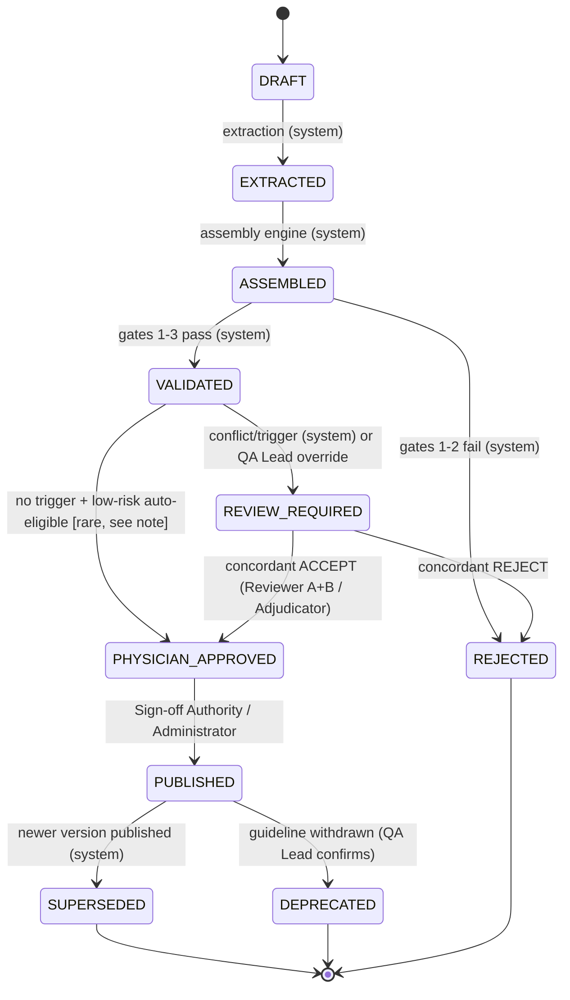

# CLINICAL_KNOWLEDGE_LIFECYCLE.md
## Clinical Knowledge Governance · P5.2 · Phase 1
## Status: PROPOSED (design only — no code, no database changes)

> Governs the transition Knowledge Objects → Clinical Regimens → Production Recommendations.
> Builds on P5.1 (`CLINICAL_REGIMEN_MODEL.md`, `REGIMEN_ASSEMBLY_ENGINE_RFC.md`,
> `REGIMEN_VALIDATION_GATES.md`) and P5.0 (`SINGLE_SOURCE_OF_TRUTH_RFC.md`). This document also
> resolves **RC-022** (status vocabulary drift) — the 9-state model below is the elaboration of the
> already-canonical Constitution lifecycle (`draft→validated→published→superseded→deprecated`), not
> a third, competing vocabulary.

## 1. Reconciliation with the existing canonical lifecycle
Two lifecycles already exist in the repository and must not be treated as separate:
- **Constitution (object-level, 5 states):** `draft → validated → published → superseded →
  deprecated` — what `RC-022` says the code should write instead of `active`.
- **Clinical Validation Framework (review sub-machine, 3 states):** `Extracted → Validated →
  Reviewed` — the review-specific refinement of the "validated" step.

The 9-state model this document defines **is** those two, unified and made precise enough for a
Regimen (not just a bare Knowledge Object) to move through mechanically:

```
DRAFT            = Constitution "draft"          (object exists, not yet extraction-complete)
   │
EXTRACTED        = Constitution "draft" (still)   (atomic fact extracted with provenance; kb_p44 object created)
   │
ASSEMBLED        = Constitution "draft" (still)   (Regimen Assembly Engine produced a ClinicalRegimen — P5.1)
   │
VALIDATED        = Constitution "validated" ∩ CVF "Validated"   (Gates 1-3 passed: required fields, provenance, safety — REGIMEN_VALIDATION_GATES.md)
   │
REVIEW_REQUIRED  = CVF "Reviewed" (in progress)   (Gate 4/5: conflict present OR mandatory-review trigger fired)
   │
PHYSICIAN_APPROVED = CVF "Reviewed" (concordant)   (Gate 5/6 passed: double-review + adjudication if needed, approved=1)
   │
PUBLISHED        = Constitution "published"       (served to the Clinical Decision Engine)
   │
SUPERSEDED       = Constitution "superseded"      (a newer version published; this version retained, not servable)
   │
DEPRECATED       = Constitution "deprecated"      (guideline withdrawn/expired; not superseded by a newer version, simply retired)
```

**Resolution of RC-022:** going forward, the `objects.status` column (and its future `Regimen`
equivalent) writes one of these 9 values, collapsing correctly to the Constitution's 5 when reported
at that granularity (`DRAFT/EXTRACTED/ASSEMBLED → draft`, `VALIDATED → validated`,
`REVIEW_REQUIRED/PHYSICIAN_APPROVED → validated` until `PUBLISHED`, then `published`, etc). This is
an additive migration (existing `active` values map to `PUBLISHED` if `validation_status=valid`,
else to `VALIDATED` or `REVIEW_REQUIRED` depending on `review_status` — exact mapping table is a
migration-execution artifact, not designed further here per STRICT MODE).

## 2. State definitions & entry/exit conditions

| State | Entry condition | Exit condition | Object types it applies to |
|---|---|---|---|
| `DRAFT` | A document enters the corpus (PDF ingested) | Extraction produces ≥1 atomic fact | Document-level, precedes any object |
| `EXTRACTED` | An atomic Knowledge Object is created with complete Provenance v2 (INV-01..17) | Assembly Engine consumes it into a candidate Regimen (P5.1 Stage A) | Knowledge Object (Dose, Medication, Contraindication, Evidence, Diagnosis) |
| `ASSEMBLED` | Regimen Assembly Engine (P5.1) produces a `ClinicalRegimen` with `assembly_trace` | Validation Gates 1-3 run | ClinicalRegimen |
| `VALIDATED` | Gates 1 (required fields), 2 (provenance), 3 (safety) all pass with no REJECT | Gate 4 (conflict check) and Gate 5 (review trigger) evaluated | ClinicalRegimen |
| `REVIEW_REQUIRED` | Gate 4 found an unresolved conflict, OR Gate 5's mandatory-review triggers fired (high-risk intersection, low confidence, novel guideline), OR any Gate 3 safety check downgraded to REVIEW | Reviewer A + Reviewer B reach concordant verdict, or Adjudicator rules | ClinicalRegimen |
| `PHYSICIAN_APPROVED` | Concordant `ACCEPT`/`ACCEPT_WITH_NOTE` from both reviewers (or Adjudicator ruling), `approved=1`, `reviewed_by`+`review_date` set (Gate 6) | Publication decision (Administrator/Release process) | ClinicalRegimen |
| `PUBLISHED` | Publication step (§Phase 7 gates all pass) | A newer version reaches `PHYSICIAN_APPROVED` (→ this becomes `SUPERSEDED`), OR guideline withdrawal (→ `DEPRECATED`) | ClinicalRegimen (the only state the Clinical Decision Engine may read under `ValidationPolicy.STRICT`) |
| `SUPERSEDED` | A new version of the same regimen identity reaches `PUBLISHED` | Terminal (retained for audit, never re-activated) | ClinicalRegimen |
| `DEPRECATED` | Source guideline withdrawn/expired, no successor version | Terminal (retained for audit, never re-activated) | ClinicalRegimen |

## 3. Who can move an object between states (authority table)

| Transition | Actor | Mechanism |
|---|---|---|
| — → `DRAFT` | System (ingestion pipeline) | Automatic, no human gate |
| `DRAFT` → `EXTRACTED` | System (Extraction: P4.4 rule-based or LLM pipeline, `KNOWLEDGE_TO_REGIMEN_PIPELINE.md` §1) | Automatic, deterministic; provenance completeness is machine-checked (INV-01..17), not human-approved |
| `EXTRACTED` → `ASSEMBLED` | System (Regimen Assembly Engine, `REGIMEN_ASSEMBLY_ENGINE_RFC.md`) | Automatic, deterministic, ruleset-versioned |
| `ASSEMBLED` → `VALIDATED` | System (Validation Gates 1-3, `REGIMEN_VALIDATION_GATES.md`) | Automatic, machine-checkable only — no human judgment gate at this step |
| `VALIDATED` → `REVIEW_REQUIRED` | System (Gates 4/5 trigger evaluation) | Automatic when triggers fire |
| `VALIDATED` → `REVIEW_REQUIRED` (mandatory even with no trigger) | **Medical QA Lead** may force any regimen into review | Manual override, logged |
| `REVIEW_REQUIRED` → `PHYSICIAN_APPROVED` | **Reviewer A + Reviewer B** (concordant), or **Adjudicator** (on disagreement) | Human, per `REVIEW_WORKFLOW_RFC.md` — never automatic |
| `REVIEW_REQUIRED` → `REJECT` (terminal, not in the 9-state happy path — see §4) | **Reviewer A + Reviewer B** (concordant reject) or **Adjudicator** | Human |
| `PHYSICIAN_APPROVED` → `PUBLISHED` | **Clinical Sign-off Authority** (existing role, `CLINICAL_VALIDATION_FRAMEWORK.md`) or delegated **Administrator** for routine, non-flagged publications | Human decision, logged (Phase 7 certification gates must all pass first) |
| `PUBLISHED` → `SUPERSEDED` | System (automatic, on new version reaching `PUBLISHED`) | Automatic — versioning is append-only, no human step needed to retire an old version once its successor is approved |
| `PUBLISHED`/`SUPERSEDED` → `DEPRECATED` | **Medical QA Lead** or **Administrator**, triggered by guideline-withdrawal detection | Human-confirmed, system-detected |
| Any state → `REVIEW_REQUIRED` (re-open) | **Medical QA Lead**, or automatic on guideline update affecting a published regimen | Logged with reason |

**Hard rule:** no automated process may move a regimen into `PHYSICIAN_APPROVED` or `PUBLISHED`.
These two transitions require a named, accountable human action, always (Gate 6 / INV-21 from
`REGIMEN_VALIDATION_GATES.md`).

## 4. Non-happy-path terminal state: REJECTED
Not in the mandate's 9-state list, but required for completeness: a regimen that fails Gate 1/2
(structural), or receives a concordant clinical REJECT (Reviewer verdict vocabulary
`REJECT_FIDELITY`/`REJECT_CLINICAL`, reused from `CLINICAL_VALIDATION_FRAMEWORK.md` §2.3), enters
`REJECTED` — terminal, retained for audit (why was this candidate regimen rejected), never served.
This is the fail-closed complement to `PUBLISHED`.

## 5. State diagram

**Note on `VALIDATED → PHYSICIAN_APPROVED` direct edge:** per `CLINICAL_VALIDATION_FRAMEWORK.md`
§2.4 ("No assertion advances to Reviewed on a single reviewer... Production requires double
review"), this direct edge should be **disabled by policy in production** — every regimen passes
through `REVIEW_REQUIRED` for at least the double-review step before `PHYSICIAN_APPROVED`, even
absent an automatic trigger. It is shown for completeness (a future, explicitly governed low-risk
fast-path) but is NOT recommended as the default — see `REGIMEN_APPROVAL_MODEL.md` §Fast-path policy.
