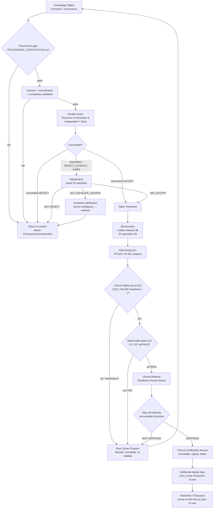

# ANTIBIO CLINICAL VALIDATION FRAMEWORK
## VERSION 1.0 — Permanent Medical Validation Framework

> **Status:** ACTIVE design document, adopted for the ANTIBIO Clinical Knowledge Platform.
> **Type:** Governance / process specification. **NOT code.** This document defines *how* ANTIBIO is
> clinically validated before any production use; it does not implement validation.
> **Precedence:** Subordinate to and governed by `docs/governance/CLINICAL_GOVERNANCE.md` (the
> Medical AI Constitution). Where any process here conflicts with a clinical-safety rule in the
> Clinical Governance / Constitution, **the Constitution wins**. This framework operationalizes the
> Constitution's `CLINICAL VALIDATION`, `HUMAN REVIEW`, `CONFIDENCE`, `EVIDENCE`, and
> `CLINICAL SAFETY` clauses into an auditable, gated, sign-off-bearing process.
> **Companion artifacts:** `GOLDEN_DATASET_SPECIFICATION.md` (the physician-authored reference
> answer set — *source of validation truth*), `PROVENANCE_CERTIFICATION.md` (traceability
> certification — *source of origin truth*), `PHYSICIAN_VALIDATION_GUIDE.md` (curation mechanics),
> `CLINICAL_KNOWLEDGE_YIELD.md` (CKY yield metric).
> **First principle of this framework:** *A recommendation is unsafe until proven safe.* Absence of
> evidence of harm is never treated as evidence of safety. Every default is fail-safe: when in
> doubt, the system withholds, downgrades, or escalates to a human — it never guesses forward.

---

## 0. Scope, Purpose, and Non-Negotiables

### 0.1 What this framework validates
ANTIBIO transforms official Ministry of Health (MoH) clinical recommendations into versioned,
traceable **Knowledge Objects (KOs)** consumed by a deterministic **Clinical Decision Engine**.
This framework validates two distinct things, which must never be conflated:

1. **Provenance correctness** — *can every KO be traced to its exact origin?* Owned by
   `PROVENANCE_CERTIFICATION.md`. A KO can be perfectly traceable and still be clinically wrong.
2. **Clinical correctness** — *does the engine's output match what the guideline and a qualified
   physician would recommend for a given patient?* Owned by **this document**.

Both must PASS independently. Provenance certification is a **precondition** of clinical
validation (you cannot clinically validate a KO you cannot trace), but it is not a substitute.

### 0.2 Non-negotiables (inherited from the Constitution)
- **Medical truth never originates from AI.** Validation confirms fidelity to the *source*, not to
  AI opinion. The Golden Dataset is authored by physicians against MoH guidelines, never by AI.
- **AI may NOT diagnose, prescribe, change recommendations, invent evidence, or replace physician
  judgement.** The engine surfaces guideline-derived options; a physician decides.
- **No hallucination.** Missing information is `Unknown / Missing / Needs Review` — never
  synthesized. A missing field is a *validation finding*, not a defect to be silently filled.
- **Fail-safe default.** Any unresolved ambiguity, conflict, or low confidence blocks production
  and routes to human review. `PRODUCTION_CURATED` is granted only at 0 pending / 0 invalid.

### 0.3 Out of scope
Engine performance, UI, code refactors, and non-clinical infrastructure. Those are governed by the
Engineering Playbook. This framework touches them only where they gate patient safety.

---

## 1. Roles and Authorities

Clinical validation is a **separation-of-duties** process. No single person can move a KO from
draft to production. Roles below are *functions*; one person may hold several **except** where an
independence rule forbids it (a reviewer may never adjudicate their own review; an author may never
be sole reviewer of their own extraction).

| Role | Who | Authority | Cannot |
|------|-----|-----------|--------|
| **Knowledge Author / Extraction Owner** | Engineering (Architecture Lead) | Produces KOs from source; fixes extraction/provenance defects | Approve clinical correctness of own output |
| **Reviewer A (Primary)** | Licensed physician, relevant specialty | Independent clinical review of KO / engine output vs. source | Adjudicate a disagreement they are party to |
| **Reviewer B (Secondary)** | Second licensed physician, independent of A | Independent parallel review (blind to A's verdict) | See A's verdict before submitting own |
| **Adjudicator** | Senior clinician / infectious-disease (ID) specialist, not A or B | Resolves A↔B disagreements; final clinical word on a KO | Adjudicate a case they reviewed as A or B |
| **Medical QA Lead** | Designated clinical quality owner | Owns Golden Dataset integrity, metric computation, gate verdicts | Override a sign-off authority's decision |
| **Clinical Sign-off Authority (Approver)** | Named accountable physician (e.g. Chief Medical reviewer / project medical owner) | Grants or denies **Clinical Certification** for a release scope | Delegate final accountability; certify with open blocking gates |
| **Release Board** | Sign-off Authority + Medical QA Lead + Architecture Lead | Convenes Clinical Release Readiness Review; records verdict | Certify against a failing measurable gate (§13) |

> **Independence rule (hard):** Reviewer A and Reviewer B must reach their verdicts *independently
> and blind to each other*. The Adjudicator must be a third person. This mirrors and extends
> `PHYSICIAN_VALIDATION_GUIDE.md`'s "each conflict decided separately, no auto-resolution."

---

## 2. Physician Review Workflow

The unit of review is a **Clinical Assertion** — the smallest independently-verifiable medical
statement (one drug + dose + route + frequency + duration + population qualifier, with its
indication and provenance), or one engine **decision output** for a defined patient scenario.

### 2.1 Preconditions to enter review (fail-safe gate)
A KO / assertion is eligible for physician review **only if all hold**:
1. Schema validation PASS (Constitution: `CLINICAL VALIDATION`).
2. Provenance present and self-consistent (per `PROVENANCE_SPECIFICATION.md`): source PDF,
   guideline_id, page, original wording, extractor, engine.
3. Normalization complete or explicitly flagged (`medical_normalizer`); original wording preserved.
4. Review state is `Extracted` or `Validated` (per Constitution state machine).

If any precondition fails, the item **does not enter review** — it returns to the Author with a
`Needs Provenance` / `Needs Normalization` finding. Reviewers never spend clinical judgement
compensating for a broken provenance chain.

### 2.2 Review steps (per assertion)
1. **Read the source, not the KO first.** Reviewer opens the original guideline passage (page +
   bounding box) *before* the extracted value, to avoid anchoring on the AI output.
2. **Verify fidelity.** Does the KO faithfully represent the source? (dose, unit, route, frequency,
   duration, population, indication, contraindication, evidence level, strength).
3. **Verify completeness.** Are required fields present or correctly marked Missing? A silently
   dropped contraindication is a critical finding (§10).
4. **Verify engine behaviour (for decision outputs).** For a defined patient scenario, does the
   engine surface the guideline-appropriate option(s), correctly exclude contraindicated ones, and
   correctly abstain when the guideline is silent?
5. **Record verdict + rationale + confidence** in the review ledger (§2.4). Rationale is
   **mandatory**; a bare verdict is invalid and does not count.

### 2.3 Verdict vocabulary
`ACCEPT` · `ACCEPT_WITH_NOTE` · `REJECT_FIDELITY` (KO ≠ source) · `REJECT_CLINICAL` (source
faithfully copied but clinically unsafe as surfaced — escalate; may indicate a source or scoping
problem) · `NEEDS_INFO` (blocked on missing provenance/normalization) · `ABSTAIN` (out of
reviewer's specialty — reroute).

### 2.4 Artifacts
- **Clinical Review Ledger** (append-only, one row per assertion per reviewer): `assertion_id`,
  `ko_version`, `guideline_id`, `reviewer_id`, `specialty`, `verdict`, `confidence`, `rationale`,
  `reviewed_at`, `source_ref (pdf/page/bbox)`. Mirrors the auditability of
  `diagnosis_index_decisions.json` (`decided_by` / `decided_at` / `rationale`).
- **Review state transition** recorded against the Constitution state machine
  (`Extracted → Validated → Reviewed`).

> No assertion advances to `Reviewed` on a single reviewer. Single-review is **advisory only**.
> Production requires double review (§3).

---

## 3. Double-Review Process (Two Independent Reviewers)

Every assertion destined for production is reviewed **twice, independently, blind**:

1. **Assignment.** Medical QA Lead assigns Reviewer A and Reviewer B, both competent in the
   relevant specialty, with no supervisory relationship between them for this item.
2. **Blinding.** B cannot see A's verdict, confidence, or rationale until B submits. The ledger
   enforces write-once-then-reveal.
3. **Parallel review.** Each performs the §2 workflow independently against the *source*.
4. **Concordance computation.** After both submit, the system compares verdicts:
   - **Concordant ACCEPT** (both ACCEPT / ACCEPT_WITH_NOTE) → eligible to advance to `Reviewed`.
   - **Concordant REJECT** → returns to Author with combined rationale; does not advance.
   - **Discordant** (any disagreement on ACCEPT vs REJECT, or conflicting clinical notes that
     change the recommendation) → **mandatory adjudication (§4)**. It never auto-resolves.

**Double-review acceptance threshold:** an assertion is `Reviewed` only when it has **two
independent physician verdicts that are concordant-ACCEPT**, *or* an Adjudicator ruling (§4).
Inter-reviewer agreement is tracked as a program health metric (target **Cohen's κ ≥ 0.80** across
the reviewed corpus; κ below 0.60 triggers a process review — it signals ambiguous criteria or
under-specified sources, not just reviewer error).

---

## 4. Disagreement Handling (Adjudication)

Discordance is expected and is a *feature* — it surfaces genuine clinical ambiguity. It is never
resolved by AI, by majority heuristic, or by the more senior reviewer "winning" informally.

### 4.1 Adjudication process
1. **Trigger.** Any discordant double-review, or any single `REJECT_CLINICAL`, or any assertion
   flagged by the Constitution's `HUMAN REVIEW` triggers (conflicting recommendations, multiple
   doses, conflicting duration, low confidence, ambiguous extraction, failed normalization,
   multiple interpretations).
2. **Assignment.** Medical QA Lead routes to an **Adjudicator** — a third, senior clinician (ID
   specialist where infection-management judgement is needed), independent of A and B.
3. **Materials.** Adjudicator receives: the source passage, both reviewers' verdicts + rationales,
   provenance, and the relevant Golden Dataset entry (if one exists).
4. **Ruling.** Adjudicator issues a binding `ADJ_ACCEPT` / `ADJ_REJECT` / `ADJ_ESCALATE_SOURCE`
   (the source itself is ambiguous/conflicting → route to guideline-clarification, not to
   production) with written rationale.
5. **Record.** Ruling appended to the Review Ledger with `adjudicator_id`, `ruling`, `rationale`,
   `ruled_at`, and references to A/B rows. **Immutable.** If a ruling is later revisited, a *new*
   versioned ruling is appended; the old one is never overwritten (Constitution: append-only).

### 4.2 Fail-safe on unresolved disagreement
If adjudication cannot resolve within the release window, the assertion **stays out of production**
in its safe default state (withheld / marked `Needs Review`). Shipping an unadjudicated clinical
disagreement is prohibited. A blocked assertion never silently degrades to "ship anyway."

---

## 5. Confidence Scoring

Confidence is a first-class, **never-guessed** property (Constitution: `CONFIDENCE`). It is a
composite of five documented sources, each in `[0,1]`:

| Factor | Symbol | Origin |
|--------|--------|--------|
| Source quality | `Cs` | Guideline authority & recency per Source Hierarchy (official MoH current = 1.0) |
| Extraction quality | `Ce` | Extractor/table confidence (`table_conf`), OCR/parse certainty |
| Semantic certainty | `Cm` | Normalization match strength (exact ATC/ICD map = high; fuzzy = low) |
| Validation status | `Cv` | Schema + provenance + consistency validation (binary-ish: 1.0 pass, 0 fail) |
| Human review | `Ch` | 0 = unreviewed, 0.5 = single review, 1.0 = concordant double-review/adjudicated |

**Composite confidence (per assertion):**

```
Confidence = min(Cs, Ce, Cm, Cv) × Ch_weight
where Ch_weight = 0.5 + 0.5 × Ch      (unreviewed content is capped at 0.5)
```

The **min()** is deliberate and fail-safe: the weakest link dominates. A perfectly extracted value
from an ambiguous source is low-confidence, not averaged-up. Confidence bands:

| Band | Range | Meaning | Production posture |
|------|-------|---------|--------------------|
| High | ≥ 0.85 | Strong source, clean extraction, double-reviewed | Eligible for production |
| Medium | 0.60–0.84 | Usable but review-gated | Requires human-in-the-loop display + review before use |
| Low | < 0.60 | Weak on ≥1 dimension | **Blocked** from production; `Needs Review` |

> Confidence never *raises* a recommendation into production on its own. High confidence is
> necessary but not sufficient — the §13 gates and clinical sign-off still apply.

---

## 6. Evidence Grading (tied to guideline evidence levels)

ANTIBIO **preserves and surfaces** the source guideline's own evidence grading — it never invents
or upgrades it (Constitution: `EVIDENCE`, `NO HALLUCINATIONS`). Every recommendation carries the
source's `Evidence level`, `Recommendation strength`, and `Evidence source` when the guideline
states them.

### 6.1 Normalized evidence ladder
MoH recommendations use tiered evidence/strength labels. These are mapped 1:1 to a normalized
internal ladder **without loss of the original label** (original wording preserved):

| Normalized level | Typical source meaning | Weight in Clinical Safety Score |
|------------------|------------------------|---------------------------------|
| `EL-A` / Strong | High-certainty evidence, strong recommendation | 1.0 |
| `EL-B` / Moderate | Moderate-certainty, conditional recommendation | 0.8 |
| `EL-C` / Weak | Low-certainty / expert consensus | 0.6 |
| `EL-U` / Ungraded | Guideline states no grade | 0.5 (surfaced as "ungraded") |
| `EL-MISSING` | Grade expected but not extracted | **Blocking finding** — treated as Missing, routes to review |

### 6.2 Rules
- A recommendation whose source *has* a grade but whose KO shows `EL-MISSING` is a **provenance/
  extraction defect**, not a low grade — it blocks and returns to the Author.
- Evidence grade is displayed to the physician alongside every recommendation; it is never hidden.
- Higher engine ranking of an option must be consistent with (never contradict) the source's
  strength ordering. A discordance here is a `REJECT_FIDELITY`.

---

## 7. Clinical Acceptance Criteria

For a KO / decision output to be **clinically accepted** (advance to `Reviewed` and be eligible for
certification), **all** must hold:

- **AC-1 Fidelity:** Output matches the source guideline exactly on drug, dose, unit, route,
  frequency, duration, population qualifier, indication, contraindication.
- **AC-2 Completeness:** All required clinical fields present or correctly marked Missing; no
  silently dropped contraindication/allergy/pregnancy/renal/pediatric caveat.
- **AC-3 Provenance:** Full traceable chain to source (gated by `PROVENANCE_CERTIFICATION.md`).
- **AC-4 Evidence:** Evidence level & strength preserved and surfaced (§6).
- **AC-5 Confidence:** Composite confidence ≥ threshold for its band, and the band is compatible
  with its intended production use (§5).
- **AC-6 Double-review:** Concordant double-review ACCEPT or Adjudicator ACCEPT (§3–4).
- **AC-7 Golden-Dataset concordance:** Where a Golden Dataset case covers this assertion, engine
  output matches the physician-authored expected answer (§8, §12).
- **AC-8 Safety caveats intact:** Allergy cross-class exclusions, pregnancy, pediatric weight-based
  dosing, and renal caveats are represented and correctly gate the recommendation.

Any failed criterion → the assertion is **not accepted** and takes its fail-safe state.

---

## 8. Benchmark Against Ministry of Health Guidelines (Source of Truth)

The MoH clinical recommendations are the **highest authority** in the Source Hierarchy and the
ground truth for fidelity. The primary benchmark instrument is the **Golden Dataset**
(`GOLDEN_DATASET_SPECIFICATION.md`): a physician-authored, versioned set of *(patient scenario →
expected guideline-conformant recommendation)* cases, each citing the exact guideline passage.

### 8.1 Method
1. **Case sourcing.** Golden cases are derived *from the guidelines*, not from engine output, to
   avoid circularity. Each case names the `guideline_id`, page, and passage it encodes, plus the
   expected answer authored/approved by a physician (extends the existing
   `clinical_engine/golden_cases/` set: `diagnosis_*`, `cap_*`, negative cases).
2. **Coverage requirement.** The Golden Dataset must cover, at minimum, every guideline that has an
   active production KO, including **negative cases** (scenarios where the correct answer is
   "no recommendation / not applicable / escalate") — negatives guard against over-triggering.
3. **Execution.** For each case, run the engine and compare output to expected on every field in
   AC-1/AC-2/AC-4/AC-8.
4. **Scoring.** Compute **guideline concordance** = cases fully matching expected ÷ total cases,
   reported overall and per medical-risk tier (§11).

### 8.2 Acceptance thresholds (guideline benchmark)
| Metric | Threshold for production |
|--------|--------------------------|
| Overall guideline concordance | ≥ 98% |
| Concordance on **Critical/High-risk** cases (§11) | **100%** (no exceptions) |
| Negative-case correctness (no false trigger) | 100% |
| Unresolved fidelity defects (`REJECT_FIDELITY`) | 0 |

> Critical/high-risk concordance is an absolute gate: a single wrong critical-tier answer blocks
> the entire release scope, not just that case.

---

## 9. Benchmark Against Infectious-Disease Specialists

Guideline concordance proves fidelity to the text; the **specialist benchmark** proves the engine's
*applied* behaviour is clinically sound where guidelines require interpretation (drug interactions,
allergy cross-reactivity, escalation, local resistance caveats).

### 9.1 Method
1. **Panel.** ≥ 2 independent ID specialists (or relevant-specialty physicians), distinct from the
   Golden Dataset authors, to avoid author bias.
2. **Blind scenario set.** A representative scenario sample (stratified across risk tiers and
   specialties) is answered independently by (a) the engine and (b) each specialist, blind to each
   other.
3. **Comparison.** Specialist consensus answer vs. engine answer, scored on the AC fields.
   Divergences are triaged: engine-wrong (defect), specialist-divergence-from-guideline (route to
   guideline clarification — the guideline still wins per Source Hierarchy), or genuinely ambiguous.

### 9.2 Acceptance thresholds (specialist benchmark)
| Metric | Threshold |
|--------|-----------|
| Engine–specialist agreement (overall) | ≥ 95% |
| Engine–specialist agreement on Critical/High cases | 100% |
| Unexplained engine-wrong divergences | 0 |

> Where a specialist disagrees with the *guideline* (not the engine), the engine is **not** changed
> to match the specialist — the divergence is logged and escalated to guideline governance. Medical
> truth originates from the guideline, not from an individual expert.

---

## 10. False Positive Analysis (recommending an inappropriate antibiotic)

A **False Positive (FP)** = the engine surfaces/ranks an antibiotic (or regimen) that is *not*
appropriate for the scenario: wrong drug, contraindicated drug (allergy/pregnancy/renal), wrong
dose/route/duration presented as valid, or a recommendation where the guideline indicates none.

### 10.1 Why FPs are the primary safety threat
An inappropriate recommendation can cause direct patient harm (allergic reaction, toxicity,
treatment failure, resistance). FP control is therefore the **stricter** side of the framework.

### 10.2 Method
- Every FP found in review, Golden benchmark, or specialist benchmark is logged with: scenario,
  engine output, correct output, **failure mode**, provenance of the offending KO, and **medical
  risk tier (§11)**.
- **Root cause** is traced to one of: extraction/fidelity defect, normalization error, missing
  contraindication caveat, engine ranking/logic, or source ambiguity. FPs are fixed at root cause,
  not patched per-case (consistent with the Root Cause Program in `ROOT_CAUSE_REGISTER.md`).

### 10.3 Thresholds (fail-safe: FP is weighted heavier than FN)
| FP class | Threshold for production |
|----------|--------------------------|
| **Contraindicated-drug FP** (allergy/pregnancy/renal-unsafe surfaced as valid) | **0 — absolute** |
| Critical/High-risk FP | 0 |
| Medium-risk FP rate | ≤ 0.5% of applicable cases |
| Low-risk FP rate | ≤ 2% of applicable cases, all logged with remediation plan |

---

## 11. False Negative Analysis (missing an indicated therapy)

A **False Negative (FN)** = the engine fails to surface a therapy the guideline indicates: omits a
first-line option, drops a valid alternative, or abstains where the guideline gives a clear answer.

### 11.1 Why FNs still matter (but rank second to FP)
A missed therapy can delay effective treatment. However, an FN degrades to "physician consults the
guideline directly" — the physician is always in the loop and the guideline is always traceable
(Constitution: `TRACEABILITY`). An FP actively *proposes* harm. Hence FP thresholds are stricter.
Crucially, ANTIBIO's fail-safe posture *converts* uncertainty into FNs (withhold/abstain) rather
than FPs (guess) — a deliberate, safe bias.

### 11.2 Method
- Each FN logged with scenario, missed therapy, guideline reference, failure mode, risk tier.
- Root-caused to: over-aggressive dedup/exclusion, dropped KO in build, normalization miss, or
  overly conservative engine gating.
- **Missing-therapy that is life-saving** (e.g. omitting the only indicated agent for a
  time-critical infection) is treated at **Critical** tier despite being an FN.

### 11.3 Thresholds
| FN class | Threshold |
|----------|-----------|
| Critical/High-risk FN (life-saving/time-critical omission) | 0 |
| First-line therapy omission (any tier) | 0 |
| Medium-risk FN (alternative omission) rate | ≤ 2% |
| Low-risk FN rate | ≤ 5%, logged |

> The framework **never** trades an FP reduction for a Critical FN, or vice-versa. Both critical
> tiers are 0-tolerance.

---

## 12. Medical Risk Classification (severity tiers of an error)

Every validation error is assigned a **medical risk tier** by its worst-plausible patient
consequence, independent of how the error arose. Tier drives required action and gating.

### 12.1 Risk Classification Table (error type → severity → required action)

| # | Error type | Example | Severity tier | Required action | Production gate |
|---|-----------|---------|---------------|-----------------|-----------------|
| E1 | Contraindicated drug surfaced as valid | β-lactam recommended for documented anaphylactic allergy | **CRITICAL** | Immediate block of scope; root-cause; adjudicated fix; re-benchmark 100% | **Hard block, 0-tolerance** |
| E2 | Wrong dose by clinically dangerous magnitude | 10× overdose; pediatric mg/kg mis-scaled | **CRITICAL** | Block; root-cause; dosing verification pass | Hard block, 0-tolerance |
| E3 | Omission of only indicated/time-critical therapy | No agent surfaced for time-critical infection | **CRITICAL** | Block; root-cause; FN analysis (§11) | Hard block, 0-tolerance |
| E4 | Wrong drug for indication (not contraindicated) | Non-guideline agent ranked first-line | **HIGH** | Block scope; adjudicate; fix + re-benchmark | Hard block |
| E5 | Missing safety caveat (pregnancy/renal/pediatric) surfaced without warning | Renal-dose caveat dropped | **HIGH** | Block; restore caveat; consistency re-check | Hard block |
| E6 | First-line alternative omitted | One of several first-line options dropped | **HIGH** | Block until restored or justified | Hard block |
| E7 | Wrong duration/route (non-dangerous) | 5 vs 7 days where clinically minor | **MEDIUM** | Fix + review; may ship with logged remediation if ≤ threshold | Threshold-gated (§10/§11) |
| E8 | Evidence level lost/misgraded | `EL-MISSING` where source graded | **MEDIUM** | Return to Author; restore grade | Threshold-gated |
| E9 | Normalization/label imperfection, no clinical change | Synonym display, unit formatting | **LOW** | Log; batch-fix; does not block if ≤ threshold | Threshold-gated |
| E10 | Provenance display imperfection, value correct | Page ref off-by-one, value right | **LOW** | Log; fix in provenance layer | Threshold-gated |

> **Escalation rule:** when unsure which tier applies, assign the **higher** tier (fail-safe). Tier
> is set by a physician (Reviewer/Adjudicator), never by AI.

---

## 13. Clinical Safety Score (composite metric)

The **Clinical Safety Score (CSS)** is a single 0–100 composite that gates certification. It is
*not* an average that lets strengths hide weaknesses — it is dominated by critical-error terms and
**hard-zeroed** by any critical failure.

### 13.1 Definition

```
Let, over the validated scope (Golden Dataset + specialist benchmark):

  N            = total applicable evaluated cases
  FP_c, FN_c   = count of CRITICAL false positives / false negatives
  FP_h, FN_h   = count of HIGH false positives / false negatives
  FP_m, FN_m   = count of MEDIUM errors (FP+FN)
  FP_l, FN_l   = count of LOW errors (FP+FN)
  Concord      = guideline concordance fraction (§8)   in [0,1]
  SpecAgree    = specialist agreement fraction (§9)     in [0,1]
  RevCov       = double-review coverage fraction        in [0,1]
  ProvCert     = 1 if PROVENANCE_CERTIFICATION.md = CERTIFIED for scope, else 0

Weighted error penalty (per 100 cases):
  Penalty = ( 50·(FP_c+FN_c)                      # critical dominate
            + 12·(FP_h+FN_h)
            +  3·(FP_m+FN_m)
            +  0.5·(FP_l+FN_l) ) / N × 100

Base quality:
  Quality = 100 × (0.45·Concord + 0.25·SpecAgree + 0.20·RevCov + 0.10·ProvCert)

Clinical Safety Score:
  CSS = max(0, Quality − Penalty) × HardGate

  HardGate = 0  if ANY of:
                (FP_c + FN_c) > 0                         # any critical error
                contraindicated-drug FP > 0              # E1, absolute
                Critical/High guideline concordance < 100%
                ProvCert = 0                              # scope not traceable
                any unadjudicated clinical disagreement
             else 1
```

### 13.2 Interpretation and thresholds

| CSS | Meaning | Disposition |
|-----|---------|-------------|
| **0** | A hard gate tripped (critical error / untraceable / unadjudicated) | **NOT production-ready. Blocked.** No override. |
| 1–89 | No critical failure, but quality/penalty below bar | Not production-ready; remediate + re-validate |
| **90–100** | All hard gates pass; quality high, residual errors within Medium/Low thresholds | **Eligible** for clinical certification (still requires sign-off §16) |

> **CSS ≥ 90 AND HardGate = 1** is *necessary but not sufficient*. It makes a scope **eligible**;
> the Sign-off Authority still exercises judgement (§16). A high CSS never auto-certifies.

---

## 14. Approval Workflow

Approval is staged; each stage has an owner, an entry gate, and an immutable record.

```
Extracted ──▶ [Provenance gate] ──▶ Validated ──▶ [Double review] ──▶ Reviewed
   (Author)      (Prov. Cert.)        (QA Lead)      (Rev A + B)        (concordant/ adjudicated)
                                                                            │
                                                                            ▼
                                                              [Benchmark + CSS gate (§8,9,13)]
                                                                            │
                                                                            ▼
                                                        Clinical Release Readiness Review (Board)
                                                                            │
                                                                            ▼
                                                        Clinical Certification (Sign-off Authority)
                                                                            │
                                                                            ▼
                                                        Published (production) / else back to remediation
```

Each transition records: `who`, `when`, `evidence (ledger/benchmark/CSS refs)`, `verdict`,
`rationale`. Transitions are append-only; a reversal creates a new versioned transition
(Constitution: append-only, immutable KOs).

---

## 15. Human-in-the-Loop Review (decisions that ALWAYS require a human)

Per the Constitution's `HUMAN REVIEW` and `AI LIMITATIONS` clauses, the following **always** route
to a human and can never be resolved by AI or auto-promoted:

1. **Any clinical conflict** — conflicting recommendations, multiple doses, conflicting duration,
   conflicting pediatric/pregnancy/renal advice.
2. **Any low-confidence** (< 0.60) or Medium-confidence item intended for production use.
3. **Any ambiguous extraction / failed normalization / multiple interpretations.**
4. **Any Critical or High risk-tier error or scenario** (§12).
5. **Any contraindication/allergy cross-class decision** (e.g. β-lactam cross-reactivity).
6. **Any negative recommendation with clinical weight** (system says "no therapy / escalate").
7. **Every final recommendation shown to a physician in production** is presented *as
   decision-support with full provenance*, for the physician to accept or override — the system
   never prescribes. Human-in-the-loop is permanent at point of care, not just at validation time.

> **Fail-safe default at the point of care:** if the engine cannot produce a confident,
> guideline-traceable answer, it **abstains and surfaces the guideline reference** rather than
> guessing. Abstention is always a safe, allowed output.

---

## 16. Certification Workflow

Certification is the formal grant that a defined **release scope** (a named set of guidelines/KOs)
is clinically production-ready. It mirrors the evidence-gated model of
`PROVENANCE_CERTIFICATION.md` (measured gates, no code changes during certification, failing gates
open a Root Cause Program rather than being patched mid-audit).

### 16.1 Steps
1. **Freeze.** Content freeze on the scope; no KO edits during certification.
2. **Assemble evidence.** Medical QA Lead compiles: Review Ledger (double-review complete),
   adjudication records, Golden benchmark results (§8), specialist benchmark (§9), FP/FN analyses
   (§10/§11), risk-tier log (§12), computed **CSS** (§13), and the current
   `PROVENANCE_CERTIFICATION.md` verdict for the scope.
3. **Verify measurable gates (§17).** Each gate is marked PASS/FAIL with evidence. Any FAIL →
   certification denied; Root Cause Program opens for that gate; **no mid-audit patching**.
4. **Clinical Release Readiness Review.** The Release Board convenes, reviews the evidence pack,
   and records a verdict.
5. **Sign-off (§16.2).**
6. **Record.** Certification decision, scope, evidence references, CSS, gate table, and signatures
   are written to a **Clinical Certification Record** (immutable, versioned, dated).

### 16.2 Sign-off authority and what gets recorded
- **Authority:** the named **Clinical Sign-off Authority** (accountable physician) grants or denies.
  This authority is personal and non-delegable for the certification decision.
- **Recorded, permanently:**
  - Scope (guideline_ids / KO version set) and `guideline_set_version`.
  - Verdict: `CERTIFIED` / `NOT CERTIFIED`, with per-gate PASS/FAIL table.
  - CSS value and HardGate status.
  - Named signatories: Sign-off Authority, Medical QA Lead, Architecture Lead, reviewer roster.
  - Date, evidence-pack references, and any conditions/limitations of use.
  - For `NOT CERTIFIED`: the blocking gate(s) and the opened Root Cause Program reference.

### 16.3 Final clinical acceptance
A scope becomes **Published / production-eligible** only upon `CERTIFIED`. Deployment remains a
**separate, deliberate step** (per `PHYSICIAN_VALIDATION_GUIDE.md` §5 and the Production Guard: an
engine in `strict_mode` refuses to run on non-`PRODUCTION_CURATED` resources). Certification does
not auto-deploy; a human performs the deploy after certification.

---

## 17. "Clinically Production-Ready" — Measurable Gates

A release scope is **clinically production-ready** if, and only if, **every** gate below is a
measured PASS on the full scope (not a sample, not a projection). This is the binding definition.

| # | Gate | Measure | Threshold (PASS) |
|---|------|---------|------------------|
| G1 | Provenance certified | `PROVENANCE_CERTIFICATION.md` verdict for scope | CERTIFIED (all §4 gates PASS) |
| G2 | Schema/normalization validation | Constitution `CLINICAL VALIDATION` pass rate | 100% of production KOs |
| G3 | Double-review coverage | Assertions with concordant double-review or adjudication | 100% of production assertions |
| G4 | Adjudication closure | Open clinical disagreements | 0 |
| G5 | Guideline concordance (overall) | Golden Dataset match rate (§8) | ≥ 98% |
| G6 | Critical/High concordance | Golden Dataset match on Critical+High cases | **100%** |
| G7 | Negative-case correctness | No-trigger cases correct | 100% |
| G8 | Specialist agreement | Engine–specialist agreement (§9) | ≥ 95% overall; 100% Critical/High |
| G9 | Contraindicated-drug FP (E1) | Count | **0** |
| G10 | Critical FP + FN | Count | **0** |
| G11 | High FP/FN | Count | 0 |
| G12 | Medium/Low error rates | §10/§11 rates | ≤ stated thresholds, each logged |
| G13 | Confidence floor | Production KOs below Low band (< 0.60) | 0 in production |
| G14 | Evidence integrity | `EL-MISSING` on graded sources | 0 |
| G15 | Clinical Safety Score | CSS (§13) | ≥ 90 **and** HardGate = 1 |
| G16 | Curation status | Resource curation state | `PRODUCTION_CURATED` (0 pending / 0 invalid) |
| G17 | Signed certification | Clinical Certification Record | `CERTIFIED`, signed by Sign-off Authority |

> If any gate is not *measured*, it is treated as FAIL (unknown = unsafe). "We expect it passes" is
> never a PASS. This mirrors `PROVENANCE_CERTIFICATION.md`: PENDING ≠ PASS.

---

## 18. Validation Workflow Diagram



---

## 19. Tie-ins (governing and companion artifacts)

- **`docs/governance/CLINICAL_GOVERNANCE.md` (Medical AI Constitution) — GOVERNS this framework.**
  This document operationalizes its clauses: Source Hierarchy (§8/§9 benchmark ordering),
  `CLINICAL VALIDATION` (§7/§17 gates), `HUMAN REVIEW` triggers (§15), `CONFIDENCE` (§5), `EVIDENCE`
  (§6), `NO HALLUCINATIONS` (Missing ≠ invented, throughout), append-only immutability (§4/§14/§16),
  and `CLINICAL SAFETY` (fail-safe defaults, patient safety overrides everything).
- **`GOLDEN_DATASET_SPECIFICATION.md` — the validation source of truth.** Physician-authored,
  guideline-cited expected answers; drives §8 concordance, §7 AC-7, and CSS `Concord`. Extends the
  existing `clinical_engine/golden_cases/` set. *(Companion spec; to be maintained alongside this
  framework.)*
- **`PROVENANCE_CERTIFICATION.md` — the origin source of truth.** Its CERTIFIED verdict is a hard
  precondition (G1) and a CSS `ProvCert` input. Same certification philosophy: measured gates, no
  mid-audit patching, PENDING ≠ PASS.
- **`PHYSICIAN_VALIDATION_GUIDE.md`** — curation mechanics and the `AUTO_GENERATED_DRAFT →
  PARTIALLY_CURATED → PRODUCTION_CURATED` fail-safe status model (G16); audit-trail pattern reused
  by the Review Ledger.
- **`CLINICAL_KNOWLEDGE_YIELD.md` (CKY)** — yield/coverage north-star; ensures validation coverage
  tracks real clinical knowledge, not just the easy subset.
- **`ROOT_CAUSE_REGISTER.md` / Root Cause Program** — every failing gate opens a root-cause item;
  errors are fixed at cause, not patched per-case.
- **Production Guard (`strict_mode`, `RESOURCE_NOT_CURATED`)** — the runtime fail-safe that refuses
  to serve non-certified/non-curated resources (§16.3).

---

## 20. Governing Principle

Every clinical recommendation ANTIBIO surfaces in production must answer the Constitution's three
questions — *Where did it come from? Why is it correct? Can it be independently verified?* — **and**
this framework's fourth: *Has a qualified human accepted it, and can that acceptance be shown?*
If any answer is missing, the recommendation is not clinically production-ready, and the fail-safe
default holds: **withhold, downgrade, or escalate to a human — never guess forward.**

*End of Clinical Validation Framework v1.0.*
