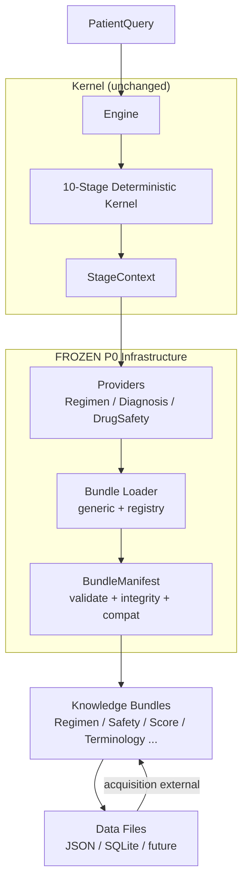

# P0_COMPLETION_REPORT.md — ANTIBIO Infrastructure Foundation

**Milestone:** P0 — Knowledge Foundation  
**Status:** COMPLETE + FROZEN (2026-07-10)  
**Gate:** P0 Phase Gate Review accepted. P0 officially closed.  
**Purpose:** Permanent standalone reference. Any engineer/AI can understand the entire infrastructure foundation without history.  
**Baseline Date:** 2026-07-10  
**Rule:** No changes to frozen components without new RFC. Repository = single source of truth.

---

## 1. Objectives Achieved

- Establish Ports & Adapters + Knowledge-as-Data architecture (v3).
- Decouple kernel from concrete readers via stable Provider ports.
- Introduce versioned immutable knowledge bundles with manifest governance.
- Deliver generic, pure-infrastructure Bundle Loader (no domain knowledge).
- Wrap existing resources behind bundles while preserving 100% identical behavior.
- Freeze infrastructure contracts so future work (evaluation, terminology, logic) builds on stable base.
- Enforce permanent workflow: Analysis → RFC (light) → Impl → Tests → Acceptance → Freeze → Docs + Audit + Handoff.
- Achieve 0 regression on core engine (1159+ tests baseline).
- Enable future extension (new bundle formats, data sources) via registry/adapters only.

All P0 objectives from ENGINEERING_MASTER_PLAN and DEVELOPMENT_BACKLOG Phase 0 met.

---

## 2. Components Delivered

- **P0-1 BundleManifest Specification**  
  JSON Schema, typed dataclass, validator, loader, examples, tests.

- **P0-2 Provider Ports**  
  Abstract ports + thin adapters over readers. DI into Engine/StageContext. Incremental stage migration. Equality verification.

- **P0-3 Bundle Loader**  
  Generic infrastructure loader with manifest validation, compatibility, integrity (hash), pluggable format registry. Pure (no medical/reader/provider/decision logic).

- **P0-4 Bundle Wrapping (Checklist Migration)**  
  Real content hashes on manifests. Resource wrapping for diagnosis_index, drug_reference (db/index.json), clinical_constants, score_profiles. Loader discovery + smoke. Config flag. No architecture changes.

- Supporting: P0-4_Checklist.md, P0_Phase_Gate_Review.md, updated handoff/status docs.

---

## 3. Frozen Contracts

All of the following are **FROZEN**. Changes require new RFC.

- Architecture v3 (ARCHITECTURE_V3.md + ENGINEERING_MASTER_PLAN.md)
- BundleManifest (fields, versioning axes: schema_version/version/requires_kernel/bundle_format, I10 forward compat)
- bundle_manifest.schema.json (draft-07, additionalProperties tolerant)
- Manifest validator + loader API (manifest.py)
- Provider Ports (RegimenProvider, DiagnosisProvider, DrugSafetyProvider contracts + adapters)
- Bundle Loader (lifecycle, registry pattern, pure infra guarantees)
- Bundle Wrapping pattern (manifests + loader usage)
- P0 engineering contracts and workflow rule

---

## 4. Public APIs

**Bundle / Manifest (clinical_engine/manifest.py + __init__.py)**  
- `BundleManifest` (frozen dataclass with all P0-1 fields; unknown optionals dropped per I10)  
- `validate_manifest(manifest: dict) -> None`  
- `load_manifest(data: dict | str | Path) -> BundleManifest`  

**Bundle Loader (clinical_engine/bundles/loader.py + __init__.py)**  
- `BundleLoader(strict=True, engine_version="1.0.0")`  
- `register_bundle_format(bundle_format: str, handler: Callable[[Path, BundleManifest], Any])`  
- `load_bundle(path: str|Path, *, strict=True) -> LoadedBundle`  
- `LoadedBundle(manifest, resource, bundle_path, verified, warnings)`  
- `BundleLoadError(code, message, bundle_path)`  

**Providers (via readers + pipeline)**  
- `DiagnosisProvider.lookup(diagnosis: str|None, icd10: str|None) -> list[DiagnosisEntry]`  
- `RegimenProvider.load_regimens(guideline_ids: tuple[str,...], policy=STRICT) -> list[RecommendationCandidate]`  
- `DrugSafetyProvider.get_drug_info / resolve_drug_ref / get_*`  

**Engine / Config**  
- `Engine(config: EngineConfig)`  
- `Engine.recommend(query: PatientQuery) -> RecommendationSet`  
- `EngineConfig(..., use_provider_ports=False, use_bundles=False, strict_mode=True, ...)`  
- `Profiles.production/research/development/audit(sqlite_path)`  

**Other stable**  
- All models (frozen dataclasses/enums), ClinicalConstants, ScoreWeights, StageContext (now with providers), PipelineStage protocol.

---

## 5. Feature Flags

- `use_provider_ports: bool = False` (P0-2) — legacy readers vs provider ports coexist. Default preserves exact prior behavior.
- `use_bundles: bool = False` (P0-4) — direct resource paths vs BundleLoader. Additive, identical output.
- `strict_mode: bool = True` (pre-P0, Milestone 13) — Production Guard on uncurated index.
- All flags additive. Legacy paths remain for rollback. Review/prune post-P0 gate + evaluation.

---

## 6. Known Technical Debt (if any)

- Transition flags (use_provider_ports, use_bundles) coexist with legacy direct paths (intentional for migration; documented for later cleanup).
- sqlite often supplied externally (loader returns path/handle; full bundle packaging deferred).
- Example manifests updated with real hashes but remain alongside legacy direct loads.
- No per-resource bundle packaging dir structure yet (P0-4 used sidecar manifests + discovery).
- Production Guard still partially inspects raw meta (full migration to manifest.curation_status in follow-up).
- No cryptographic signature verification yet (stubs only; future adapter).

All debt explicitly tracked. No hidden permanent hacks.

---

## 7. Deferred Work

- Full engine/config wiring to always prefer bundles (P0-4 partial; smoke sufficient).
- P0-5 style legacy reader removal (post evaluation).
- Terminology Layer (ATC/ICD binding) — deferred in favor of Evaluation.
- Evaluation & Assurance (golden cases, regression, A/B/C coverage, metrics) — next priority.
- Guideline Logic Layer, Search, Offline+Sync, Governance, Provenance, etc. (per master plan).
- Real physician-curated diagnosis_index + golden cases (human task).
- H1 (per-recommendation Evidence) — closed for v1.

---

## 8. Acceptance Summary

- All P0 items passed checklists + gate.
- 100% identical engine behavior (legacy path unchanged).
- Loader pure infrastructure: no medical, reader, provider, or decision logic.
- Generic: new formats = register handler only (no loader modification).
- Frozen contracts respected.
- Workflow followed end-to-end.
- 0 regression.
- Gate review accepted: P0 foundation solid.

---

## 9. Final Architecture Diagram

**Layers (from Architecture v3):**  
Execution Kernel (const) | Providers (ports) | Loader (infra) | Manifests (governance) | Bundles (versioned data) | Acquisition (outside).

Variability in data/bundles. Kernel deterministic.

---

## 10. Lessons Learned

- Strict "Analysis first + lightweight RFC + pure contracts" prevents architecture drift.
- "No medical logic in loader" + "wrap only" guarantees ports remain stable.
- Registry + I10 + frozen manifest = true extensibility without modification.
- Checklist format (P0-4) sufficient once contracts exist; avoids unnecessary design docs.
- Coexistence (flags + legacy) enables safe migration and rollback.
- Phase gate (non-RFC) is effective closure mechanism.
- Pure infrastructure separation makes clinical work (next) safer.

---

## 11. Definition of the New Baseline

From 2026-07-10:

- Architecture v3 + Engineering Master Plan = frozen reference.
- All P0 components (Manifest + Loader + Providers + Wrapping) = stable foundation.
- Engine = `(PatientQuery + Knowledge via Bundles + Config) → RecommendationSet` (deterministic).
- Any new work (P1+) must use the above or justify via RFC.
- Workflow mandatory for all future items.
- "Infrastructure Foundation = Frozen" declaration active.

---

## 12. Exit Criteria Proving P0 Complete

- [x] All 4 P0 items delivered and accepted (P0-1 frozen, P0-2 ports frozen, P0-3 loader frozen, P0-4 wrapping via checklist).
- [x] Gate review accepted by user.
- [x] No changes to frozen contracts without RFC.
- [x] 0 regression on core behavior and tests.
- [x] Loader is pure infrastructure (verified in code + tests + docs).
- [x] Generic extension proven (registry, no core edits for new types).
- [x] All documentation updated + consistency audit passed.
- [x] Cross-IDE handoff complete (HANDOFF, SESSION_SUMMARY, etc.).
- [x] P0_COMPLETION_REPORT.md exists as standalone reference.
- [x] Phase gate confirms: foundation solid, temps reviewed, flags tracked, documentation complete.
- [x] Official P0 close + baseline declared.

**P0 COMPLETE. Infrastructure Foundation Frozen.**

Next phase planning may begin only after this report + all updates + audit + handoff.
