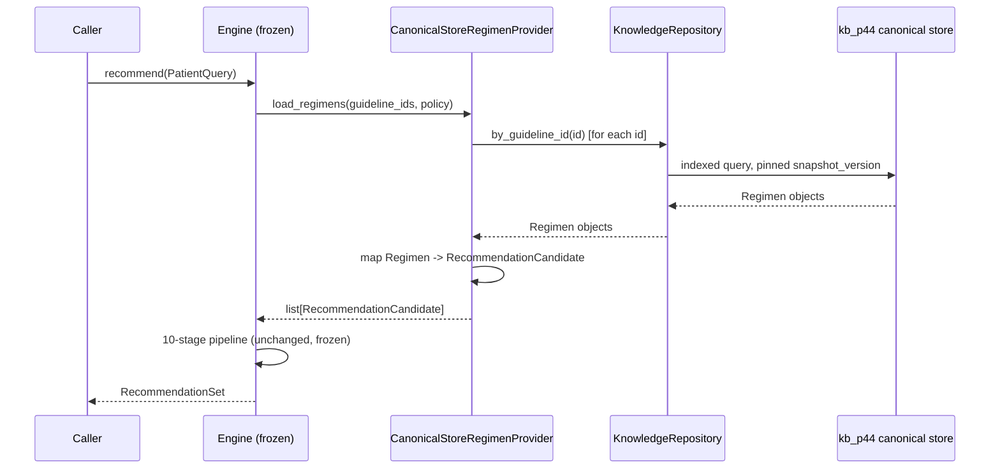

# P5_MIGRATION_MASTER_PLAN.md
## Knowledge Platform Migration — Single Source of Truth · Master Plan
## P5.0 Enterprise Architecture Program · 2026-07-15
## Status: PROPOSED (documentation only — no implementation, no code, no migration executed)

> Read `EXECUTIVE_SUMMARY.md` first. This document is the full narrative connecting all Phases
> 1–10 of the mandate; the six companion RFCs (`SINGLE_SOURCE_OF_TRUTH_RFC.md`,
> `KNOWLEDGE_PLATFORM_MIGRATION_RFC.md`, `CLINICAL_ENGINE_ADAPTER_RFC.md`, `QUERY_LAYER_RFC.md`,
> `DECISION_MATRIX.md`, `RISK_REGISTER.md`) contain the detail; this document is the index and the
> connective narrative a new architect reads to understand how they fit together.

---

## Phase 1 — Current state analysis (full detail)

### 1.1 Every reference located (grep-verified, 2026-07-15)
- `medical_normalizer` (the frozen normalization package): referenced by
  `clinical_engine/engine.py`, `clinical_engine/readers/sqlite_reader.py`,
  `clinical_engine/tools/build_normalized_sqlite.py`, all of `medical_normalizer/*.py` (its own
  implementation + tests), and `src/pipeline/extraction/semantic.py` (a separate, smaller usage —
  **not verified in this pass whether this is a real dependency or a coincidental name match; flag
  for execution-phase confirmation**).
- `normalized_regimens` (table/file): referenced by `clinical_engine/api/service.py`,
  `clinical_engine/corpus/{locator,provenance}.py`, `clinical_engine/golden_cases/runner.py`, ten
  `clinical_engine/tests/*.py` files, `clinical_engine/tools/{build_normalized_sqlite,
  build_curated_regimens, build_regimen_ledger, clinical_data_audit, performance_audit,
  regimen_review_workbench, validate_regimen_curation}.py`, and `medical_normalizer/db.py` (its
  owner).
- `kb_p44` / `KnowledgeBase` class: referenced by `build_p44_kb.py`,
  `src/pipeline/knowledge_base.py` (owner), `src/pipeline/knowledge_coverage.py`,
  `src/pipeline/knowledge_invariants.py`, and a set of root-level one-off diagnostic scripts
  (`_p44_*.py`, `_migrate_p44.py`, `_verify_migration.py` — these are ad hoc tools, not part of the
  designed architecture; **candidates for RC-004 repo-clutter cleanup**, not part of this migration).

### 1.2 Ownership table

| Store | Writer(s) | Reader(s) | Owner (by convention) | Migrates via | Validates via |
|---|---|---|---|---|---|
| `metadata.sqlite::antibiotic_regimens` | `src/pipeline/database.py::save_regimens()`, called from `src/pipeline/main.py cmd_knowledge` | `clinical_engine/tools/build_normalized_sqlite.py` (batch, one-time-per-build) | LLM extraction pipeline (`main.py`/`src/pipeline/main.py`) | No formal migration tool found — table recreated via `save_regimens()`'s `DELETE FROM antibiotic_regimens` + re-insert (full replace, not incremental) | `cmd_validate` (GLM validation pass) before `cmd_knowledge` writes it |
| `normalized_regimens.sqlite` | `clinical_engine/tools/build_normalized_sqlite.py` only | `clinical_engine/readers/sqlite_reader.py::SQLiteReader`, `clinical_engine/corpus/provenance.py`, `clinical_engine/golden_cases/runner.py`, various `clinical_engine/tools/*` | Clinical Decision Engine team (frozen-spec-governed) | `build_normalized_sqlite.py` does a full rebuild (`out_path.unlink()` then rewrite) — no incremental migration | `medical_normalizer/validator.py` (per-regimen, at normalize time), `clinical_engine/tools/validate_regimen_curation.py` |
| `kb_p44.db` | `src/pipeline/knowledge_base.py::KnowledgeBase.add_document()` exclusively, driven by `build_p44_kb.py` | Nothing in production; `src/pipeline/knowledge_{coverage,invariants}.py` + `src/pipeline/extraction/semantic_yield_audit.py` (audit tools only) | P4.4 (this project's own recent work) | `KnowledgeBase._migrate_add_column()` (additive schema evolution, see RC-016...RC-018 history) | `knowledge_invariants.py` (INV-01..17), certified 2026-07-15 |

### 1.3 What is NOT known (explicitly, per the mandate's "state unknown if unprovable" rule)
- Whether `review_status`/`reviewed_by`/`approved` columns in `normalized_regimens.sqlite` are
  populated with real data (MR-5, Risk Register).
- Whether the engine is deployed/receiving production traffic today (MR-8).
- The current `Engine.recommend()` performance baseline (MR-3).
- Whether `medical_normalizer`'s "frozen" designation permits new callers (MR-4).
- Whether `src/pipeline/extraction/semantic.py`'s `medical_normalizer` reference is a real
  dependency (§1.1).

---

## Phase 2 — Canonical data flow

### 2.1 Current state (component diagram)
```
┌──────────────┐     ┌──────────────────┐     ┌─────────────────────┐
│  PDF Corpus   │────▶│ LLM Pipeline      │────▶│ metadata.sqlite      │
│ (clinrec_     │     │ main.py /          │     │  antibiotic_regimens │
│  downloader)  │     │ src/pipeline/      │     │  (2,675 rows,         │
│               │     │ main.py            │     │   100% validated)     │
│               │     │ extract_raw→       │     └──────────┬────────────┘
│               │     │ validate→knowledge  │                │
│               │     └──────────────────┘                │ build_normalized_sqlite.py
│               │                                           │ (+ medical_normalizer, FROZEN)
│               │                                           ▼
│               │                                ┌───────────────────────┐
│               │                                │ normalized_regimens    │
│               │                                │  .sqlite (2,675 rows)   │
│               │                                └──────────┬──────────────┘
│               │                                            │ SQLiteReader
│               │                                            ▼
│               │                                ┌───────────────────────┐
│               │                                │ Clinical Decision       │
│               │                                │ Engine (FROZEN spec)     │
│               │                                └───────────────────────┘
│               │
│               │     ┌──────────────────┐     ┌─────────────────────┐
│               │────▶│ P4.4 Pipeline      │────▶│ kb_p44.db             │
│               │     │ build_p44_kb.py     │     │  31,336 objects        │
│               │     │ Layout+Semantic      │     │  (certified, 2026-07-15)│
│               │     │ (rule-based, no LLM)  │     └──────────┬────────────┘
│               │     └──────────────────┘                │
└──────────────┘                                            ▼
                                                    (nothing reads this
                                                     in production today)
```
Two convergent extraction paths, two independent serving stores, one of which (`kb_p44.db`) is
currently orphaned from the serving side. This is RC-019 (`ENTERPRISE_ARCHITECTURE_REVIEW.md` EAR-1),
now precisely characterized per Phase 1 above.

### 2.2 Future state (target, post-migration)
```
┌──────────────┐     ┌──────────────────┐
│  PDF Corpus   │────▶│ LLM extraction     │──┐
│               │     │ (extract+validate)  │  │
│               │     └──────────────────┘  │
│               │                              │  both map into the
│               │     ┌──────────────────┐  │  SAME canonical contract
│               │────▶│ P4.4 rule-based     │──┤
│               │     │ layout extraction    │  │
│               │     └──────────────────┘  │
└──────────────┘                              ▼
                                    ┌────────────────────────┐
                                    │  kb_p44 canonical store   │
                                    │  (Provenance Spec v2 +      │
                                    │   new Regimen aggregate)      │
                                    └──────────┬─────────────────┘
                                                │  KnowledgeRepository
                                                │  (QUERY_LAYER_RFC.md)
                                                ▼
                                    ┌────────────────────────┐
                                    │ CanonicalStoreRegimen-   │
                                    │ Provider implements       │
                                    │ RegimenProvider (existing  │
                                    │ port, sqlite_reader.py)      │
                                    └──────────┬─────────────────┘
                                                │
                                                ▼
                                    ┌────────────────────────┐
                                    │ Clinical Decision Engine  │
                                    │ (FROZEN, unchanged)          │
                                    └────────────────────────┘
```

### 2.3 Transition state (during Migration Phases 1–4)
Both diagrams' right-hand sides coexist: the engine still reads `normalized_regimens.sqlite` via
the existing `RegimenProviderAdapter`, while `CanonicalStoreRegimenProvider` is built and shadow-
validated (Migration RFC Phase 3/4) without being wired to `Engine` in production. See the Migration
RFC's phase-by-phase description for the exact sequencing; see `CLINICAL_ENGINE_ADAPTER_RFC.md` §2
for the corrected (existing-port-based) component diagram.

### 2.4 Sequence diagram — a recommendation request, future state


### 2.5 Dependencies & ownership (future state)
- `KnowledgeRepository` and the `Regimen` schema extension: owned by the Knowledge Platform
  side (P4.4/P5 lineage) — same team/process that owns `kb_p44.db` today.
- `CanonicalStoreRegimenProvider`: the seam between the two — owned jointly, reviewed against the
  frozen spec by whoever owns Clinical Engine governance.
- `Engine`, `RecommendationCandidate`, `ValidationPolicy`, the 10-stage pipeline: unowned by this
  migration — frozen, referenced only.

---

## Phase 3–9 — see companion RFCs
This master plan intentionally does not restate Phases 3 (SSOT design), 4 (migration strategy), 5
(engine adaptation, query layer), 6 (risk), 8 (decision matrix) — each has its own document, listed
in `EXECUTIVE_SUMMARY.md`'s table, to keep each reviewable independently. Phase 9 (exit criteria) is
summarized in `EXECUTIVE_SUMMARY.md` §Phase 9 and detailed inside `KNOWLEDGE_PLATFORM_MIGRATION_RFC.md`'s
per-phase exit gates.

## Phase 10 — Final verdict
See `EXECUTIVE_SUMMARY.md` §Phase 10 for the direct six-question answer set (Board-style,
non-repeated here to avoid drift between two copies of the same verdict).

---

## Success criterion self-check
Per the mandate: *"another senior architect should be able to implement the entire migration
without making architectural decisions from scratch."* This package makes the following decisions
explicitly, so execution does not require re-deciding them:
1. Canonical contract = `kb_p44`'s Provenance Spec v2, extended with `Regimen` (not a swap to
   `normalized_regimens`'s schema, not a new third schema).
2. Engine integration point = the EXISTING `RegimenProvider` port — a new sibling implementation,
   not a new abstraction, not a change to `Engine`.
3. Migration sequencing = five additive, independently-rollback-able phases, cutover is a config
   flip, never a data migration under load.
4. `medical_normalizer`'s logic is reused as a library in the new ingestion mapper; its FILE
   (`normalized_regimens.sqlite`) is retired post-compatibility-window, not its logic.
5. Where facts are genuinely missing (frozen-spec fields the canonical model doesn't yet supply,
   MR-2), the answer is: enumerate and close the gap in Migration Phase 1, not paper over it with a
   default.

What execution still must decide (deliberately left open, marked UNKNOWN, not guessed): the
performance baseline number (MR-3), whether human approvals already exist in
`normalized_regimens.sqlite` (MR-5), the real deployment/traffic model (MR-8), and the frozen-scope
interpretation of `medical_normalizer` (MR-4). These require reading data or asking the project
owner, not architectural judgment — correctly left for execution time, not invented here.
