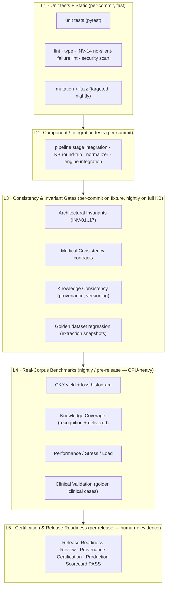

# ANTIBIO — Production Quality Assurance Program
## VERSION 1.0 · Design Specification · created 2026-07-15

> **Purpose.** This is the end-to-end design of ANTIBIO's production Quality Assurance system: the
> complete set of test disciplines, their gates, and their wiring into Continuous Integration. It
> is the design that closes **RC-007** ("No CI pipeline — no automated test/regression gate") and
> **PR-006**. It is a *design document* — it specifies what to build, how each layer gates a
> release, and how every layer ties back to the artifacts ANTIBIO already has: the Architectural
> Invariants, the Root Cause Register, Clinical Knowledge Yield (CKY), Knowledge Coverage, the
> Provenance Specification/Certification, and the Production Scorecard.
>
> **Governed by** `docs/governance/` (Autonomous Engineering Kernel → Constitution → Playbook →
> AI OS → Clinical Governance → Repository Intelligence). Where any QA rule here conflicts with a
> clinical-safety rule in `docs/governance/CLINICAL_GOVERNANCE.md`, **the clinical rule wins**
> (patient safety overrides performance, convenience, automation, speed). Frozen scope
> (Clinical Decision Engine, approved medical content, deterministic treatment logic, bundle
> schemas) is not modified by QA work — QA *verifies* it, never rewrites it.
>
> **Prime QA directive.** The objective of QA is not "green tests". It is to guarantee, with
> evidence, that every Knowledge Object shown to a physician can answer the three governing
> questions — *Where did it come from? Why is it correct? Can it be independently verified?* — and
> that no change silently lowers **CKY**, breaks a **provenance invariant**, or violates a
> **medical-consistency contract**.

---

## 0. Scope, principles, and non-negotiables

**In scope:** the knowledge pipeline (`src/pipeline` + `src/pipeline/extraction`), the Knowledge
Base persistence layer, the medical normalizer (`medical_normalizer`), the medical dictionary, and
the Clinical Decision Engine (`clinical_engine`) as a *verification target* (frozen — tests may not
change its behavior).

**QA principles (inherited from governance):**

1. **Real execution only.** CKY, Coverage, performance, and clinical-consistency numbers are
   measured against a real corpus KB, never against synthetic or mocked runs
   (`CLINICAL_KNOWLEDGE_YIELD.md` rule: "measured on real corpus execution only").
2. **Repository is authoritative.** Test truth order = Repository → Code → Tests → Real execution →
   Documentation → Conversation. A test that disagrees with measured real execution is the suspect.
3. **Invariants are guarantees, not examples.** Tests check examples; invariants check guarantees.
   A blocking invariant failure is a release blocker, never a warning
   (`ARCHITECTURAL_INVARIANTS.md`).
4. **Nothing disappears.** Any defect a QA layer finds becomes a permanent **Root Cause Register**
   entry (classify → rank by benefit÷effort → fix top-first). QA never silently patches around a
   finding (`ROOT_CAUSE_REGISTER.md` process).
5. **Safety axes gate closure.** Pediatric / pregnancy / renal are reported and gated explicitly;
   a high overall number may never mask a near-zero safety-axis number.
6. **No silent failure.** Encoded as INV-14; QA lints for `except: pass` in value stages, because
   the two worst defects in project history (RC-001, RC-016) were swallowed exceptions.

---

## 1. The Test Pyramid (layered model)

QA is organized as a pyramid: many fast deterministic checks at the base, fewer expensive
real-execution checks at the top. Each layer has a distinct failure meaning and a distinct CI
trigger (per-commit vs nightly vs release).

**Reading the pyramid:**

- **L1/L2** run on every commit and every pull request; they are cheap, deterministic, and must be
  green before anything else runs. This is where the existing `pytest` suite lives
  (`medical_normalizer/tests`, `clinical_engine/tests`, `src/tests` per `pyproject.toml`).
- **L3** is the *contract* layer: invariants, medical consistency, knowledge/provenance
  consistency, and golden-dataset regression. On a commit it runs against a small **fixture KB**;
  nightly it runs against the **full corpus KB**.
- **L4** is real-corpus measurement (CKY, Coverage, performance/stress/load, clinical golden
  cases). CPU-heavy; runs nightly and pre-release, never contends with an active rebuild.
- **L5** is the human-plus-evidence gate: Provenance Certification + Release Readiness Review +
  Production Scorecard, all of which must be PASS on measured artifacts before a release tag.

---

## 2. QA disciplines

Each discipline below states: **Purpose · What it tests · CI wiring · Pass/fail gate · Ties**.

### 2.1 Regression strategy

- **Purpose.** Guarantee that a change never reintroduces a fixed defect and never silently lowers
  a measured quality number. The project's costliest defects (RC-001 tables→0, RC-016 RapidTable
  drift, RC-017 cell-collapse) were regressions of *silent* behavior; regression QA exists to make
  that class impossible to reship.
- **What it tests.** Three tiers: (1) **example regression** — every fixed RC gets a named test
  (e.g. `test_layout_table_provenance.py`, `test_merge_provenance_retains_distinct_cells`); (2)
  **golden regression** — extraction/KB snapshots (see 2.2); (3) **metric regression** — CKY,
  Coverage, invariant violation counts, object/version counts compared against the committed
  baseline (`PRODUCTION_SCORECARD.md` / `AI_LOG.md` snapshots) with a tolerance band.
- **CI wiring.** Example + fast golden regression run per-commit (L2/L3, fixture KB). Metric
  regression runs nightly on the full KB (L4) and pre-release. A new RC fix **must** ship its
  regression test in the same change (Root Cause Program step 4: "add regression protection").
- **Pass/fail gate.** All example/golden regression tests pass. Metric regression: CKY overall and
  every **safety axis** (pediatric/pregnancy/renal) must be **≥ baseline − tolerance**; a drop
  beyond tolerance is a **blocking** failure and opens an RC entry. Invariant violation counts must
  be **≤ baseline** (never increasing).
- **Ties.** Root Cause Register (every fix → regression test); CKY + Coverage baselines; Invariants.

### 2.2 Golden tests

- **Purpose.** Freeze a doctor/engineer-verified reference of "correct extraction and correct
  engine output" so any drift is caught deterministically, without re-measuring the whole corpus.
- **What it tests.** Two golden families:
  - **Golden clinical cases** (already scaffolded): `clinical_engine/golden_cases/*.json` — verified
    `query → expect` pairs run by `clinical_engine/golden_cases/runner.py`; infrastructure verified
    by `clinical_engine/tests/test_golden_runner.py`. Cases encode clinical truth and are authored
    by a physician (spec §10.1 Tier 3).
  - **Golden extraction/KB snapshots** — for a fixed small set of representative PDFs, the expected
    structured-table count, entity types, KB object counts, and provenance shape (table_row/col,
    guideline_id, original_text present). This is the layer that would have caught RC-001 the day it
    regressed.
- **Reference spec.** The full format, selection criteria, sample size per clinical axis, update
  protocol, and physician sign-off rules live in **`GOLDEN_DATASET_SPECIFICATION.md`** *(to be
  authored — referenced normative spec)*. That document is the single source of truth for what a
  golden case is and how it may change; this QA program only wires it into CI.
- **CI wiring.** Golden clinical-case runner + golden snapshot tests run per-commit at L3 (they are
  deterministic given a fixed engine + fixture KB). Full clinical-case run against the production
  `diagnosis_index` runs nightly/pre-release once the index reaches `PRODUCTION_CURATED`.
- **Pass/fail gate.** 100% of golden cases PASS. A golden diff is **blocking**; changing a golden
  expectation requires the update protocol in `GOLDEN_DATASET_SPECIFICATION.md` (physician sign-off
  for clinical cases; a `DECISIONS.md` entry for extraction snapshots).
- **Ties.** Clinical Governance (clinical truth originates from review, not AI); Regression; the
  engine's frozen behavior.

### 2.3 Clinical validation

- **Purpose.** Verify that the *clinical output* — what a physician would actually see — is correct
  and safe, beyond structural correctness.
- **What it tests.** The golden clinical cases (2.2) plus the physician-validation workflow
  (`PHYSICIAN_VALIDATION_GUIDE.md`): first-line vs alternative selection, route normalization,
  allergy/pregnancy/pediatric exclusions, and that every recommendation carries a resolvable
  provenance trace. Negative-exclusion proofs (`not_accepted_drug_refs`, `excluded_reason_contains`,
  `safety_flag_codes`) are first-class — proving the engine *withholds* an unsafe drug is as
  important as proving it recommends a safe one.
- **CI wiring.** Runs at L4 (nightly/pre-release) against the curated index; the infrastructure
  test runs per-commit at L2.
- **Pass/fail gate.** All golden clinical cases PASS **and** every safety-exclusion case PASS
  (pregnancy CI, allergy class exclusion, pediatric weight-based). A single safety-exclusion failure
  is **blocking** (safety-overrides-all). Also gated: the Production Guard must refuse to run on a
  non-`PRODUCTION_CURATED` index under strict mode (`RELEASE_READINESS.md` §2).
- **Ties.** Clinical Governance; CKY safety axes; golden dataset spec.

### 2.4 Performance testing

- **Purpose.** Ensure the pipeline and engine stay within known time/space budgets, so quality work
  never silently makes the system unusable.
- **What it tests.** (a) **Pipeline throughput** — wall-time per PDF (layout is 2–6 min/PDF; that is
  the dominant cost), full-corpus rebuild wall-time, KB size; (b) **Engine latency** — query →
  recommendation latency and KB read-query latency; (c) baseline captured in
  `performance_audit_engine.md` and the rebuild logs.
- **CI wiring.** L4, nightly/pre-release only, and — per the PRP **concurrency rule** — **never
  while a rebuild is active** (contending CPU produces invalid numbers). Micro-benchmarks (engine
  query latency, KB query) can run per-commit because they don't need the full corpus.
- **Pass/fail gate.** Engine query latency and KB query latency **≤ baseline × (1 + tolerance)**;
  per-PDF and full-rebuild wall-time within budget. Regression beyond tolerance is a **WARNING**
  (non-blocking) unless it crosses an absolute SLO, which is **blocking**.
- **Ties.** Production Scorecard (Performance row); PRP Phase 7.

### 2.5 Stress testing

- **Purpose.** Establish behavior at and beyond the edge of expected input — degraded PDFs,
  oversized tables, malformed layout — and prove the pipeline degrades *observably*, never silently.
- **What it tests.** Adversarial/edge inputs: corrupt or image-only PDFs, pages with hundreds of
  table cells, deeply nested layout, empty documents, non-UTF-8 text, drug names beyond the
  `DRUG_SYNONYMS` scan window (the RC-010 class). The success criterion is *observability*: every
  failure logs and increments a metric (INV-14), and no exception is swallowed.
- **CI wiring.** L4 nightly. A curated `stress_corpus/` of pathological inputs is maintained
  alongside the golden set.
- **Pass/fail gate.** Zero swallowed exceptions (INV-14 lint stays green under stress inputs); the
  process either produces a valid partial result **with** provenance or fails loudly with a logged
  reason. A silent drop under stress is **blocking**.
- **Ties.** INV-14 (no silent failure); RC-001/RC-016 lessons; Root Cause Register (new stress
  finding → RC entry).

### 2.6 Load testing

- **Purpose.** Verify the system holds up under sustained/concurrent load at the scale it will run
  — full 192-PDF corpus rebuilds and (future) concurrent engine API requests.
- **What it tests.** (a) **Batch load** — a full-corpus rebuild completes deterministically, with
  checkpoint/resume integrity (the `kb_p44.checkpoint.json` mechanism) and no memory blowup; (b)
  **Engine API load** — sustained concurrent requests against `clinical_engine/api` at a target
  RPS, measuring latency percentiles and error rate.
- **CI wiring.** L4, pre-release (and on demand). Batch-load = the definitive rebuild itself,
  instrumented. Engine API load uses a load harness against a fixture KB.
- **Pass/fail gate.** Rebuild completes 192/192 with checkpoint resumability proven; engine API p95
  latency ≤ SLO and error rate = 0 at target RPS. Failure is **blocking** for a production release,
  **WARNING** for an interim milestone.
- **Ties.** Provenance Certification "Rebuild complete 192/192" gate; Performance.

### 2.7 Mutation testing

- **Purpose.** Measure whether the test suite actually *detects* faults, not just whether it runs.
  Guards against the RC-001 failure mode where tests existed but the guarantee was untested.
- **What it tests.** Inject small faults (mutants) into critical modules — `knowledge_base.py`
  (provenance mapping), `knowledge_invariants.py`, the layout table path, the medical normalizer —
  and confirm the suite kills them. Mutation score = killed ÷ total mutants.
- **CI wiring.** L1/nightly, **targeted** (only safety-critical modules, not the whole tree — full
  mutation is too slow for CI). Tooling: a `mutmut`/`cosmic-ray`-style runner scoped by a module
  allowlist.
- **Pass/fail gate.** Mutation score **≥ threshold** (start at 60% on the critical-module allowlist,
  ratchet up over milestones). Below threshold is a **WARNING** that opens a "missing test" RC
  entry; the threshold itself is only ratcheted via `DECISIONS.md`.
- **Ties.** Regression; the RC-001 retrospective ("why tests missed it"); Root Cause Register.

### 2.8 Fuzz testing

- **Purpose.** Find parser/normalizer crashes and provenance-contract violations on random or
  semi-structured input that hand-written cases miss.
- **What it tests.** Property-based/fuzz inputs into the pure, deterministic seams: the medical
  normalizer (random drug/dose/route/frequency strings), the provenance serializer (round-trip
  `from_row(to_row(p)) == p` under random field values, per `PROVENANCE_SPECIFICATION.md`), and the
  table-cell → entity mapping. Free-text handling is fuzzed specifically to confirm the governance
  rule *"never infer from free text → WARNING only, never exclusion"* holds.
- **CI wiring.** L1 nightly (property tests via `hypothesis`-style generators); a fast, seeded
  subset runs per-commit for determinism.
- **Pass/fail gate.** Zero unhandled exceptions; provenance round-trip invariant holds for all
  generated inputs; no fuzz input causes a silent data drop. Any crash is **blocking** and opens an
  RC entry with the seed as a permanent regression case.
- **Ties.** Provenance Specification (round-trip invariant); INV-14; "never infer from free text".

### 2.9 Medical consistency testing

- **Purpose.** Enforce clinical-safety contracts that are *always true of correct medicine*,
  independent of any single source — the executable form of `CLINICAL_GOVERNANCE.md` "MEDICAL
  CONSISTENCY".
- **What it tests.** Machine-checkable clinical contracts over the KB and engine output, e.g.:
  - **dose ≤ documented maximum** for a drug (a dose above the source max is a defect, never a
    silent pass);
  - **pediatric dosing is weight-based** (a pediatric regimen with an absolute-only dose and no
    weight basis is flagged);
  - **route ∈ allowed set** (oral/iv/im/…), **frequency/duration well-formed**;
  - **no conflicting regimens silently merged** — conflicting doses/durations/alternatives/
    pregnancy/renal advice are **flagged for human review, never auto-resolved** (governance: "Flag.
    Never silently merge"; AI never resolves medical conflicts autonomously);
  - **no hallucinated fields** — a dose/duration/indication that has no provenance is a violation
    (nothing becomes anonymous).
- **CI wiring.** L3. Per-commit on fixture KB, nightly on full KB. Implemented as a
  `medical_consistency.py` checker in the same style and CLI shape as `knowledge_invariants.py`
  (`--db kb_p44.db`, PASS/FAIL per contract, non-zero exit on blocking violation). New contracts
  are added to `ARCHITECTURAL_INVARIANTS.md` first, then implemented — same discipline as invariants.
- **Pass/fail gate.** Zero blocking medical-consistency violations. A dose-exceeds-max or a silently
  merged conflict is **blocking**. Missing-info cases must be marked *Unknown/Missing/Needs Review*,
  never invented (that state is a PASS, not a failure).
- **Ties.** Clinical Governance; Architectural Invariants (INV-05 dose-has-unit is the seed of this
  family); CKY safety axes; human-review triggers.

### 2.10 Knowledge consistency testing

- **Purpose.** Enforce the structural guarantees of the Knowledge Base: provenance completeness,
  traceability, and versioning integrity — the executable form of the Provenance Specification.
- **What it tests.** The architectural invariants that govern knowledge structure:
  - **Provenance:** INV-01 (every object has ≥1 provenance), INV-02 (no orphaned provenance), INV-03
    (table-derived ⇒ table_row/col retained), INV-09 (original wording preserved), INV-15 (real
    engine label, never inferred), INV-16 (guideline_id present for known guidelines), INV-17
    (table_row ⇒ table_conf).
  - **Versioning/lifecycle:** INV-08 (every object ≥1 version), INV-10 (version history monotonic,
    append-only), INV-11 (migration preserves history), INV-12 (status ∈ allowed lifecycle states).
  - **Determinism:** INV-13 (content key deterministically identifies object), INV-14 (no silent
    failure in value stages).
  - **Provenance round-trip** and the "1:1 mapping, no inference" consumer rule from
    `PROVENANCE_SPECIFICATION.md`.
- **CI wiring.** L3. `python -m src.pipeline.knowledge_invariants --db <db>` — per-commit on fixture
  KB, nightly on full KB. This is the existing checker; QA extends it as new INVs land.
- **Pass/fail gate.** **Zero blocking invariant violations.** Any blocking INV failure is a release
  blocker (as INV-09/RC-012 currently blocks P4.4). Advisory invariants (e.g. INV-05 until RC-008)
  are reported but non-blocking until promoted; promotion/demotion requires a `DECISIONS.md` entry.
- **Ties.** Architectural Invariants (the checker *is* this layer); Provenance Specification/
  Certification; Root Cause Register (INV failures are RC entries).

### 2.11 Version compatibility

- **Purpose.** Guarantee that schema and content versions coexist and are correctly resolved — a
  core clinical requirement ("every recommendation version must coexist; old versions remain
  available").
- **What it tests.** (a) **Schema versions** — `provenance_schema_version = 2` reads v1 and v2 rows;
  the migration is idempotent and backfills v1 rows to `schema_version=1` (RC-018 regression);
  bundle-schema versions load correctly. (b) **Content versions** — multiple recommendation
  versions of the same object are all retrievable; version resolution returns the correct one.
- **CI wiring.** L3, per-commit. A `test_version_compatibility` suite loads a pinned **v1 fixture
  DB** and a **v2 fixture DB** and asserts both open, migrate, and read correctly.
- **Pass/fail gate.** v1 and v2 DBs both open and read; migration idempotent (running twice = no
  change); no version dropped or renumbered (INV-11). Failure is **blocking**.
- **Ties.** Provenance Specification (schema versioning, migration, forward-compat "unknown keys
  ignored"); INV-10/INV-11; RC-018.

### 2.12 Backward compatibility

- **Purpose.** Guarantee that a new build can always read data written by an older build, and that
  historical clinical recommendations never disappear.
- **What it tests.** Opening a **real archived v1 KB** (e.g. the 48,617-provenance-row DB used in
  the RC-018 audit) with current code: it must open, migrate without loss, and remain readable and
  traceable. Also: bundle/engine API contract stability — a frozen bundle schema still loads;
  removing/renaming an engine output field is a breaking change and must be caught.
- **CI wiring.** L3, per-commit against a small pinned legacy fixture; nightly against a full
  archived DB when available.
- **Pass/fail gate.** Legacy DB opens + migrates + reads with **zero row loss** and version history
  intact; no historical recommendation becomes unreachable. Loss is **blocking**. Any intended
  breaking change requires an approved migration in the milestone (Kernel: "Maintain backward
  compatibility unless an approved migration is part of the milestone").
- **Ties.** Clinical Governance (versioning, "historical recommendations must never disappear");
  RC-018; Provenance backward-compat section.

### 2.13 Continuous validation

- **Purpose.** Keep the quality signal *always live*, not just at release — so drift is caught in
  hours, not at the next milestone.
- **What it tests.** The scheduled (nightly) re-run of the full L3/L4 stack against the current full
  corpus KB: invariants, medical + knowledge consistency, CKY + loss histogram, Coverage,
  performance micro-benchmarks, golden cases. Output is a dated snapshot appended to
  `PRODUCTION_SCORECARD.md` / `AI_LOG.md`.
- **CI wiring.** A scheduled nightly CI job (cron), plus doc-consistency validation (RC-005 gate):
  ROADMAP / PROJECT_STATE / NEXT_TASK / DECISIONS / AI_LOG must stay mutually consistent.
- **Pass/fail gate.** Nightly must stay green; a red nightly opens an RC entry automatically and
  notifies the owner. A metric that drifts below baseline − tolerance is treated as a regression
  (2.1). Doc-drift is a **WARNING** gate (RC-005).
- **Ties.** Production Scorecard (regenerated, never hand-waved); CKY/Coverage benchmark policy
  ("every fix records CKY before→after"); RC-005.

### 2.14 Release checklist

- **Purpose.** A single, ordered, human-checkable gate list that must be fully satisfied before a
  release tag — the concrete extension of `RELEASE_READINESS.md`.
- **Checklist (all must be ✔):**
  1. Branch + review (never commit to `main` directly); release branch created (e.g.
     `release/v1.0.0-engine`).
  2. `pytest` green across all three suites (baseline: 1141 passed, 1 xfailed — update as suite
     grows).
  3. **Zero blocking architectural-invariant violations** (`knowledge_invariants.py`).
  4. **Zero blocking medical-consistency violations** (`medical_consistency.py`).
  5. CKY baseline captured, with loss histogram; overall + every safety axis **≥ baseline**.
  6. Coverage baseline captured (recognition + delivered); safety-axis coverage reviewed.
  7. Full-corpus rebuild complete (192/192), reproducible, checkpoint-resumable.
  8. Golden clinical cases + golden snapshots 100% PASS.
  9. Version + backward compatibility suites green (v1 + v2 DBs read).
  10. Performance within budget; load/stress pre-release runs PASS.
  11. `diagnosis_index` = `PRODUCTION_CURATED` (Production Guard will otherwise refuse strict-mode
      startup); `allergy_class_map` verified.
  12. Documentation synchronized (ROADMAP/STATE/NEXT/DECISIONS/AI_LOG); doc-consistency gate green.
  13. Root Cause Register: no **Open Critical/High** RC that is also a release blocker.
  14. **Provenance Certification = CERTIFIED** (§2.15) and **Production Scorecard = PASS**.
  15. Release Readiness Review sign-off recorded; tag applied.
- **Ties.** Everything above; `RELEASE_READINESS.md`; `PRODUCTION_SCORECARD.md` closure gates.

### 2.15 Certification process

- **Purpose.** The formal, evidence-based decision that a subsystem is production-ready — currently
  defined for provenance in `PROVENANCE_CERTIFICATION.md`, generalized here to a repeatable model.
- **Model (Release Readiness Review).** Certification is granted **only** if every gate in the
  subsystem's certification table is a **measured PASS on the full corpus** (no assumptions, no
  optimism). During certification there is a **code freeze**: a failing gate does **not** get patched
  mid-audit — it opens a Root Cause Program and defers the verdict. An **Independent Auditor pass**
  (adversarial "try to disprove it") is mandatory — this is the discipline that surfaced RC-017 and
  RC-018 *inside a layer already declared fixed*.
- **What it certifies (provenance example, `PROVENANCE_CERTIFICATION.md` §4):** rebuild 192/192;
  original_text 100%; guideline_id 100% (known guidelines); INV-17 (table_row⇒table_conf) 0
  violations; 0 blocking invariants; INV-09 PASS; 0 silent nulls; regression green; CKY + Coverage
  baselines captured.
- **CI wiring.** L5, pre-release. The certification table is auto-filled from real artifacts
  (invariant checker, coverage, yield audit, backward-compat probe). CI cannot *grant*
  certification (that is a human Release Readiness Review sign-off) but it **produces the evidence**
  and blocks the release if any certification gate is not measured-PASS.
- **Pass/fail gate.** All certification-table gates measured PASS ⇒ eligible for CERTIFIED verdict.
  Any pending/fail ⇒ **NOT CERTIFIED**, release blocked, RC opened. (Current live example: provenance
  is INTERIM NOT CERTIFIED, blocked on the incomplete rebuild + INV-09/RC-012.)
- **Ties.** `PROVENANCE_CERTIFICATION.md`; Release Readiness Review; Production Scorecard;
  Root Cause Register.

---

## 3. CI Pipeline

```mermaid
flowchart TD
    DEV["Commit / Pull Request"] --> STAGE0

    subgraph STAGE0["Stage 0 · Static  (fast, per-commit)"]
        S0A["lint + format"]
        S0B["type check"]
        S0C["INV-14 no-silent-failure lint (no bare except: pass in value stages)"]
        S0D["security scan (deps, secrets, unsafe deserialization)"]
    end

    STAGE0 -->|pass| STAGE1
    STAGE0 -->|fail| BLOCK["BLOCK merge · report"]

    subgraph STAGE1["Stage 1 · Unit + Component  (per-commit)"]
        S1A["pytest: medical_normalizer/tests · clinical_engine/tests · src/tests"]
        S1B["KB round-trip + provenance serializer tests"]
        S1C["seeded fuzz subset (deterministic)"]
    end

    STAGE1 -->|pass| STAGE2
    STAGE1 -->|fail| BLOCK

    subgraph STAGE2["Stage 2 · Contract Gates on FIXTURE KB  (per-commit)"]
        S2A["knowledge_invariants.py --db fixture (INV-01..17)"]
        S2B["medical_consistency.py --db fixture"]
        S2C["golden clinical cases + golden snapshots"]
        S2D["version + backward compatibility (v1/v2 fixtures)"]
    end

    STAGE2 -->|pass| MERGE["Merge to main"]
    STAGE2 -->|fail| BLOCK

    MERGE --> STAGE3

    subgraph STAGE3["Stage 3 · Nightly on FULL corpus KB  (scheduled, CPU-heavy, never during rebuild)"]
        S3A["full-KB invariants + medical/knowledge consistency"]
        S3B["CKY + loss histogram (semantic_yield_audit.py)"]
        S3C["Coverage recognition + delivered (knowledge_coverage.py)"]
        S3D["performance micro-benchmarks · stress corpus"]
        S3E["targeted mutation + full fuzz"]
        S3F["doc-consistency gate (RC-005)"]
    end

    STAGE3 -->|regression vs baseline| METRIC{"metric ≥ baseline − tol?  invariants ≤ baseline?"}
    METRIC -->|no| RCOPEN["open Root Cause entry · notify owner"]
    METRIC -->|yes| SNAP["append dated snapshot to PRODUCTION_SCORECARD / AI_LOG"]

    SNAP --> STAGE4

    subgraph STAGE4["Stage 4 · Pre-release  (release branch)"]
        S4A["full-corpus rebuild 192/192 (reproducible)"]
        S4B["load + stress full runs"]
        S4C["clinical validation on PRODUCTION_CURATED index"]
        S4D["fill certification tables from real artifacts"]
    end

    STAGE4 --> RRR{"Release Readiness Review<br/>Scorecard PASS? Certified? Checklist ✔?"}
    RRR -->|no| BLOCK2["BLOCK release · RC / defer"]
    RRR -->|yes| TAG["Tag release (e.g. v1.0.0-engine)"]
```

**Concurrency rule (enforced in CI).** Stage 3/4 CPU-heavy jobs are mutually exclusive with an
active corpus rebuild (PRP rule) — the scheduler must not launch benchmarks while a rebuild holds
the CPU, or the numbers are invalid. Implement as a CI lock/queue keyed on the rebuild job.

---

## 4. CI Quality Gates (concrete, implementable)

Each row is a gate. **Blocking?** = does a failure stop the merge/release. **Stage** maps to the
pipeline above. All checker CLIs follow the `knowledge_invariants.py` shape (`--db <db>`, PASS/FAIL
per check, non-zero exit on blocking failure), so they are drop-in CI steps.

| # | Gate | Tool / Command | Pass criterion | Blocking? | Stage |
|--:|------|----------------|----------------|:---------:|-------|
| G01 | Lint / format | `ruff` / project linter | 0 errors | ✅ | 0 |
| G02 | Type check | `mypy` (scoped) | 0 errors on typed modules | ⚠️ warn→✅ ratchet | 0 |
| G03 | No silent failure | INV-14 lint (grep `except:\s*pass` in value stages) | 0 hits | ✅ | 0 |
| G04 | Security scan | dep-audit + secret scan + unsafe-deser check | 0 high/critical | ✅ | 0 |
| G05 | Unit + component | `pytest` (3 testpaths) | 100% pass (baseline 1141 passed, 1 xfailed) | ✅ | 1 |
| G06 | Provenance round-trip | `pytest -k provenance_roundtrip` | `from_row(to_row(p))==p` all fields | ✅ | 1 |
| G07 | Seeded fuzz | property tests (deterministic seed) | 0 crashes, 0 silent drops | ✅ | 1 |
| G08 | Architectural invariants (fixture) | `python -m src.pipeline.knowledge_invariants --db fixture.db` | 0 **blocking** violations | ✅ | 2 |
| G09 | Medical consistency (fixture) | `python -m src.pipeline.medical_consistency --db fixture.db` *(to build)* | 0 blocking (dose≤max, peds weight-based, no silent conflict merge) | ✅ | 2 |
| G10 | Golden clinical cases | `clinical_engine/golden_cases/runner.py` | 100% PASS; all safety-exclusion cases PASS | ✅ | 2 |
| G11 | Golden extraction snapshots | `pytest -k golden_snapshot` | 0 unapproved diffs | ✅ | 2 |
| G12 | Version compatibility | `pytest -k version_compat` (v1+v2 fixtures) | both open/migrate/read; migration idempotent | ✅ | 2 |
| G13 | Backward compatibility | `pytest -k backward_compat` (legacy DB) | opens, 0 row loss, history intact | ✅ | 2 |
| G14 | Full-KB invariants | `knowledge_invariants.py --db kb_p44.db` | 0 blocking violations | ✅ (release) | 3 |
| G15 | Full-KB medical consistency | `medical_consistency.py --db kb_p44.db` | 0 blocking violations | ✅ (release) | 3 |
| G16 | CKY (yield) | `semantic_yield_audit.py` | overall + every safety axis ≥ baseline − tol; histogram present | ✅ (release) / ⚠️ (nightly) | 3 |
| G17 | Knowledge coverage | `python -m src.pipeline.knowledge_coverage --db kb_p44.db` | delivered coverage ≥ baseline; safety axes reviewed | ⚠️ warn (blocking if safety axis →0) | 3 |
| G18 | Performance | perf harness vs `performance_audit_engine.md` | latency ≤ baseline×(1+tol); no SLO breach | ⚠️ warn (✅ on SLO breach) | 3 |
| G19 | Stress | stress corpus run | 0 swallowed exceptions; loud-or-valid | ✅ | 3 |
| G20 | Mutation (critical modules) | mutation runner (allowlist) | score ≥ threshold (start 60%) | ⚠️ warn → RC | 3 |
| G21 | Full fuzz | property suite (unseeded) | 0 crashes; round-trip holds | ✅ | 3 |
| G22 | Doc consistency | doc-consistency checker (RC-005) | ROADMAP/STATE/NEXT/DECISIONS/AI_LOG consistent | ⚠️ warn | 3 |
| G23 | Rebuild reproducibility | instrumented full rebuild | 192/192, deterministic, resumable | ✅ (release) | 4 |
| G24 | Load | load harness (engine API + batch) | p95 ≤ SLO, error rate 0 at target RPS | ✅ (release) | 4 |
| G25 | Clinical validation (curated) | golden runner on `PRODUCTION_CURATED` index | 100% PASS incl. safety exclusions | ✅ (release) | 4 |
| G26 | Production Guard | engine strict-mode startup check | refuses non-`PRODUCTION_CURATED` under strict | ✅ (release) | 4 |
| G27 | Provenance certification | fill `PROVENANCE_CERTIFICATION.md` §4 from artifacts | all gates measured PASS | ✅ (release) | 4/5 |
| G28 | Production Scorecard | regenerate `PRODUCTION_SCORECARD.md` | every closure gate ✔; no FAIL in Clinical Governance/Invariants | ✅ (release) | 5 |
| G29 | Release Readiness Review | human sign-off + checklist §2.14 | all checklist items ✔ | ✅ (release) | 5 |

**Legend.** ✅ blocking · ⚠️ non-blocking (WARNING; opens/updates an RC entry). "warn → ✅ ratchet"
= starts as a warning and is promoted to blocking once the baseline is clean, via a `DECISIONS.md`
entry (never silently). Tools marked *(to build)* are new; all others exist today.

**Gate authoring discipline.** A new gate is added to `ARCHITECTURAL_INVARIANTS.md` (if it is an
invariant) or here (if it is a QA discipline) *before* it is implemented. A gate is never weakened
silently: downgrading blocking→advisory requires a `DECISIONS.md` entry with rationale — the same
rule that governs the invariants today.

---

## 5. How QA ties to the existing artifacts (summary map)

| Existing artifact | Role in this QA program |
|-------------------|-------------------------|
| `ARCHITECTURAL_INVARIANTS.md` + `knowledge_invariants.py` | The knowledge-consistency gate (G08/G14); the model every new gate follows (state → machine-check → enforce → block). |
| `ROOT_CAUSE_REGISTER.md` | The sink for every QA finding. QA never patches around a finding; it files an RC, which is ranked benefit÷effort. This program *is* the resolution of RC-007. |
| `CLINICAL_KNOWLEDGE_YIELD.md` (CKY) | The metric-regression north-star (G16). CKY overall + safety axes gate release; every fix records CKY before→after. |
| `KNOWLEDGE_COVERAGE.md` | The capability gate (G17); safety-axis coverage →0 is a release red flag even at high CKY. |
| `PROVENANCE_SPECIFICATION.md` | Source of the provenance round-trip (G06), version/backward-compat contracts (G12/G13), and INV-15/16/17. |
| `PROVENANCE_CERTIFICATION.md` | The certification model generalized in §2.15 (G27); Independent Auditor pass is mandatory. |
| `PRODUCTION_SCORECARD.md` / `RELEASE_READINESS.md` | The L5 human gate (G28/G29); the release checklist §2.14 extends them. |
| `GOLDEN_DATASET_SPECIFICATION.md` *(to author)* | Normative spec for golden tests (§2.2); defines case format, selection, and the physician sign-off update protocol that G10/G11 enforce. |

---

## 6. Build order (to implement later, highest-leverage first)

1. **CI skeleton** (Stages 0–2) wiring the *existing* tools: `pytest`, `knowledge_invariants.py`,
   golden runner, INV-14 lint. Closes the bulk of RC-007 immediately with zero new test code.
2. **Fixture KBs** (small v1 + v2 + golden-snapshot DBs) so L3 gates run per-commit fast.
3. **`medical_consistency.py`** checker (G09/G15) — the highest-value new checker (dose≤max,
   pediatric weight-based, no silent conflict merge).
4. **`GOLDEN_DATASET_SPECIFICATION.md`** + first golden extraction snapshots (G11).
5. **Nightly Stage 3** (CKY/Coverage/perf/stress/mutation/fuzz) with baseline capture + regression
   tolerance.
6. **Pre-release Stage 4/5** automation (certification-table fill, scorecard regeneration).

Each step follows the milestone lifecycle (design → implement → test → benchmark → doc-sync →
close) and ships its own regression protection.

---

*End of PRODUCTION_QA_PROGRAM.md — design specification. No code changed; frozen scope untouched.*
