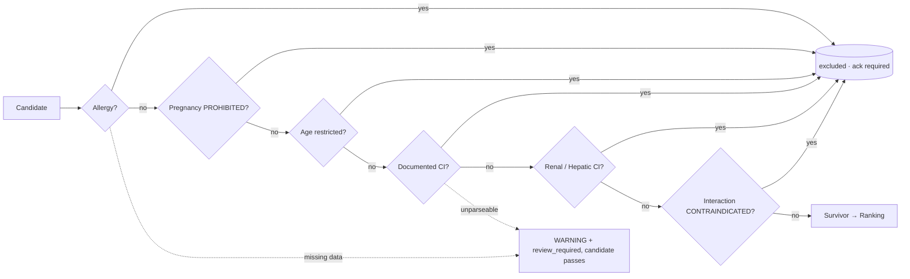
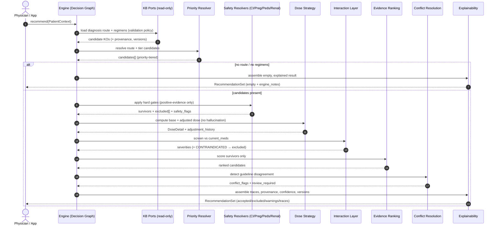
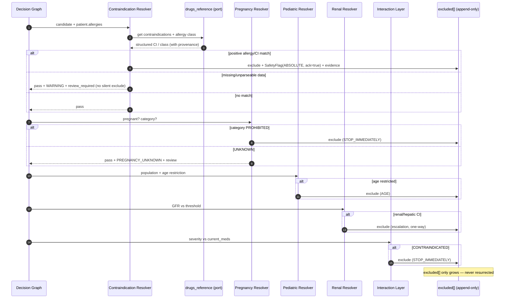
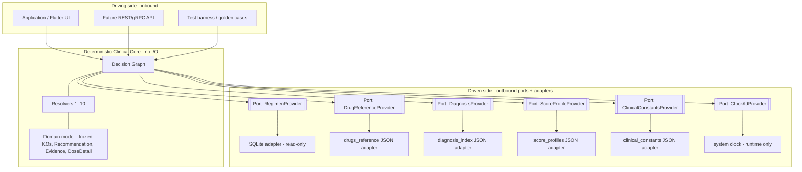
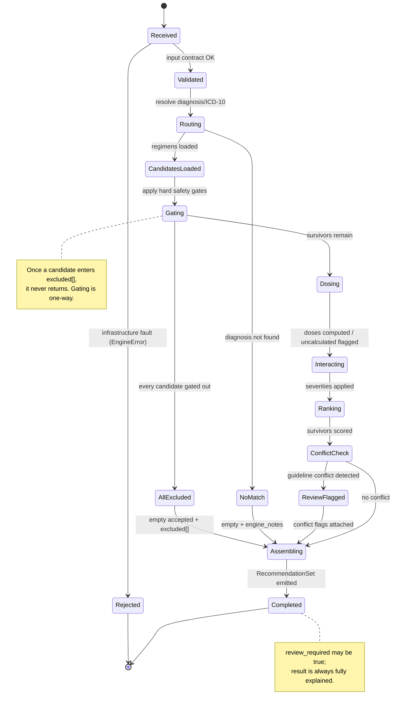

# CLINICAL DECISION ENGINE (P6) — ARCHITECTURE DESIGN

> **Status:** DESIGN / ARCHITECTURE ONLY. No implementation. No code changes.
> **Phase:** P6 — Clinical Decision Engine.
> **Scope note:** The Clinical Decision Engine *logic* is currently **FROZEN**. This document is
> design/architecture documentation and does **not** modify frozen code. Any change to engine
> behaviour still requires a formal RFC.
> **Extends:** `docs/superpowers/specs/clinical-decision-engine-v1.md` (the frozen v1 spec).
> **Governs:** every section here is subordinate to `docs/governance/CLINICAL_GOVERNANCE.md`
> (the Clinical Governance & Medical AI Constitution). Where this document and the Clinical
> Governance conflict, **the Clinical Governance wins** — patient safety overrides everything else.

---

## Table of Contents

1. [Purpose, Position & Non-Goals](#1-purpose-position--non-goals)
2. [Design Principles & Governance Alignment](#2-design-principles--governance-alignment)
3. [Inputs & Outputs (Contract)](#3-inputs--outputs-contract)
4. [Component Architecture (Resolver Map)](#4-component-architecture-resolver-map)
   - 4.1 [Decision Graph](#41-decision-graph)
   - 4.2 [Priority Resolver](#42-priority-resolver)
   - 4.3 [Contraindication Resolver](#43-contraindication-resolver)
   - 4.4 [Pregnancy Resolver](#44-pregnancy-resolver)
   - 4.5 [Pediatric Resolver](#45-pediatric-resolver)
   - 4.6 [Renal Resolver](#46-renal-resolver)
   - 4.7 [Drug Interaction Layer](#47-drug-interaction-layer)
   - 4.8 [Evidence Ranking](#48-evidence-ranking)
   - 4.9 [Conflict Resolution](#49-conflict-resolution)
   - 4.10 [Fallback Logic](#410-fallback-logic)
   - 4.11 [Dose Calculation Strategy](#411-dose-calculation-strategy)
   - 4.12 [Explainability Layer](#412-explainability-layer)
5. [Output Schema (Illustrative JSON)](#5-output-schema-illustrative-json)
6. [Safety Gates (Hard, Non-Overridable)](#6-safety-gates-hard-non-overridable)
7. [Failure Modes (Fail-Safe, Never Guess)](#7-failure-modes-fail-safe-never-guess)
8. [Sequence Diagrams](#8-sequence-diagrams)
9. [Ports & Adapters (Hexagonal) View](#9-ports--adapters-hexagonal-view)
10. [Decision Request State Machine](#10-decision-request-state-machine)
11. [Determinism & Reproducibility Requirements](#11-determinism--reproducibility-requirements)
12. [Alignment with CLINICAL_GOVERNANCE.md](#12-alignment-with-clinical_governancemd)
13. [Glossary](#13-glossary)

---

## 1. Purpose, Position & Non-Goals

### 1.1 Purpose

The Clinical Decision Engine (CDE) is the deterministic reasoning layer of ANTIBIO. Given a
**patient clinical context** and a versioned **Knowledge Base (KB)** of normalized antibiotic
guideline data, it produces a **ranked, safety-gated, fully-explainable** antibiotic
recommendation set.

The engine is a *transformer of approved clinical knowledge into a decision*, never a generator
of new medical knowledge. It does not diagnose, does not prescribe, and does not invent doses,
durations, indications, contraindications, or alternatives. It surfaces what the guidelines say,
filters for patient safety, ranks by evidence, and hands a physician a traceable, reviewable
result.

### 1.2 Position in the platform

```
Ministry of Health PDFs
   → Extraction (P2)
   → Normalization (P3)  → Knowledge Objects (immutable, versioned, provenance-bearing)
   → Quality (P4)
   → Knowledge Base (SQLite regimens + drugs_reference + diagnosis_index)
                                   │
                                   ▼
                    ┌──────────────────────────────┐
                    │  Clinical Decision Engine (P6) │  ← THIS DOCUMENT
                    │  deterministic, read-only      │
                    └──────────────────────────────┘
                                   │
                                   ▼
                       Physician / Application (P7 UI)
```

The CDE is strictly **downstream** and **read-only** with respect to the KB. It never parses PDFs,
never normalizes text, never accesses raw extraction artifacts, and never writes to any data
source.

### 1.3 Non-Goals

- **Not a diagnostic engine.** Diagnosis is a physician input, not an engine output.
- **Not a prescriber.** Output is a *recommendation for a physician*, not an order.
- **Not a text interpreter at runtime.** Free-text clinical fields are structured at KB
  preparation time; the engine applies structured rules only.
- **Not a source of medical truth.** Every fact traces back to an approved guideline.
- **Not a machine-learning model.** The core is fully deterministic. AI hooks are optional,
  additive, and can never override a safety decision.

---

## 2. Design Principles & Governance Alignment

| # | Principle | Source in Governance |
|---|-----------|----------------------|
| P1 | **Deterministic core.** Same input + same KB version ⇒ byte-identical decision. | Future compatibility / auditability |
| P2 | **Medical truth originates only from approved guidelines.** Engine never invents. | Primary Medical Principle |
| P3 | **No hallucinated dosing.** Missing dose/duration ⇒ `UNKNOWN` / `NEEDS_REVIEW`, never a guessed value. | No Hallucinations |
| P4 | **Fail-safe.** Ambiguity or missing data degrades to a warning/abstain, never a silent guess or silent exclusion. | Clinical Safety |
| P5 | **Safety gates are absolute.** Hard contraindications can never be scored away or overridden. | Clinical Safety |
| P6 | **Human-review triggers are automatic.** Conflicts, multiple doses, low confidence ⇒ flagged for a physician; the engine never resolves a medical conflict autonomously. | Human Review |
| P7 | **Full traceability.** Every recommendation resolves to source document, page, wording, and version within seconds. | Traceability / Provenance |
| P8 | **Immutability & versioning.** Knowledge Objects are read as immutable; every version coexists; results carry the exact versions used. | Clinical Data Immutability / Versioning |
| P9 | **Confidence is never guessed.** It is derived from source, extraction, decision, and evidence quality. | Confidence |
| P10 | **One source of truth per domain.** No duplicate safety data inside the engine. | Medical Consistency |

Every component below is a concrete expression of these ten principles.

---

## 3. Inputs & Outputs (Contract)

### 3.1 Input — Patient Clinical Context

| Field | Type | Notes |
|-------|------|-------|
| `diagnosis` | string \| null | Free or normalized diagnosis term. |
| `icd10` | string \| null | ICD-10 code, e.g. `J18`. At least one of `diagnosis`/`icd10` required. |
| `age` | number \| null | Years (fractional allowed for neonates). |
| `weight_kg` | number \| null | Required for pediatric weight-based dosing. |
| `pregnant` | bool | Default `false`. |
| `renal_function` | number \| null | GFR ml/min. |
| `hepatic_impairment` | bool | Default `false`. |
| `allergies` | string[] | Drug **classes** (e.g. `penicillins`), normalized. |
| `current_meds` | string[] | For the Drug Interaction Layer. |
| `severity` | enum \| null | e.g. `mild` / `moderate` / `severe` — informs therapy-line preference and profile. |
| `preferences` | object | Optional therapy-line, route, population, ranking profile. |

**KB inputs (read-only):** normalized regimens (SQLite), `drugs_reference` (drug safety
metadata), `diagnosis_index` (routing), score profiles, clinical constants. Each carries a version
label that is echoed into the output.

### 3.2 Output — Decision Result

A `RecommendationSet` (full schema in [§5](#5-output-schema-illustrative-json)) containing:

- `accepted[]` — ranked, safety-passed recommendations, each with dose, evidence, confidence.
- `excluded[]` — every candidate removed by a safety gate, **with the reason and provenance**.
- `warnings[]` — non-excluding safety flags requiring physician attention.
- `traces[]` — the append-only decision audit trail.
- `metadata` — the five version strings that pin reproducibility.
- `runtime` — timestamp + timings (non-deterministic, kept out of decision data).
- `engine_notes[]` — system/degraded-mode notes for the UI.
- `review_required` — boolean + reasons; true whenever a human-review trigger fired.

**Fail-safe contract:** the engine *always* returns a `RecommendationSet` for clinical
no-data conditions (empty `accepted`, populated `excluded`/`engine_notes`). It only raises for
**infrastructure** faults (missing/corrupt KB files).

---

## 4. Component Architecture (Resolver Map)

The engine is a **sequential, immutable pipeline** of resolvers. Each resolver is a pure function
`(state, context) → state'`, where `state` is a frozen object and mutation happens only through
copy-on-write (`replace()`). Order is fixed and safety-first: **candidates are filtered for safety
before they are ever scored**, and scoring can never resurrect an excluded candidate.

```
PatientContext
  → Decision Graph orchestrates:
      1. Priority Resolver        (route diagnosis → guidelines → candidate regimens, tier them)
      2. Contraindication Resolver (absolute clinical exclusions)
      3. Pregnancy Resolver        (pregnancy-category gate)
      4. Pediatric Resolver        (population fit + weight-based dosing prerequisites)
      5. Renal Resolver            (renal dose adjustment / renal contraindication)
      6. Dose Calculation Strategy (base dose → adjusted dose, with adjustment history)
      7. Drug Interaction Layer    (current-meds interaction severity; CONTRAINDICATED = exclude)
      8. Evidence Ranking          (score survivors by evidence + fit)
      9. Conflict Resolution       (detect guideline disagreement → flag / rank / abstain)
     10. Explainability Layer      (assemble trace, provenance, confidence, review triggers)
  → RecommendationSet
```

> **Ordering invariant:** safety resolvers (2–5, plus interaction CONTRAINDICATED and hepatic CI)
> run *before* Evidence Ranking. Ranking sees only survivors. This is a hard architectural rule,
> not a convenience.

Each resolver below is documented with **Responsibility · Inputs · Outputs · Knowledge Objects &
Provenance used · Fail-safe behaviour**.

---

### 4.1 Decision Graph

**Responsibility.** The Decision Graph is the orchestrator and the formal specification of resolver
order, data dependencies, and gate placement. It is a directed acyclic graph (DAG): nodes are
resolvers, edges are the immutable `state` handed forward. It guarantees that safety gates
dominate ranking and that no cycle can move a candidate from `excluded` back to `accepted`.

**Inputs.** `PatientContext`, `EngineConfig` (paths, ranking profile, validation policy), the
injected read-only ports (KB adapters).

**Outputs.** A fully assembled `RecommendationSet`. Internally, an ordered list of `StageResult`
objects (one per node), each with its own timing and metrics.

**Knowledge Objects & provenance.** The Decision Graph itself holds no clinical data; it moves
`Recommendation` objects (which carry KO provenance) between resolvers and never mutates their
provenance.

**Fail-safe.** If any node signals *clinical no-data*, the graph short-circuits remaining clinical
nodes but **always** runs the Explainability node so the caller receives a complete, empty-but-
explained result. Infrastructure faults abort the run and raise `EngineError` before any partial
result is emitted.

```mermaid
flowchart TD
    A[PatientContext] --> B[Priority Resolver]
    B -->|no route / no regimens| Z[Explainability Layer]
    B --> C[Contraindication Resolver]
    C --> D[Pregnancy Resolver]
    D --> E[Pediatric Resolver]
    E --> F[Renal Resolver]
    F --> G[Dose Calculation Strategy]
    G --> H[Drug Interaction Layer]
    H --> I[Evidence Ranking]
    I --> J[Conflict Resolution]
    J --> Z[Explainability Layer]
    Z --> R[RecommendationSet]

    C -.excluded.-> X[(excluded[])]
    D -.excluded.-> X
    E -.excluded.-> X
    F -.hepatic/renal CI.-> X
    H -.CONTRAINDICATED.-> X
    X --- Z
```

---

### 4.2 Priority Resolver

**Responsibility.** Resolve the patient's diagnosis/ICD-10 to one or more guideline routes, load
the candidate regimens for those routes, and assign each a **clinical priority tier**
(`FIRST_CHOICE` → `ALTERNATIVE` → `RESERVE` → `SALVAGE` → `EXPERIMENTAL`). This encodes the
guideline's own therapy-line hierarchy; it does **not** re-rank by evidence (that is
[Evidence Ranking](#48-evidence-ranking)). Priority answers *"which regimens are on the table, and
what does the guideline consider first-line here?"*

**Inputs.** `diagnosis`, `icd10`, `severity`, `preferences.therapy_line`, `preferences.population`,
`validation_policy`.

**Outputs.** `candidates[]` (typed `RecommendationCandidate` domain objects), each tagged with a
`clinical_priority` tier and the guideline route it came from.

**Knowledge Objects & provenance.** Reads `diagnosis_index` (diagnosis/ICD-10 → guideline route)
and the normalized regimen Knowledge Objects. Each candidate inherits KO provenance verbatim:
source PDF, page, quote, section, normalizer version, extraction confidence, guideline title/year/
revision date/URL. The therapy-line tier is read from the KO — **never inferred** by the engine.
Only KOs whose validation state satisfies the active `ValidationPolicy` (e.g. `PASS` only in
production) enter the pipeline.

**Fail-safe.** Diagnosis not found in the index → empty candidate set + `engine_note`
`NO_DIAGNOSIS_MATCH` + trace `NO_MATCH`; the graph short-circuits to Explainability. Route found
but zero regimens → `NO_REGIMENS`. The resolver never fabricates a route or a regimen.

---

### 4.3 Contraindication Resolver

**Responsibility.** Apply **absolute** clinical exclusions that are not pregnancy/pediatric/renal-
specific: documented contraindications and drug-class allergy matches. This is a hard safety gate:
a matched contraindication removes the candidate permanently.

**Inputs.** `candidates[]`, `patient.allergies`, `patient` comorbidity flags, and the drug's
structured contraindication + allergy-class metadata.

**Outputs.** Surviving `candidates[]`; newly `excluded[]` entries each paired with a
`SafetyFlag(ABSOLUTE_CONTRAINDICATION, …)` and provenance; append-only traces.

**Knowledge Objects & provenance.** Reads `drugs_reference` (`contraindications`,
`allergy_class` hierarchy) — the single source of truth for drug safety metadata. The allergy check
walks the **class hierarchy** (e.g. `penicillins` → amoxicillin, ampicillin, amoxiclav,
piperacillin…) so an allergy to a class excludes every member. Each exclusion trace cites the
`drugs_reference` field and its provenance.

**Fail-safe.** This is the governing rule of the whole safety layer:

> **Exclude only on *positive* evidence of contraindication. Missing data ⇒ WARNING, never a
> silent exclusion — and never a silent inclusion presented as safe.**

- Drug not found in `drugs_reference` → WARNING `DRUG_UNKNOWN`, candidate passes but is flagged and
  marked review-required.
- Contraindication field unstructured/unparseable → WARNING `CI_UNPARSED`, candidate passes,
  review-required. No runtime text guessing.

---

### 4.4 Pregnancy Resolver

**Responsibility.** Gate candidates on pregnancy status against the drug's pregnancy category.
`PROHIBITED` → absolute exclusion; `CAUTION` → non-excluding warning + rank penalty; `ALLOWED` →
pass; `UNKNOWN` → pass with warning + review-required.

**Inputs.** `patient.pregnant`, each drug's `pregnancy_category`.

**Outputs.** Survivors; `excluded[]` for prohibited drugs with `PREGNANCY_CI` flags
(`action = STOP_IMMEDIATELY`, `requires_physician_acknowledgement = true`); warnings for caution/
unknown.

**Knowledge Objects & provenance.** Reads `drugs_reference.pregnancy_category`, a normalized field
derived from the guideline. The category maps to an internal enum
(`PROHIBITED / CAUTION / ALLOWED / UNKNOWN`); the mapping and the source wording are both carried
into the trace so a physician can verify the classification.

**Fail-safe.** `patient.pregnant` unknown → skip gate, no assumption. `pregnancy_category` unknown
→ do **not** assume safe or unsafe: pass with `PREGNANCY_UNKNOWN` warning and review-required. The
engine never guesses a pregnancy category.

---

### 4.5 Pediatric Resolver

**Responsibility.** Two jobs: (a) population-fit filtering (adult / child / neonate, with neonate =
age < 28 days), and (b) establishing the prerequisites for pediatric weight-based dosing so the
Dose Calculation Strategy can compute mg/kg/day. It gates out regimens whose population does not
match the patient and flags missing dosing prerequisites.

**Inputs.** `patient.age`, `patient.weight_kg`, `preferences.population`, each candidate's
population applicability flags (`adult` / `child`), and the drug's `pediatric_dosing` block and age
restrictions.

**Outputs.** Population-filtered `candidates[]`; age-restriction exclusions (`AGE` code) where the
drug is contraindicated below/above an age; warnings where pediatric dosing data or weight is
missing.

**Knowledge Objects & provenance.** Reads the KO population flags and `drugs_reference`
`pediatric_dosing` (`mg_per_kg_day`, `max_daily_mg`, weight/age bands) and `age_restriction_min/
max`. All values come from approved data; none are extrapolated.

**Fail-safe.** Age unknown → skip age gate, add `AGE_UNKNOWN` warning. Pediatric patient but
`pediatric_dosing` absent → `PEDS_DOSING_UNKNOWN`, dose left uncalculated, review-required (never
scaled down from an adult dose). Weight missing for a child → `WEIGHT_REQUIRED`, dose uncalculated.
Weight outside the documented band → still calculated but flagged `BELOW/ABOVE_WEIGHT_BAND` for
clinician review.

---

### 4.6 Renal Resolver

**Responsibility.** Adjust dosing for renal impairment and, where the guideline documents a renal
contraindication, escalate to exclusion. Determines whether GFR crosses a drug-specific threshold
and, if so, hands a structured adjustment instruction to the Dose Calculation Strategy.

**Inputs.** `patient.renal_function` (GFR), each drug's structured `renal_adjustment` rule and
renal-contraindication metadata, and the clinical-constants GFR thresholds.

**Outputs.** Adjustment directives attached to survivors (e.g. `extend_interval`, `reduce_dose`);
`excluded[]` where renal status is an absolute contraindication (`RENAL` code); warnings where a
renal adjustment applies (`action = MONITOR_CLOSELY`).

**Knowledge Objects & provenance.** Reads `drugs_reference.renal_adjustment` — required to be a
**structured** field (`{threshold, action, …}`) prepared at KB build time. The engine applies the
structured rule directly and records both the rule and its provenance in the trace.

**Fail-safe.** GFR unknown → no renal adjustment, `RENAL_UNKNOWN` warning, review-required — the
engine does **not** assume normal renal function. Only free-text renal data available → WARNING
`RENAL_ADJ_UNPARSED`, dose left **unadjusted** and flagged for manual clinician review; the engine
never parses free text at runtime and never invents an adjustment factor.

---

### 4.7 Drug Interaction Layer

**Responsibility.** Screen each surviving candidate against `patient.current_meds`, classify
interaction severity, and act on it: `CONTRAINDICATED` → absolute exclusion; `MAJOR/MODERATE/MINOR`
→ non-excluding warning + graded rank penalty; `UNKNOWN` → warning + review-required (never
silently upgraded or downgraded).

**Inputs.** `patient.current_meds`, each drug's structured interaction records.

**Outputs.** `interaction_severity` on survivors, interaction `SafetyFlag`s, and
`excluded[]` for contraindicated combinations.

**Knowledge Objects & provenance.** Reads `drugs_reference` interaction records, which are
**structured at preparation time** (`{interacts_with, severity, note, source}`). The engine matches
`current_meds` against these records and applies the pre-classified severity. Severity keywords are
used only by KB-build tooling, never at runtime. Each flag cites the interaction record's source.

**Fail-safe.** `current_meds` empty → layer skipped. Match found but severity not classified →
`InteractionSeverity.UNKNOWN` (explicitly *not* defaulted to MODERATE), warning + review-required,
so the physician sees "classification unknown" rather than a fabricated severity.

---

### 4.8 Evidence Ranking

**Responsibility.** Score and order the **survivors only**. Ranking is a preference function over
clinically acceptable options — it makes no safety decision and cannot exclude, resurrect, or alter
any safety flag or dose. It answers *"of the safe options, which best fits the evidence and the
request?"*

**Inputs.** Surviving `candidates[]` with their flags, dose state, priority tier, confidence, and
guideline recency; the active score profile (weights).

**Outputs.** `candidates[]` annotated with `score`, `score_breakdown`, and 1-based `rank`, sorted
descending. Score floor is `0.0` (a penalty can never invert into an exclusion).

**Knowledge Objects & provenance.** Reads the KO-derived fields — therapy-line tier, extraction/
normalization confidence, guideline year (recency), route, population fit — and the score-profile
weights (a curated engine resource, versioned). Recency is derived from the guideline's revision
date carried in provenance.

**Scoring dimensions (weighted):** therapy-line match, source confidence, evidence recency, safety
fit (warning penalty), route preference, population match, interaction penalty. Profiles
(`default`, `ent`, `urology`, `icu`, `pediatrics`) re-weight for context. Ranking is a pure,
deterministic function of these inputs — no randomness, stable tie-break (see [§11](#11-determinism--reproducibility-requirements)).

**Fail-safe.** Zero survivors → empty `accepted[]`, no error. Ranking never touches `excluded[]`.

---

### 4.9 Conflict Resolution

**Responsibility.** Detect when the Knowledge Base itself **disagrees** — two guidelines (or two
versions/regimens) give conflicting doses, durations, therapy lines, or population advice for the
same situation — and route the disagreement to a physician instead of silently picking a winner.
Per Governance, **the engine never resolves a medical conflict autonomously.**

**Inputs.** The ranked survivor set plus their provenance (which guideline/version each came from).

**Outputs.** `conflict_flags[]` describing each disagreement (the conflicting values and their two
sources), `review_required = true`, and — critically — the conflicting candidates are **both
retained and both shown**, not merged. Ranking order is preserved but annotated "conflict: review
required".

**Knowledge Objects & provenance.** Compares KO fields across candidates using their immutable
provenance. Because Knowledge Objects are versioned and never overwritten, older and newer guideline
versions can legitimately coexist; the resolver surfaces both with their versions rather than
assuming the newer supersedes.

**Conflict handling policy:**

| Situation | Engine behaviour |
|-----------|------------------|
| Same drug, different dose across two guidelines | Flag `CONFLICT_DOSE`; show both with sources; review-required. Never average, never pick silently. |
| Different therapy-line tier for same drug | Flag `CONFLICT_THERAPY_LINE`; retain both. |
| Conflicting duration | Flag `CONFLICT_DURATION`; present range with both sources. |
| Conflicting pregnancy/renal/pediatric advice | Flag `CONFLICT_SPECIAL_POPULATION`; **fail safe to the more restrictive** guidance for gating, but display both. |
| Newer vs. older guideline version | Prefer newer for *ranking recency* only; both remain visible; flag `CONFLICT_VERSION`. |

**Fail-safe.** When conflicting **safety** advice cannot be reconciled, gating uses the most
restrictive interpretation (safer) while the result explicitly flags the unresolved conflict for
human review. The engine abstains from declaring a single medical truth.

---

### 4.10 Fallback Logic

**Responsibility.** Define graceful degradation at every point where preferred data is absent, so
the engine still returns a *useful, honest, safe* result instead of failing or guessing. Fallback
governs how each resolver behaves when its ideal input is missing.

**Inputs.** Degraded-mode signals raised by any resolver.

**Outputs.** A consistent set of `engine_notes`, warnings, and `review_required` flags; a possibly
reduced but always-explained `accepted[]`.

**Fallback ladder (most → least specific), applied per resolver:**

1. **Structured KO field present** → use it (ideal path).
2. **Route/data partially present** → use the safe subset, flag the gap, mark review-required.
3. **Only free text present** → do **not** parse at runtime; warn + review-required; leave the
   dependent value `UNKNOWN`.
4. **Nothing present** → emit `UNKNOWN` / `NEEDS_REVIEW`; never synthesize a value.

**Diagnosis-level fallback:** exact diagnosis match → ICD-10 match → parent-category ICD-10 match
(if the index defines one) → **abstain** with `NO_DIAGNOSIS_MATCH`. The engine never "picks a
nearby diagnosis" on its own judgement.

**Fail-safe.** Fallback can lower confidence and add warnings; it can **never** manufacture a dose,
duration, contraindication, or interaction severity. The correct fallback for "no safe answer" is
an empty, fully-explained `accepted[]` — not a low-confidence guess.

---

### 4.11 Dose Calculation Strategy

**Responsibility.** Compute the recommended dose for each survivor and record an auditable
**adjustment history** (`base → renal → hepatic → final`). Two base strategies plus adjustment:

- **Fixed (adult):** take the guideline's documented dose × frequency from the KO.
- **Weight-based (pediatric):** `mg_per_kg_day × weight_kg`, clamped to `max_daily_mg`, divided by
  frequency for single dose.
- **Adjusted:** apply the structured renal/hepatic directives from the Renal Resolver (and hepatic
  handling) on top of the base.

**Inputs.** Candidate base dose/frequency/duration (KO), `patient.weight_kg`, structured
`pediatric_dosing`, renal/hepatic adjustment directives, `max_daily_mg`, clinical constants.

**Outputs.** A `DoseDetail` per survivor: `calculated_dose_mg`, `frequency_per_day`,
`duration_days`, `max_daily_mg`, `calculation_method` (`FIXED / MG_PER_KG / RENAL_ADJUSTED /
HEPATIC_ADJUSTED / UNCALCULATED`), `adjustment_applied`, and the ordered `adjustment_history`
tuple.

**Knowledge Objects & provenance.** Adult doses come **verbatim** from the regimen KO (with its
page/quote provenance). Pediatric factors and caps come from `drugs_reference.pediatric_dosing`.
Every arithmetic step is recorded so a physician can reproduce the number by hand from the cited
source values.

**Safety & fail-safe.**

- **No hallucinated dosing (Governance).** If the base dose is missing → `UNCALCULATED` +
  `DOSE_UNCALCULABLE`, review-required. The engine never fills a missing dose.
- Weight-based dosing is **capped** at the documented daily maximum; it never exceeds the cap.
- Dose adjustment **can escalate to exclusion** (e.g. hepatic contraindication) but can **never
  de-escalate** a prior hard exclusion.
- Both renal and hepatic adjustment applicable → the **most conservative** (lowest dose / longest
  interval) is chosen, and the dual adjustment is flagged for monitoring.
- Any uncalculable or clamped dose lowers dose-confidence and is surfaced explicitly.

---

### 4.12 Explainability Layer

**Responsibility.** Assemble the complete, append-only decision record so that **every
recommendation is traceable to its source guideline and provenance within seconds**, and compute
the review-required verdict. This is the terminal resolver and it makes no clinical decision — it
records and packages them.

**Inputs.** The final `state` (survivors + excluded + all flags + traces), the KB version strings,
and per-stage timing.

**Outputs.** The `RecommendationSet`: `accepted[]`, `excluded[]` (with reasons), `warnings[]`,
`traces[]`, `confidence_breakdown` per recommendation, `metadata` (five versions), `runtime`,
`engine_notes[]`, and `review_required` + reasons.

**Knowledge Objects & provenance.** For every recommendation and every exclusion it emits an
`Evidence` record: `source_pdf`, `source_page`, `source_quote`, `source_section`,
`guideline_title`, `guideline_year`, `guideline_revision_date`, `source_url`. It also emits, per
decision, a `StageTrace` (`stage_name`, `decision_code`, `reason`, `evidence`,
`decision_confidence`). The trace is **immutable and append-only** (Governance: history is
append-only, nothing overwritten).

**Confidence.** Final confidence is a weighted, *derived* composite (source · decision · dose ·
completeness · evidence), each a discrete level — never a guessed number (Governance: "confidence
is never guessed").

**Human-review triggers (automatic).** `review_required = true` whenever any of: an unresolved
guideline conflict; multiple conflicting doses/durations; low composite confidence; ambiguous
diagnosis match; failed normalization on a used field; uncalculable dose; unknown interaction
severity; any `requires_physician_acknowledgement` safety flag. These mirror the Governance
"Human Review" list exactly.

**Three-question test (Governance final principle).** Every emitted statement answers: *Where did it
come from?* (Evidence), *Why is it correct?* (StageTrace reason + guideline), *Can it be
independently verified?* (source_url + page + quote + versions). If any answer is missing, the item
is marked not-production-ready and review-required.

---

## 5. Output Schema (Illustrative JSON)

> Illustrative only — shape, not implementation. Field names mirror the frozen v1 dataclasses.

```json
{
  "query": {
    "diagnosis": "vnebolnichnaya pnevmoniya",
    "icd10": "J18",
    "patient": {
      "age": 45, "weight_kg": null, "pregnant": false,
      "renal_function": 88, "hepatic_impairment": false,
      "allergies": [], "current_meds": ["warfarin"], "severity": "moderate"
    },
    "preferences": { "therapy_line": "first", "route_preference": "per_os", "population": "adult" }
  },

  "accepted": [
    {
      "rank": 1,
      "score": 8.7,
      "score_breakdown": {
        "therapy_line_match": 3.0, "confidence": 1.84, "evidence_recency": 1.5,
        "safety_fit": 2.2, "route_preference": 1.0, "population_match": 1.5,
        "interaction_penalty": -0.34
      },
      "clinical_priority": "first_choice",
      "drug": { "normalized": "amoxicillin", "drug_ref": "amoxicillin", "class": "penicillins" },
      "dose": {
        "calculated_dose_mg": 500, "dose_unit": "mg", "frequency_per_day": 3,
        "duration_days": 7, "max_daily_mg": 3000,
        "calculation_method": "fixed",
        "adjustment_applied": null,
        "adjustment_history": ["base: 500mg x3/day"]
      },
      "interaction_severity": "minor",
      "safety_flags": [
        {
          "level": "warning", "code": "INTERACTION_MINOR",
          "message": "Antacids/absorption note; minor interaction with current meds.",
          "drug_ref": "amoxicillin", "stage": "DrugInteractionLayer",
          "action": "inform_patient", "requires_physician_acknowledgement": false
        }
      ],
      "confidence": 0.87,
      "confidence_breakdown": {
        "source": 0.92, "decision": 0.90, "dose": 1.0,
        "completeness": 0.70, "evidence": 1.0, "final": 0.87
      },
      "evidence": {
        "source_pdf": "CAP_adults_2024.pdf",
        "source_page": "28",
        "source_quote": "Препарат выбора — амоксициллин 500 мг 3 раза/сут 5–7 дней",
        "source_section": "Antibacterial therapy",
        "guideline_title": "Community-acquired pneumonia in adults",
        "guideline_year": 2024,
        "guideline_revision_date": "2024-03-15",
        "source_url": "https://cr.minzdrav.gov.ru/recomend/654"
      },
      "trace": [
        { "stage": "PriorityResolver", "decision_code": "diagnosis_resolved",
          "reason": "J18 → guideline 654; therapy_line=first", "decision_confidence": 1.0 },
        { "stage": "ContraindicationResolver", "decision_code": "ci",
          "reason": "No contraindication match", "decision_confidence": 1.0 },
        { "stage": "DrugInteractionLayer", "decision_code": "interaction",
          "reason": "warfarin × amoxicillin = minor", "decision_confidence": 0.75 }
      ]
    }
  ],

  "excluded": [
    {
      "drug": { "normalized": "doxycycline", "drug_ref": "doxycycline" },
      "reason": "AGE / not applicable here (illustrative)",
      "safety_flag": {
        "level": "absolute_contraindication", "code": "PREGNANCY_CI",
        "action": "stop_immediately", "requires_physician_acknowledgement": true
      },
      "evidence": { "source_pdf": "…", "source_page": "…", "source_quote": "…",
                    "guideline_year": 2024, "source_url": "…" }
    }
  ],

  "warnings": [],
  "conflict_flags": [],
  "review_required": false,
  "review_reasons": [],

  "engine_notes": [
    { "code": "RENAL_OK", "message": "GFR 88 — no renal adjustment required",
      "stage": "RenalResolver", "severity": "info" }
  ],

  "metadata": {
    "decision_engine_version": "1.0.0",
    "knowledge_dataset_version": "KB-2026-07-09",
    "normalizer_version": "1.2.0",
    "dictionary_version": "1.0.0",
    "guideline_version": "2024-07"
  },

  "runtime": {
    "generated_at": "2026-07-15T09:30:00Z",
    "elapsed_ms": 41.2,
    "profile": "strict",
    "pipeline_time_breakdown": {
      "priority": 1.1, "contraindication": 1.8, "pregnancy": 0.4,
      "pediatric": 0.5, "renal": 0.6, "dose": 0.9, "interaction": 1.2,
      "ranking": 0.8, "conflict": 0.7, "explain": 1.0
    }
  }
}
```

> **Determinism note:** `runtime` (timestamp, timings) is deliberately **outside the decision
> payload**. Two runs with identical inputs produce identical `accepted/excluded/warnings/
> conflict_flags/metadata` and differ only in `runtime`.

---

## 6. Safety Gates (Hard, Non-Overridable)

Safety gates are **absolute exclusions** that no downstream resolver, score, profile, plugin, or
configuration can override. Once a gate excludes a candidate, it is `excluded` **forever** in that
run.

| Gate | Resolver | Trigger | Result |
|------|----------|---------|--------|
| **Allergy** | Contraindication | Drug class ∈ `patient.allergies` (class hierarchy) | Exclude · `STOP_IMMEDIATELY` · ack required |
| **Documented contraindication** | Contraindication | Structured CI matches patient state | Exclude · ack required |
| **Pregnancy prohibited** | Pregnancy | `pregnant` and category `PROHIBITED` | Exclude · `STOP_IMMEDIATELY` · ack required |
| **Age restriction** | Pediatric | Age below/above drug's restriction | Exclude |
| **Renal contraindication** | Renal | GFR crosses absolute-CI threshold | Exclude |
| **Hepatic contraindication** | Dose (hepatic escalation) | Hepatic CI documented | Exclude (escalation) |
| **Interaction contraindicated** | Interaction | Severity `CONTRAINDICATED` vs current med | Exclude · `STOP_IMMEDIATELY` · ack required |

**Gate invariants (constitutional):**

1. **Gates precede ranking.** Scoring only ever sees survivors.
2. **Once excluded, forever excluded.** `excluded[]` only grows within a run.
3. **Gates fire only on positive evidence.** Missing data → WARNING + review-required, never a
   silent exclusion and never a silent "safe" pass.
4. **No override surface.** No plugin, profile, config flag, or AI hook can clear a gate. Plugins
   may reorder/annotate survivors only.
5. **Escalation is one-way.** A later resolver may *add* an exclusion; none may *remove* one.
6. **Every gate emits provenance.** Each exclusion cites the `drugs_reference`/KO field and its
   source.



---

## 7. Failure Modes (Fail-Safe, Never Guess)

The overriding rule: **when data is missing or ambiguous, degrade to a warning/abstain — never
guess, never silently exclude, never invent.** Two disjoint classes:

### 7.1 Clinical no-data (never throws — returns explained result)

| Condition | Behaviour |
|-----------|-----------|
| Diagnosis not in index | Empty `accepted`; `NO_DIAGNOSIS_MATCH`; short-circuit to Explainability. |
| Route found, no regimens | Empty `accepted`; `NO_REGIMENS`. |
| Drug not in `drugs_reference` | WARNING `DRUG_UNKNOWN`; candidate passes; review-required. |
| Pregnancy category unknown | Pass with `PREGNANCY_UNKNOWN`; review-required. |
| Age unknown | Skip age gate; `AGE_UNKNOWN`. |
| Weight missing (pediatric) | Dose `UNCALCULATED`; `WEIGHT_REQUIRED`; review-required. |
| Pediatric dosing absent | Dose `UNCALCULATED`; `PEDS_DOSING_UNKNOWN`; review-required. |
| GFR unknown | No renal adjustment; `RENAL_UNKNOWN`; review-required. |
| Renal/interaction only free-text | Not parsed; value `UNKNOWN`; review-required. |
| Interaction match, severity unclassified | `UNKNOWN` severity (not defaulted); review-required. |
| Guidelines conflict | Both retained; `CONFLICT_*`; review-required; safety gating uses most restrictive. |
| Zero survivors after gates | Empty `accepted`, fully explained; **not** an error. |

### 7.2 Infrastructure faults (throws `EngineError`, no partial result)

| Condition | Error code |
|-----------|-----------|
| SQLite KB missing | `SQLITE_NOT_FOUND` |
| SQLite corrupt / unreadable | `SQLITE_CORRUPT` |
| `drugs_reference` missing | `DRUG_REFERENCE_NOT_FOUND` |
| `diagnosis_index` missing | `DIAGNOSIS_INDEX_NOT_FOUND` |
| Score profile missing | `SCORE_PROFILE_NOT_FOUND` |
| Resource parse error | `RESOURCE_PARSE_ERROR` |
| Reader init failed | `READER_INIT_FAILED` |

**Principle:** clinical uncertainty is *data* to be surfaced; infrastructure failure is a *fault*
to be raised loudly. Neither is ever resolved by guessing a clinical value.

---

## 8. Sequence Diagrams

### 8.1 Main decision flow



### 8.2 Contraindication / safety-gate flow



---

## 9. Ports & Adapters (Hexagonal) View

The engine separates a **deterministic clinical core** (resolvers + Decision Graph + domain model)
from all I/O. The core depends only on **ports** (interfaces); concrete **adapters** implement them.
The core never imports SQLite, JSON parsing, file paths, clocks, or randomness.



**Rules of the hexagon:**

- **Inbound (driving) ports:** `Engine.recommend(PatientContext) → RecommendationSet` and
  `Engine.build_report(...)`. Callers depend on the core, never the reverse.
- **Outbound (driven) ports:** read-only providers returning **domain objects** (Knowledge Objects
  with provenance), never raw rows/JSON. Adapters own all parsing and I/O.
- **Core purity:** resolvers are pure `(state, ctx) → state'`; no clock, no filesystem, no network,
  no randomness. The only non-deterministic input (timestamp/timing) enters through the
  `Clock` port and lands **only** in `runtime`, outside the decision payload.
- **Substitutability:** today's JSON/SQLite adapters can be swapped for API/PostgreSQL adapters
  with zero core changes — the frozen resolver logic is untouched. This satisfies the Governance
  "future compatibility without redesign" requirement.
- **Immutability boundary:** adapters hand the core frozen KOs; the core hands callers a frozen
  `RecommendationSet`. Nothing crossing a port is mutable.

---

## 10. Decision Request State Machine

A single decision request moves through an explicit, one-directional lifecycle. Safety states are
terminal-forward: the request can only advance or fail-safe, never loop a candidate back past a
gate.



**State semantics:**

- `Received → Rejected` is the **only** path that raises (infrastructure fault). Every clinical
  condition routes forward to `Assembling → Completed`.
- `NoMatch` and `AllExcluded` still reach `Completed` — a fully explained, possibly-empty result.
- `ReviewFlagged` sets `review_required = true` but does not stop the request; the physician sees a
  complete result annotated for review.
- No transition ever moves a candidate from `excluded[]` back into the active set.

---

## 11. Determinism & Reproducibility Requirements

**Core guarantee:** *Same PatientContext + same KB version + same EngineConfig ⇒ byte-identical
decision payload.*

Concrete requirements:

1. **Pure resolvers.** Every resolver is a deterministic function of its explicit inputs. No hidden
   state, no I/O inside resolvers, no ambient reads.
2. **No randomness.** No RNG anywhere in the core. Ranking ties break **deterministically** on a
   fixed key order (e.g. score → therapy-line tier → drug_ref lexical), so ordering is stable.
3. **No wall-clock in decisions.** Timestamps and timings live only in `runtime`, never in
   `accepted/excluded/warnings/conflict_flags/metadata`. Decision equality ignores `runtime`.
4. **Version pinning.** Every result carries five versions — `decision_engine_version`,
   `knowledge_dataset_version`, `normalizer_version`, `dictionary_version`, `guideline_version`.
   A result is reproducible from `{PatientContext, EngineConfig, these five versions}`.
5. **Immutable inputs.** KOs are read as immutable and versioned; the same KB version yields the
   same KOs. Because KOs are append-only and never overwritten (Governance), a historical result
   can always be regenerated against its pinned versions.
6. **Ordered, stable iteration.** Candidate ordering into each resolver is deterministic
   (stable sort by a fixed key), so gate/exclusion order — and therefore trace order — is
   reproducible.
7. **Structured-only runtime rules.** No free-text parsing at runtime; a given structured field
   always yields the same decision. (Free text → `UNKNOWN` + review, deterministically.)
8. **Determinism is tested.** An invariant test asserts that two runs on identical inputs produce
   identical decision payloads (modulo `runtime`), and golden clinical cases lock
   physician-verified outputs against regression.

**Reproducibility workflow:** given a stored result, a reviewer re-runs with the echoed
`PatientContext` and the pinned versions and obtains an identical decision — enabling audit,
regression detection, and medico-legal traceability.

---

## 12. Alignment with CLINICAL_GOVERNANCE.md

| Governance clause | How this design satisfies it |
|-------------------|------------------------------|
| **Mission: deterministic knowledge platform, supports (never replaces) physicians** | Output is a ranked recommendation *for a physician*; `review_required` triggers; no autonomous prescribing. |
| **Primary Medical Principle: truth only from guidelines; AI never invents** | Every dose/duration/CI/alternative comes verbatim from a KO; the engine transforms, never generates. |
| **Source hierarchy** | Priority + Conflict resolvers honour guideline authority and never let AI hooks outrank approved data. |
| **Clinical data immutability** | Engine is strictly read-only; KOs immutable; adapters never write. |
| **No hallucinations** | Missing dose/duration/CI/interaction → `UNKNOWN`/`NEEDS_REVIEW`, never fabricated (Dose Strategy, Fallback, Failure Modes). |
| **Confidence never guessed** | Confidence is derived from source/decision/dose/completeness/evidence; discrete levels only. |
| **Human review triggers** | Explainability sets `review_required` on conflicts, multiple doses, low confidence, ambiguous match, failed normalization, unknown severity, ack-required flags — mirrors the Governance list. |
| **AI never resolves medical conflicts** | Conflict Resolution retains and displays both sources, flags for review, and fails safe to the most restrictive gating — never silently merges or picks. |
| **Provenance & traceability** | Every recommendation and exclusion carries an `Evidence` record (pdf/page/quote/section/title/year/date/url); trace resolves to source in seconds. |
| **Clinical safety overrides everything** | Hard safety gates are absolute and non-overridable by score, profile, config, or plugin. |
| **Medical consistency: flag, never silently merge** | Conflict flags surface duplicate/conflicting regimens without merging. |
| **Versioning: all versions coexist** | Five-version metadata + immutable KOs; older/newer guidelines both visible. |
| **Fail-safe** | Clinical no-data returns an explained empty result; only infrastructure faults raise; ambiguity never becomes a guess. |
| **AI limitations** | Optional AI hooks may reorder/annotate survivors only; they can never exclude, de-exclude, alter safety flags, or change a dose. |
| **Future compatibility** | Ports & Adapters allow RAG/search/API/AI extension with no core redesign. |
| **Final principle (where/why/verifiable)** | Explainability enforces the three-question test on every emitted statement; unanswered ⇒ not production-ready + review-required. |

---

## 13. Glossary

| Term | Meaning |
|------|---------|
| **KO / Knowledge Object** | Immutable, versioned, provenance-bearing normalized clinical fact (regimen, drug-safety datum). |
| **KB / Knowledge Base** | The set of KOs the engine reads: regimens (SQLite), `drugs_reference`, `diagnosis_index`, plus curated engine resources (score profiles, clinical constants). |
| **Resolver** | A pure pipeline stage `(state, ctx) → state'`. |
| **Safety gate** | An absolute, non-overridable exclusion. |
| **Provenance** | Source document, page, quote, section, and versions attached to every KO. |
| **Decision payload** | The reproducible part of the output (accepted/excluded/warnings/conflicts/metadata) — excludes `runtime`. |
| **Review trigger** | A condition that sets `review_required = true` for physician attention. |
| **Port / Adapter** | Interface (port) vs. concrete I/O implementation (adapter) in the hexagonal architecture. |

---

*End of design. Implementation remains FROZEN; changes require a formal RFC per the frozen v1 spec
and CLINICAL_GOVERNANCE.md.*
