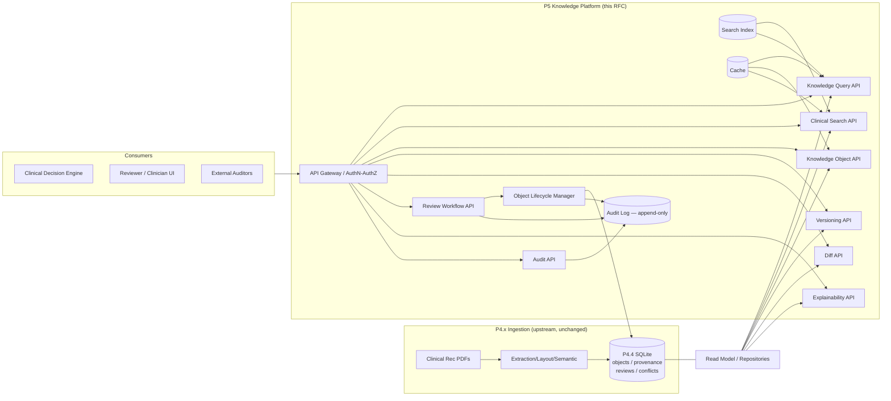
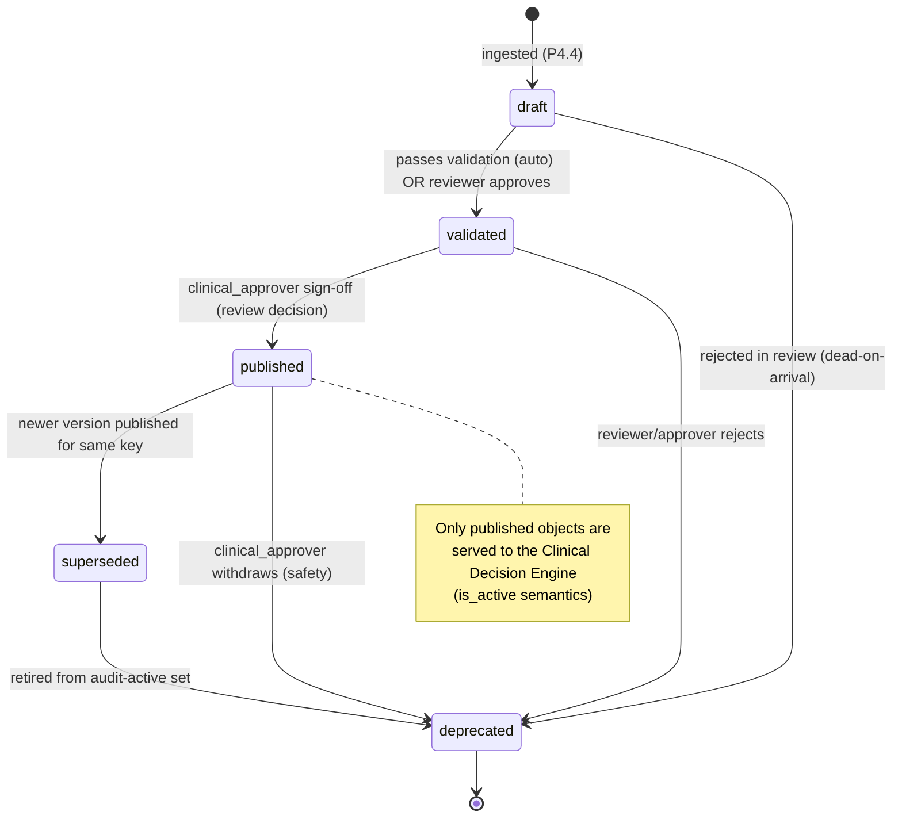

# RFC: P5 — Knowledge Platform (Serving & Governance Layer)

- **RFC ID:** P5-KP-001
- **Status:** DRAFT (Design / Documentation only — no implementation authorized by this RFC)
- **Version:** 1.0
- **Date:** 2026-07-15
- **Author:** Architecture Lead (design agent)
- **Extends:** `ANTIBIO_CONSTITUTION.md`, `ENGINEERING_PLAYBOOK.md`, `CLINICAL_GOVERNANCE.md`,
  `CURRENT_PROJECT_STATE.md`, `PROVENANCE_SPECIFICATION.md` (v1.0, `provenance_schema_version = 2`)
- **Precedence:** Where any serving-layer convenience in this RFC conflicts with a clinical-safety
  rule in `CLINICAL_GOVERNANCE.md` or a traceability rule in `PROVENANCE_SPECIFICATION.md`, the
  governance/provenance document wins. This RFC never authorizes discarding provenance, inventing
  medical content, or bypassing human review.

> **Scope boundary.** P4.4 produces the *system of record*: immutable, versioned, fully traceable
> Knowledge Objects in SQLite (`objects`, `provenance`, `reviews`, `conflicts`). **P5 does not
> create clinical truth and does not mutate historical versions.** P5 is the **read/serve +
> governance-workflow** platform layered *on top of* the P4.4 store: query, search, versioning
> views, diffs, human review lifecycle, explainability, audit, indexing, and caching. All writes P5
> performs are limited to *lifecycle transitions*, *review decisions*, and *append-only audit* — never
> to the content or provenance of an existing object version.

---

## 1. Motivation & Goals

### 1.1 Problem
The P4.4 Knowledge Base is currently reachable only through the in-process `KnowledgeBase` Python
class (`src/pipeline/knowledge_base.py`). There is no stable, versioned, auditable service contract
for consumers (Clinical Decision Engine, application UI, reviewers, external auditors). Provenance is
stored richly but is not *served* with query results, so traceability guarantees are not yet
enforced at the serving boundary.

### 1.2 Goals
1. Expose the KB through a stable, versioned API surface with hard provenance/traceability
   guarantees at every response boundary.
2. Provide first-class **human review** and **object lifecycle** governance as API-driven workflows.
3. Make every object **explainable** (why it exists, from which source cell, under which engine) and
   every state change **auditable** (append-only).
4. Preserve the P4.4 invariants: append-only, immutable historical versions, one-canonical-vocabulary
   provenance, no heuristic inference at the serving layer.

### 1.3 Non-Goals
- No new clinical extraction, no re-running the pipeline, no editing of `content` payloads.
- No modification of the Clinical Decision Engine, bundle schemas, or approved medical content
  (frozen scope per Constitution).
- No AI-generated medical content. P5 serves only what P4.4 recorded.

---

## 2. System Context



### 2.1 Data model touchpoints (P4.4, authoritative)
All P5 subsystems read from / transition over these existing structures. P5 adds nothing to
`content` and nothing to the provenance vocabulary.

| Store | Key columns P5 relies on |
|-------|--------------------------|
| `objects` | `id, type, knowledge_type, clinical_domain, content(JSON), version, status, created_at, updated_at, confidence, validation_status, review_status, normalization_status, history(JSON), relationships(JSON)` |
| `provenance` | `obj_id, pdf, guideline_id, page, paragraph, bounding_box(JSON), extractor, layout_engine, semantic_engine, table_row, table_col, table_conf, original_text, normalized_value, timestamp, doc_version, schema_version` |
| `reviews` | `id, obj_id, reason, created_at, status` |
| `conflicts` | `id, key, obj_id1, obj_id2, detected_at` |
| **New (P5-owned, additive)** | `audit_log` (append-only), `lifecycle_transitions`, `review_decisions`, `search_index` (or external index), `cache` (out-of-process) |

> **Identity semantics carried from P4.4:** `id = <type3>_<sha256(type:canonical_content)[:16]>`
> (`_stable_id`). Object identity is content-derived; `version` increments on conflict/update;
> `history` is the ordered list of prior object ids. P5 treats `(id, version)` as the immutable
> version coordinate.

### 2.2 Status vocabulary reconciliation (normative for P5)
The P4.4 code currently writes lifecycle values `draft`, `active`, `superseded` and reads
`validated`/`published` in `KnowledgeObject.is_active()`. The Constitution/State target lifecycle is
**`draft → validated → published → superseded → deprecated`**. This drift is an existing finding, not
introduced here.

**P5 resolution:** P5 adopts the target five-state lifecycle as canonical (§14). The Lifecycle
Manager maps the legacy `active` value to `published` on read (a compatibility view) and stops
emitting `active` on any new transition. This mapping is a documented read-time alias only; it never
rewrites historical rows. Migration of legacy `active` rows is a P5 exit-gate item (§16), executed as
a single additive transition event per object, preserving history.

---

## 3. Cross-cutting design principles

- **P-1 Provenance-on-every-object.** Any response that returns a knowledge object or a clinical
  fact MUST include (or link to) its provenance array. A response body that would return object
  content with zero provenance rows is a `500 PROVENANCE_MISSING` (fail-closed), except where the
  caller explicitly requests `?provenance=none` for a metadata-only projection.
- **P-2 No serving-layer inference.** P5 never reconstructs `layout_engine`, `semantic_engine`,
  `guideline_id`, or `original_text`. It maps 1:1 from stored rows exactly as
  `PROVENANCE_SPECIFICATION` mandates for the consumer.
- **P-3 Immutability.** No P5 endpoint mutates `content` or `provenance` of an existing
  `(id, version)`. Corrections happen upstream (new version) — never in place.
- **P-4 Append-only audit.** Every state-changing call writes an immutable `audit_log` row before
  returning success (write-audit-then-ack).
- **P-5 Deterministic reads.** For a given `(id, version)` and index snapshot, responses are
  byte-stable modulo pagination cursors and timestamps.
- **P-6 Fail-closed clinical safety.** When provenance or validation state is ambiguous, P5 returns
  an error or a `needs_review` flag — never a silent best guess (mirrors CLINICAL_GOVERNANCE
  "never infer from free text").

### 3.1 Authentication & Authorization (applies to all APIs)
- **AuthN:** bearer token (OIDC/JWT) at the gateway; service-to-service via mTLS for the Clinical
  Decision Engine.
- **AuthZ roles:**
  - `reader` — Query/Search/Object/Version/Diff/Explain read access.
  - `reviewer` — reader + Review Workflow claim/decide, lifecycle `draft→validated` proposals.
  - `clinical_approver` (physician sign-off) — `validated→published`, `published→deprecated`.
  - `platform_admin` — index rebuild, cache purge, audit export.
  - `auditor` — read-only Audit API + full read (no writes).
- **Least privilege:** lifecycle promotion to `published` and any `deprecated` transition require
  `clinical_approver`; this enforces the CLINICAL_GOVERNANCE rule that medical truth is confirmed by
  approved clinical review, not automation.
- All mutating calls require an `Idempotency-Key` header and an `actor` derived from the token
  (never from the request body).

---

## 4. Knowledge Query API

**Purpose.** Structured, filtered retrieval of knowledge objects by exact attributes (type,
domain, status, guideline, confidence) — the deterministic path used by the Clinical Decision
Engine. Distinct from Search (§5), which is ranked/fuzzy.

**Responsibilities.**
- Return current (published) object versions by structured predicate.
- Enforce provenance-on-every-object (P-1).
- Serve from cache/index where safe; fall back to read model.
- Never rank by relevance; ordering is deterministic (`updated_at desc, id asc` default).

**Key operations.**
- `POST /v1/query` — predicate query (body below).
- `GET  /v1/objects?type=&status=&guideline_id=&clinical_domain=&min_confidence=` — convenience form.

**Request (illustrative JSON, not executable).**
```json
{
  "filter": {
    "type": "Dose",
    "status": "published",
    "clinical_domain": "antibiotic_therapy",
    "guideline_id": "KR-654",
    "min_confidence": 0.7
  },
  "projection": ["id", "version", "content", "confidence", "provenance"],
  "page": { "limit": 50, "cursor": null },
  "consistency": "read_committed"
}
```

**Response (illustrative).**
```json
{
  "results": [
    {
      "id": "dos_9f2a17c4bb0e5d31",
      "type": "Dose",
      "version": 3,
      "status": "published",
      "confidence": 0.82,
      "content": { "value": "500", "unit": "mg", "route": "IV", "frequency": "q8h" },
      "provenance": [
        {
          "pdf": "KR654_pneumonia.pdf",
          "guideline_id": "KR-654",
          "page": 12,
          "table_row": 4, "table_col": 2, "table_conf": 0.91,
          "layout_engine": "table-transformer+rapidtable",
          "semantic_engine": "semantic+table",
          "original_text": "500 мг внутривенно каждые 8 часов",
          "normalized_value": "500 mg IV q8h",
          "schema_version": 2
        }
      ],
      "_meta": { "cache": "hit", "index_snapshot": "idx_20260715T0900Z" }
    }
  ],
  "page": { "limit": 50, "next_cursor": "eyJ2IjozLCJpZCI6..." },
  "total_estimate": 137
}
```

**Error modes.** `400 INVALID_FILTER`, `403 FORBIDDEN`, `404 NO_MATCH` (empty is `200` with empty
list — 404 reserved for unknown named resource), `422 UNSUPPORTED_PROJECTION`,
`500 PROVENANCE_MISSING` (P-1 violation), `503 INDEX_UNAVAILABLE` (falls back to read model with
`_meta.degraded=true`).

**Non-functional.** p95 ≤ **80 ms** cache hit / ≤ **250 ms** cold; consistency **read-committed** on
the current KB snapshot; `reader` role; results deterministic per index snapshot; hard cap
`limit ≤ 500`.

---

## 5. Clinical Search API

**Purpose.** Ranked, tolerant discovery over object content **and provenance text**
(`original_text`, `normalized_value`, guideline metadata) — for reviewers and clinicians exploring
the corpus.

**Responsibilities.**
- Full-text + fielded search across the P5 Search Index (§12).
- Rank by relevance with clinical-safety guardrails: never fabricate matches; return `score` and
  the matched provenance span.
- Support Russian-language analysis (source corpus is Russian MoH) and normalized-value matching.
- Every hit still carries provenance (P-1).

**Key operations.**
- `POST /v1/search` — query + filters + facets.
- `GET  /v1/search/suggest?q=` — typeahead (index-backed, no fuzzy medical invention).

**Request (illustrative).**
```json
{
  "q": "амоксициллин доза пневмония",
  "filters": { "type": ["Dose", "Recommendation"], "status": ["published"] },
  "facets": ["clinical_domain", "guideline_id", "type"],
  "highlight": ["original_text", "content.name"],
  "rank": { "profile": "clinical_default" },
  "page": { "limit": 20 }
}
```

**Response (illustrative).**
```json
{
  "hits": [
    {
      "id": "rec_11ab...", "version": 2, "type": "Recommendation", "score": 8.41,
      "highlight": { "original_text": ["...<em>амоксициллин</em> при <em>пневмонии</em>..."] },
      "content": { "therapy": "amoxicillin", "line": "first" },
      "provenance_ref": { "obj_id": "rec_11ab...", "version": 2 }
    }
  ],
  "facets": { "type": { "Recommendation": 12, "Dose": 7 }, "guideline_id": { "KR-654": 9 } },
  "page": { "limit": 20, "next_cursor": "..." },
  "_meta": { "index_snapshot": "idx_20260715T0900Z", "analyzer": "ru_medical_v1" }
}
```

**Error modes.** `400 EMPTY_QUERY`, `413 QUERY_TOO_LONG`, `422 UNKNOWN_FACET`,
`503 INDEX_UNAVAILABLE` (Search is index-only; no read-model fallback — returns 503 rather than an
unranked scan, to avoid misleading clinical results).

**Non-functional.** p95 ≤ **150 ms**; **eventually consistent** with the KB (bounded by index lag
SLO ≤ 60 s, surfaced in `_meta.index_snapshot`); `reader` role; ranking profile is versioned and
deterministic per snapshot.

---

## 6. Knowledge Object API

**Purpose.** Canonical retrieval of a single object (current or specific version) with full
provenance and lineage links.

**Responsibilities.**
- Return one object by `id` (defaults to current published version) or by `(id, version)`.
- Attach provenance array, `history`, `relationships`, and lifecycle state.
- Provide hypermedia links to Versioning, Diff, Explainability, Audit for that object.

**Key operations.**
- `GET /v1/objects/{id}` — current version.
- `GET /v1/objects/{id}/versions/{version}` — pinned version (immutable).
- `HEAD /v1/objects/{id}` — existence + ETag (version-based) for cache validation.

**Response (illustrative).**
```json
{
  "id": "med_7c1d...", "type": "Medication", "knowledge_type": "Medication",
  "clinical_domain": "antibiotic_therapy",
  "version": 4, "status": "published",
  "confidence": 0.88,
  "validation_status": "valid", "review_status": "approved", "normalization_status": "normalized",
  "content": { "name": "amoxicillin", "atc": "J01CA04" },
  "history": ["med_7c1d...@1", "med_7c1d...@2", "med_7c1d...@3"],
  "relationships": [{ "predicate": "has_dose", "target": "dos_9f2a..." }],
  "provenance": [ { "pdf": "KR654.pdf", "guideline_id": "KR-654", "page": 3, "original_text": "амоксициллин", "schema_version": 2 } ],
  "created_at": "2026-07-14T10:02:11Z", "updated_at": "2026-07-15T08:40:00Z",
  "_links": {
    "versions": "/v1/objects/med_7c1d.../versions",
    "diff_prev": "/v1/objects/med_7c1d.../diff?from=3&to=4",
    "explain": "/v1/objects/med_7c1d.../explain",
    "audit": "/v1/audit?obj_id=med_7c1d..."
  }
}
```

**Error modes.** `404 OBJECT_NOT_FOUND`, `404 VERSION_NOT_FOUND`, `410 DEPRECATED` (returns the
object with `status=deprecated` and `Warning` header; not an error for auditors),
`500 PROVENANCE_MISSING`.

**Non-functional.** p95 ≤ **60 ms** (heavily cacheable; ETag = `id@version`); **strong read** for a
pinned `(id, version)` (immutable, infinitely cacheable); `reader` role.

---

## 7. Versioning API

**Purpose.** Expose the full immutable version chain of an object and resolve version pointers.

**Responsibilities.**
- List all versions with lifecycle state and transition timestamps.
- Resolve `latest`, `latest_published`, and `as_of=<timestamp>` pointers.
- Never fabricate a version; the chain is exactly `history` + current row.

**Key operations.**
- `GET /v1/objects/{id}/versions` — ordered chain.
- `GET /v1/objects/{id}/versions/resolve?pointer=latest_published`
- `GET /v1/objects/{id}/versions/resolve?as_of=2026-07-01T00:00:00Z`

**Response (illustrative).**
```json
{
  "id": "dos_9f2a...",
  "versions": [
    { "version": 1, "status": "superseded", "created_at": "2026-07-10T...", "superseded_by": 2, "provenance_count": 1 },
    { "version": 2, "status": "superseded", "created_at": "2026-07-12T...", "superseded_by": 3, "provenance_count": 2 },
    { "version": 3, "status": "published",  "created_at": "2026-07-14T...", "superseded_by": null, "provenance_count": 3 }
  ],
  "pointers": { "latest": 3, "latest_published": 3 }
}
```

**Error modes.** `404 OBJECT_NOT_FOUND`, `422 INVALID_POINTER`, `422 AS_OF_BEFORE_GENESIS`.

**Non-functional.** p95 ≤ **80 ms**; **strong consistency** (version chain is authoritative);
`reader` role.

### 7.1 Versioning sequence (create-new-version flow)

```mermaid
sequenceDiagram
  autonumber
  participant ING as Ingestion (P4.4)
  participant KB as P4.4 Store
  participant LCM as Lifecycle Manager (P5)
  participant AUD as Audit Log
  participant IDX as Search Index
  participant CACHE as Cache

  Note over ING,KB: New conflicting fact for existing key detected upstream
  ING->>KB: insert object v(n+1), status=draft, history=[...prev]
  ING->>KB: mark prev version status=superseded
  KB-->>LCM: change event (obj_id, new_version)
  LCM->>AUD: append VERSION_CREATED {id, from:n, to:n+1, actor:ingestion}
  LCM->>IDX: enqueue reindex(id@n+1), demote(id@n)
  LCM->>CACHE: invalidate id, id@n (current pointer moved)
  Note over LCM: v(n+1) enters review queue (§9); not published until clinical_approver
```

> Provenance guarantee: the new version carries its **own** provenance rows (never inherited by
> reference); the superseded version keeps its provenance immutably. No provenance is merged across
> versions except the P4.4 cell-level dedup within a single version (`_merge_provenance`, keyed by
> `(pdf, page, table_row, table_col)` per RC-017).

---

## 8. Diff API

**Purpose.** Compute a structured, human-readable difference between two versions of the same object
(or between two related objects flagged in `conflicts`).

**Responsibilities.**
- Field-level diff of `content`, `confidence`, lifecycle state, and **provenance sets**.
- Classify each change (`added`, `removed`, `modified`) and flag **clinically material** changes
  (dose value, unit, route, contraindication condition) distinctly from metadata changes.
- Never auto-resolve; Diff is read-only decision support for reviewers.

**Key operations.**
- `GET /v1/objects/{id}/diff?from={vA}&to={vB}`
- `GET /v1/diff?left={id1}@{v}&right={id2}@{v}` (cross-object, for conflict pairs).

**Response (illustrative).**
```json
{
  "left": { "id": "dos_9f2a...", "version": 2 },
  "right": { "id": "dos_9f2a...", "version": 3 },
  "content_diff": [
    { "path": "value", "op": "modified", "from": "500", "to": "750", "clinically_material": true },
    { "path": "frequency", "op": "modified", "from": "q8h", "to": "q12h", "clinically_material": true }
  ],
  "confidence_diff": { "from": 0.74, "to": 0.82 },
  "lifecycle_diff": { "from": "superseded", "to": "published" },
  "provenance_diff": {
    "added":   [ { "pdf": "KR654_rev2.pdf", "page": 13, "table_row": 5, "table_conf": 0.88 } ],
    "removed": [],
    "retained_count": 2
  },
  "summary": { "material_changes": 2, "provenance_added": 1 }
}
```

**Error modes.** `404 OBJECT_NOT_FOUND` / `404 VERSION_NOT_FOUND`, `409 DIFF_ACROSS_TYPES`
(cross-object diff refused when `type` differs — clinically meaningless), `422 SAME_VERSION`.

**Non-functional.** p95 ≤ **200 ms** (diff is computed, cacheable by `id@vA..vB`); **strong** (pinned
immutable versions); `reader` role; `clinically_material` flags are derived from a versioned,
type-specific field map (auditable, no ML).

---

## 9. Review Workflow (Human Review Queue Lifecycle)

**Purpose.** Govern the human review of objects flagged by P4.4 (`reviews` table: validation
failure, low confidence, conflict/update). This is the gate through which draft/validated objects
reach `published`.

**Responsibilities.**
- Serve the review queue with filtering (reason, type, domain, age, priority).
- Support claim → decide (approve / reject / request-changes / escalate) with mandatory rationale.
- On decision, drive the Lifecycle Manager transition and write audit + `review_decisions`.
- Enforce role gates: only `clinical_approver` can approve a transition to `published`.
- Never allow a decision without an actor identity and a free-text rationale (accountability).

**Review item lifecycle states:** `open → claimed → in_review → {approved | rejected | changes_requested | escalated} → closed`. (Backed by `reviews.status`, extended with the P5-owned `review_decisions` log.)

**Key operations.**
- `GET   /v1/reviews?status=open&reason=conflict&type=Dose&sort=priority`
- `POST  /v1/reviews/{review_id}/claim`
- `POST  /v1/reviews/{review_id}/decision`
- `POST  /v1/reviews/{review_id}/escalate`
- `GET   /v1/reviews/{review_id}` — item + linked object + diff + explain context.

**Decision request (illustrative).**
```json
{
  "decision": "approve",
  "target_lifecycle": "published",
  "rationale": "Dose 750mg q12h confirmed against KR-654 table 4; supersedes prior 500mg q8h.",
  "reviewed_object": { "id": "dos_9f2a...", "version": 3 },
  "idempotency_key": "rev-8841-approve-v3"
}
```

**Decision response (illustrative).**
```json
{
  "review_id": 8841,
  "obj_id": "dos_9f2a...", "version": 3,
  "previous_review_status": "in_review",
  "new_review_status": "approved",
  "lifecycle_transition": { "from": "validated", "to": "published", "actor": "dr.ivanova@moh" },
  "audit_id": "aud_01J...",
  "closed_at": "2026-07-15T09:12:00Z"
}
```

**Error modes.** `403 ROLE_REQUIRED` (non-approver attempting `published`), `404 REVIEW_NOT_FOUND`,
`409 ALREADY_CLAIMED` / `409 ALREADY_CLOSED`, `409 STALE_OBJECT_VERSION` (object advanced since
claim), `422 MISSING_RATIONALE`, `422 ILLEGAL_TARGET_TRANSITION` (delegates to §14 rules).

**Non-functional.** p95 ≤ **300 ms** for list, ≤ **400 ms** for decision (writes audit + transition
+ invalidations in one transaction); **strong consistency** (queue correctness is safety-critical);
`reviewer` / `clinical_approver` roles; decisions are idempotent by `Idempotency-Key`.

### 9.1 Review + publish sequence

```mermaid
sequenceDiagram
  autonumber
  participant UI as Reviewer UI
  participant RAPI as Review API
  participant LCM as Lifecycle Manager
  participant KB as P4.4 Store
  participant AUD as Audit Log
  participant CACHE as Cache
  participant IDX as Search Index

  UI->>RAPI: GET /reviews?status=open
  RAPI-->>UI: queue (item 8841 → dos_9f2a...@3)
  UI->>RAPI: POST /reviews/8841/claim (actor=dr.ivanova)
  RAPI->>KB: reviews.status = claimed
  RAPI->>AUD: append REVIEW_CLAIMED
  UI->>RAPI: POST /reviews/8841/decision {approve, published, rationale}
  RAPI->>LCM: request transition validated→published (guard: clinical_approver)
  LCM->>KB: BEGIN; objects.status=published; reviews.status=approved
  LCM->>AUD: append LIFECYCLE_PUBLISHED + REVIEW_DECISION
  LCM->>KB: COMMIT
  LCM->>CACHE: invalidate dos_9f2a..., pointer latest_published
  LCM->>IDX: reindex dos_9f2a...@3 (status=published)
  RAPI-->>UI: 200 {new_review_status: approved, audit_id}
```

---

## 10. Explainability API

**Purpose.** Answer *"why does this knowledge object exist, and where exactly did it come from?"* —
the human- and auditor-facing lineage narrative, assembled strictly from stored provenance and
version history (no inference, no generation).

**Responsibilities.**
- Assemble a lineage graph: source PDF(s) → page → layout/semantic engine → table cell → original
  wording → normalized value → object version → lifecycle transitions → review decisions.
- Surface the exact `original_text` span(s) and `bounding_box` for UI source-highlighting.
- Report the extraction/layout/semantic engines that produced each provenance row (per
  `PROVENANCE_SPECIFICATION` INV-15) and the `guideline_id` (INV-16), `table_conf` (INV-17).

**Key operations.**
- `GET /v1/objects/{id}/explain` — current version lineage.
- `GET /v1/objects/{id}/versions/{version}/explain` — pinned version lineage.

**Response (illustrative).**
```json
{
  "id": "dos_9f2a...", "version": 3, "status": "published",
  "why": "Derived from a dosage table cell in guideline KR-654, normalized and confirmed by clinical review.",
  "lineage": [
    {
      "stage": "source",     "pdf": "KR654_pneumonia.pdf", "guideline_id": "KR-654", "doc_version": "p4.4-2026-07"
    },
    {
      "stage": "location",   "page": 12, "bounding_box": { "x0": 220.5, "y0": 640.1, "x1": 410.0, "y1": 662.3 },
      "table_row": 4, "table_col": 2, "table_conf": 0.91
    },
    {
      "stage": "engines",    "extractor": "router", "layout_engine": "table-transformer+rapidtable",
      "semantic_engine": "semantic+table", "schema_version": 2
    },
    {
      "stage": "wording",    "original_text": "500 мг внутривенно каждые 8 часов", "normalized_value": "500 mg IV q8h"
    },
    {
      "stage": "lifecycle",  "transitions": [
        { "to": "draft", "at": "2026-07-14T10:02Z", "actor": "ingestion" },
        { "to": "validated", "at": "2026-07-15T08:30Z", "actor": "reviewer:petrov" },
        { "to": "published", "at": "2026-07-15T09:12Z", "actor": "clinical_approver:ivanova", "review_id": 8841 }
      ]
    }
  ],
  "traceability": { "complete": true, "missing_fields": [] }
}
```

**Error modes.** `404 OBJECT_NOT_FOUND`, `500 PROVENANCE_MISSING` (fail-closed — an object that
cannot be explained cannot be served as published; flagged to review),
`206 PARTIAL_LINEAGE` (legacy v1 provenance rows missing engine fields → `traceability.complete=false`,
`missing_fields` enumerated; used only for pre-v2 rows, never for new objects).

**Non-functional.** p95 ≤ **150 ms**; **strong** for pinned versions; `reader` role; the narrative
`why` is a template filled from stored fields — deterministic, never LLM-generated.

---

## 11. Audit API

**Purpose.** Read + export the append-only record of every state-changing event in P5 (lifecycle
transitions, review decisions, index rebuilds, cache purges, exports).

**Responsibilities.**
- Query the immutable `audit_log` by object, actor, event type, time range.
- Provide tamper-evidence (hash-chained rows) and export for external auditors.
- Never expose a mutation endpoint; audit is write-once, appended by the platform, read by `auditor`.

**Key operations.**
- `GET  /v1/audit?obj_id=&actor=&event=&from=&to=` — filtered stream.
- `GET  /v1/audit/{audit_id}` — single event.
- `POST /v1/audit/export` — signed export bundle (async job; `platform_admin`/`auditor`).

**Audit event (illustrative).**
```json
{
  "audit_id": "aud_01J8...",
  "event": "LIFECYCLE_PUBLISHED",
  "obj_id": "dos_9f2a...", "version": 3,
  "actor": "clinical_approver:ivanova",
  "before": { "status": "validated" },
  "after":  { "status": "published" },
  "context": { "review_id": 8841, "rationale_ref": "review_decisions/8841" },
  "at": "2026-07-15T09:12:00Z",
  "prev_hash": "sha256:9ab...", "row_hash": "sha256:3fe..."
}
```

**Error modes.** `403 FORBIDDEN` (write attempt or non-auditor export), `404 AUDIT_NOT_FOUND`,
`416 RANGE_TOO_LARGE` (export windows are bounded; async job required beyond threshold).

**Non-functional.** p95 ≤ **200 ms** query; **strong, immutable** (hash-chained, WORM semantics);
retention ≥ **7 years** (clinical record); `auditor`/`platform_admin` roles; exports are signed and
themselves audited.

---

## 12. Search Index (indexing strategy)

**Purpose.** Back the Search (§5) and accelerate Query (§4) with an index over object content **and
provenance text**, kept eventually consistent with the P4.4 store.

**Indexing strategy.**
- **Index unit:** one document per `(obj_id, version)` where `status ∈ {published, validated}` for the
  serving index; a separate `all_versions` index (superseded/deprecated) for auditor/search-history.
- **Indexed fields:**
  - Structured/filter: `type, knowledge_type, clinical_domain, status, guideline_id, confidence,
    validation_status, normalization_status, page, table_conf`.
  - Full-text (Russian analyzer `ru_medical_v1` + normalized-value subfield): `content.*` (flattened),
    `provenance.original_text`, `provenance.normalized_value`, `paragraph`.
  - Facet: `type, clinical_domain, guideline_id, layout_engine, semantic_engine`.
- **Provenance preservation:** the index stores a **reference** (`obj_id@version`) plus the text
  needed for highlighting; it never becomes the source of truth. Every hit is re-hydrated from the
  read model (or carries `provenance_ref`) so a hit can always be traced back to authoritative rows.
- **Pipeline:** change-data-capture from Lifecycle Manager events (§7.1, §9.1) → indexing queue →
  bulk upsert. Full rebuild is idempotent and reproducible from the KB (`platform_admin` only).
- **Snapshotting:** each search/query response reports `index_snapshot`; snapshots are immutable
  labels enabling deterministic pagination and reproducible audit ("what did search return at T?").
- **Technology-neutral:** may be SQLite FTS5 (co-located, simplest, matches current stack) for v1,
  with a clean port path to an external engine (OpenSearch/Tantivy) if scale demands. The contract
  above is engine-agnostic.

**Error/degradation modes.** Index lag beyond SLO raises `_meta.degraded`; a failed reindex event is
retried with backoff and, on repeated failure, opens a platform review (never silently drops an
object from search).

**Non-functional.** Index lag SLO ≤ **60 s** p95; rebuild throughput target ≥ corpus (~1.8k objects)
in ≤ **5 min**; eventual consistency; `platform_admin` for rebuild/purge.

---

## 13. Caching Strategy

**Purpose.** Meet latency SLOs without weakening traceability or serving stale clinical state.

**Layers & policy.**
| Layer | What | Key | Invalidation | TTL |
|-------|------|-----|--------------|-----|
| L1 pinned-version cache | `GET objects/{id}/versions/{v}`, diffs, explain for pinned `(id,v)` | `id@v` (+ endpoint) | **never** (immutable) | ∞ (LRU eviction) |
| L2 current-pointer cache | `GET objects/{id}` current, `latest_published` | `id:current` | on any lifecycle transition of `id` | short (≤ 60 s) |
| L3 query/search results | `POST /query`, `POST /search` result pages | hash(filter+page+`index_snapshot`) | on `index_snapshot` change | ≤ 120 s |
| L4 facets/aggregates | search facets, `stats` | query hash + snapshot | on snapshot change | ≤ 300 s |

**Rules.**
- **Immutable is infinitely cacheable.** Pinned `(id, version)` content/provenance never changes
  (P-3), so L1 uses strong ETags (`id@v`) and `Cache-Control: immutable`.
- **Current pointers are event-invalidated,** not just TTL-expired: the Lifecycle Manager purges L2
  synchronously within the transition transaction (write-through invalidation) so a just-published
  version is never masked by a stale `active`/prior pointer.
- **Never cache across auth scope** in a way that leaks unpublished objects to `reader`; cache keys
  include the effective visibility scope.
- **No caching of provenance-stripped responses** as if they were full (prevents P-1 bypass).
- Cache is out-of-process (e.g. Redis) and its purges are **audited** (§11) when triggered by
  lifecycle events.

**Non-functional.** Cache hit ratio target ≥ **80%** on Query/Object read paths; invalidation
propagation ≤ **1 s**; correctness over freshness — when in doubt, miss to read model.

---

## 14. Object Lifecycle

**Purpose.** Define and enforce the canonical state machine and legal transitions; own all
lifecycle writes to `objects.status`.

**States (canonical, per Constitution/State target):**
`draft → validated → published → superseded → deprecated`.



**Transition rules.**
| From | To | Trigger | Guard (role) | Side effects |
|------|----|---------|--------------|--------------|
| — | `draft` | ingestion inserts object | ingestion (system) | provenance rows written; review queued if invalid/low-confidence |
| `draft` | `validated` | validation pass or reviewer approval | auto or `reviewer` | audit `LIFECYCLE_VALIDATED` |
| `validated` | `published` | review approval | `clinical_approver` | reindex; L2 purge; audit `LIFECYCLE_PUBLISHED` |
| `published` | `superseded` | newer version published for same `_content_key` | system (Lifecycle Mgr) | pointer moves; L2 purge; audit `VERSION_SUPERSEDED` |
| `draft`/`validated` | `deprecated` | review rejection | `reviewer`/`clinical_approver` | audit `LIFECYCLE_DEPRECATED` |
| `published` | `deprecated` | safety withdrawal | `clinical_approver` | reindex demote; audit + rationale required |
| `superseded` | `deprecated` | retire from audit-active | `platform_admin` | audit only (object stays immutably readable) |

**Invariants.**
- **L-INV-1** transitions are monotonic within the diagram; no illegal edge (e.g. `deprecated →
  published`) is permitted → `422 ILLEGAL_TARGET_TRANSITION`.
- **L-INV-2** a `superseded` transition requires an existing newer published version for the same
  content key (consistency with `history`).
- **L-INV-3** only `published` objects satisfy `is_active` and are served to the Clinical Decision
  Engine; `validated` is review-visible only.
- **L-INV-4** every transition writes exactly one immutable audit row (P-4) inside the same DB
  transaction as the `status` update (atomicity).
- **L-INV-5** legacy `active` is read-aliased to `published` and never written by P5 (§2.2).

**Non-functional.** Transition latency p95 ≤ **250 ms** (single ACID transaction across
`objects` + `audit_log` + cache purge + index enqueue); **strong consistency**; role-guarded as
above.

---

## 15. Provenance & Traceability Preservation (per PROVENANCE_SPECIFICATION v1.0)

This section maps each guarantee of `PROVENANCE_SPECIFICATION.md` onto P5's serving contract.

| Provenance guarantee (source) | How P5 preserves it |
|-------------------------------|---------------------|
| **One canonical vocabulary** (founding rule) | P5 serializes provenance using the **exact `Provenance` dataclass field names** in every response. No API renames a field or emits an alias. Response schemas are generated from the dataclass, not hand-authored. |
| **Consumer maps 1:1, never infers** (Phase 4) | P5 is a downstream consumer: Query/Object/Explain read provenance rows and pass them through unchanged. P5 **never** reconstructs `layout_engine`/`semantic_engine` from `extractor`/`source` (the RC-014 class), never substitutes `original_text` from another key (RC-012), never re-derives `guideline_id` (RC-013). Enforced by contract test on the serialization path. |
| **`original_text` never discarded** (INV-09, Clinical Governance) | Explainability and Object APIs always surface `original_text`; it is a required field in the `wording` lineage stage. A published object with null `original_text` fails P-1/§10 and is routed to review, not served. |
| **Real engine, no placeholder** (INV-15) | Explainability reports `layout_engine`/`semantic_engine` verbatim; for legacy v1 rows lacking them, it returns `206 PARTIAL_LINEAGE` with `missing_fields`, never a fabricated engine name. |
| **`guideline_id` present for corpus PDFs** (INV-16) | Query supports `guideline_id` as a first-class filter; Explainability's `source` stage requires it for corpus objects; absence on a corpus object is a traceability defect flagged in `traceability.missing_fields`. |
| **`table_conf` preserved for table cells** (INV-17) | Carried through Query/Object/Explain and surfaced in Diff's `provenance_diff`; indexed as a filter/quality signal (§12). Never dropped. |
| **`schema_version` = 2 stamped** | Echoed in every provenance object so consumers can distinguish v2 from legacy v1 rows and apply the `206 PARTIAL_LINEAGE` handling. |
| **Cell-level dedup keyed by `(pdf,page,table_row,table_col)`** (RC-017) | P5 does not re-dedup; it serves the provenance set as stored. Diff's `provenance_diff` compares sets on the same key tuple so multi-cell provenance is never collapsed. |
| **Round-trip invariant `from_row(to_row(p)) == p`** | P5's read model deserializes provenance without lossy transforms; `bounding_box` is parsed from stored JSON back to `{x0,y0,x1,y1}` exactly. A contract test asserts response-provenance equals stored-provenance field-for-field. |
| **Forward compat: unknown keys ignored** (I10) | P5 serialization ignores unknown future provenance columns rather than failing, matching the 1:1 mapper's forward-compat rule. |
| **Acceptance question** ("traceable to exact origin without heuristics/ambiguity/loss") | The Explainability API is the operational answer to this question: for any published object it must return a complete lineage (`traceability.complete=true`). P5's exit gate (§16) requires this to hold for 100% of published objects. |

---

## 16. Exit Criteria / Production Gates (P5)

P5 is **not closeable** until every gate below is an evidence-based YES (per the project's "real
execution only" quality policy — no mocked execution):

1. **G1 — Provenance-on-every-object.** Automated audit: 0 published objects served without a
   complete v2 provenance array. `500 PROVENANCE_MISSING` count in production = 0 over the soak
   window.
2. **G2 — No serving-layer inference.** Contract test proves response provenance ≡ stored provenance
   field-for-field (round-trip), and static check proves no code path derives engine/guideline/text
   fields at the serving layer.
3. **G3 — Lifecycle correctness.** All illegal transitions rejected (`422`); every transition
   produces exactly one atomic audit row; legacy `active` fully migrated/aliased with a per-object
   transition event and zero history loss.
4. **G4 — Review governance.** No transition to `published` without a `clinical_approver` actor and a
   stored rationale; 100% of `reviews` decisions have a linked `review_decisions` + audit row.
5. **G5 — Explainability completeness.** Explain API returns `traceability.complete=true` for 100%
   of published objects; partial lineage only ever appears for genuine legacy v1 rows and is
   enumerated.
6. **G6 — Audit immutability.** Hash-chain verifies end-to-end; no mutation endpoint exists; export
   is signed and itself audited; retention configured ≥ 7 years.
7. **G7 — Index fidelity.** Rebuild is reproducible from KB; every published object is
   discoverable via Search; index-lag SLO (≤ 60 s p95) met over soak; no object silently dropped.
8. **G8 — Cache correctness.** Just-published version is never masked by a stale pointer
   (invalidation ≤ 1 s); no provenance-stripped response is cached as full; hit ratio ≥ 80%.
9. **G9 — Performance SLOs.** All per-API p95 targets in §§4–14 met under representative load on the
   real corpus (~1.8k objects, ~4k provenance rows).
10. **G10 — Security.** Role matrix enforced (deny-by-default); mTLS for CDE; no PII/clinical content
    in URLs or logs; auth failures audited.
11. **G11 — Documentation sync.** ROADMAP/PROJECT_STATE/DECISIONS/AI_LOG updated; this RFC's status
    moves DRAFT → ADOPTED; status-vocabulary reconciliation (§2.2) recorded in DECISIONS.
12. **G12 — Frozen-scope integrity.** Regression proves the Clinical Decision Engine, bundle schemas,
    and approved medical content are unmodified by P5.

---

## 17. Open Questions & Risks

**Open questions.**
- **Q1 (status vocabulary):** Confirm the §2.2 read-alias (`active`→`published`) + one-time migration
  is acceptable vs. a full backfill rewrite. Requires DECISIONS entry. (Blocks G3.)
- **Q2 (search engine choice):** FTS5 co-located (simplest, matches stack) vs. external engine.
  Recommendation: FTS5 for v1 given corpus size (~1.8k objects); revisit if corpus/query scale grows.
- **Q3 (index for superseded/deprecated):** Should Search default include historical versions for
  reviewers/auditors, or is that opt-in (`?include_history=true`)? Default proposed: current-only.
- **Q4 (clinically-material field map):** The Diff `clinically_material` map is type-specific and
  safety-relevant — who signs off on it (CLINICAL_GOVERNANCE owner)? Proposed: `clinical_approver`
  role owns the versioned map.
- **Q5 (multi-tenancy/deployment):** In-process library vs. standalone service. Recommendation:
  in-process FastAPI-style service over the same SQLite for v1 (no infra change), with the API
  contract stable enough to relocate later.
- **Q6 (SQLite concurrency):** Under review-write + read-serve load, does single-writer SQLite meet
  G9? Mitigation: WAL mode, short write transactions, read replicas/snapshots for query.

**Risks.**
- **R1 — Provenance regression at the serving boundary (HIGH / clinical).** A serialization shortcut
  could reintroduce the RC-012/014 inference class. *Mitigation:* dataclass-generated schemas + G2
  round-trip contract test as a merge gate.
- **R2 — Stale-pointer clinical hazard (HIGH).** Cache serving a superseded dose after a newer one is
  published. *Mitigation:* write-through L2 invalidation inside the transition transaction (§13),
  L-INV-4 atomicity, G8.
- **R3 — Unauthorized publish (HIGH).** Automation or wrong role promoting to `published`,
  contradicting CLINICAL_GOVERNANCE. *Mitigation:* deny-by-default role guard on the single Lifecycle
  Manager write path; G4.
- **R4 — Index/KB divergence (MED).** Search returns objects the KB has demoted. *Mitigation:* CDC
  from the authoritative transition events, `index_snapshot` labels, reconciliation job, G7.
- **R5 — Legacy v1 provenance gaps (MED).** Pre-2026-07-14 rows lack engine fields → partial lineage.
  *Mitigation:* explicit `206 PARTIAL_LINEAGE`, never fabricate; encourage KB re-run to regenerate v2
  rows (per PROVENANCE_SPECIFICATION backward-compat).
- **R6 — SQLite write contention (MED).** *Mitigation:* WAL, short transactions, batching of index
  enqueue, Q6 evaluation under G9.
- **R7 — Audit-log growth / retention cost (LOW).** *Mitigation:* hash-chained cold storage + bounded
  export windows (§11).
- **R8 — Scope creep into content editing (LOW but severe if realized).** *Mitigation:* P-3
  immutability is architectural; no P5 endpoint accepts a `content` write; G12 regression.

---

## 18. Appendix — Standard error envelope

All P5 errors share one envelope (never leaks clinical content or provenance into logs/URLs):

```json
{
  "error": {
    "code": "PROVENANCE_MISSING",
    "http_status": 500,
    "message": "Object has no provenance; cannot be served (fail-closed).",
    "obj_ref": "dos_9f2a...@3",
    "trace_id": "01J8...",
    "remediation": "Routed to review queue; see /v1/reviews?obj_id=dos_9f2a..."
  }
}
```

*End of RFC P5-KP-001.*
